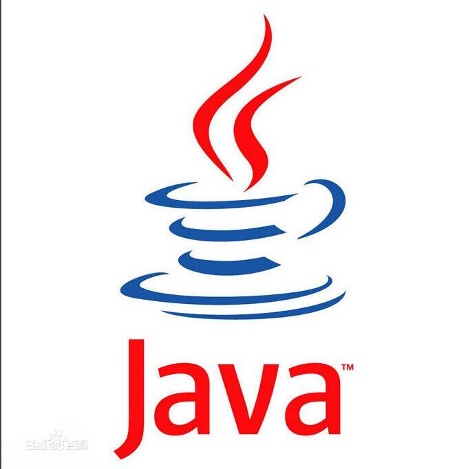

## 简介

Java是一种可以撰写跨平台应用程序的面向对象的程序设计语言。Java 技术具有卓越的通用性、高效性、平台移植性和安全性，广泛应用于PC、数据中心、游戏控制台、科学超级计算机、移动电话和互联网，同时拥有全球最大的开发者专业社群。

## 详情

具体请看 百度百科：<http://baike.baidu.com/subview/29/12654100.htm#viewPageContent>

## 总结

Java作为一门优秀开发语言，主要优点如下：

跨平台，一次编译 ，到处运行； （理论上是这么说的，实际情况不一定）

编译型语言，语法严格，扩展性强，面向对象； 

开源项目无数，找解决方案容易；

## 创始人

再上一个 创始人头像：名字是 **詹姆斯·高斯林**

