## 下载

现在我们来配置下Java运行和开发环境搭建之Jdk配置

JDK (Java SE Development Kit) 就是java开发包的意思，当然里面也包括了 JRE （Java Runtime Environment）Java运行环境

首先我们要去Oracle官网去下载JDK 地址：<http://www.oracle.com/technetwork/java/javase/downloads/jdk8-downloads-2133151.html>

这里我们用的是1.8版本；

当然我们这里提供百度云下载地址：64位和32位都包括：<http://pan.baidu.com/s/1skTZIGH>

## 安装

首先我们在D盘 新建文件夹 jdk1.8和jre1.8分别用来作为jdk和jre的安装目录；

然后我们双击jdk安装包：

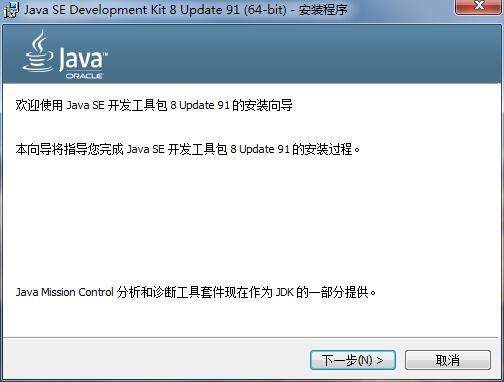

我们点击 “下一步”；

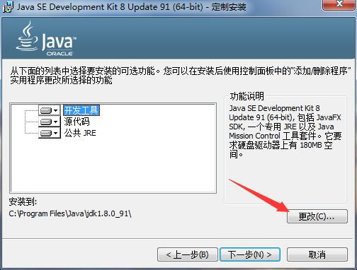

这里我们要更改安装目录：我们安装到D盘的jdk1.8目录下；

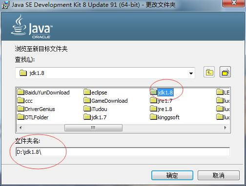

点击“确定”，然后继续；

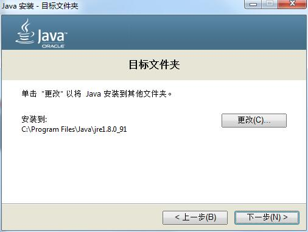

到了jre的安装目录，我们要点更改，换成D盘的jre1.8目录；

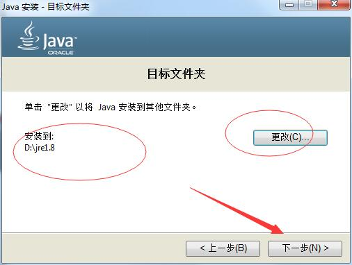

然后点“下一步”，继续；

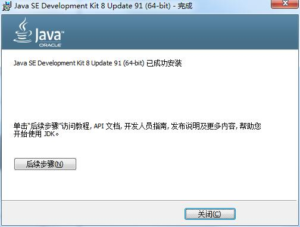

这样的话，就说明我们安装完成了；

## 配置环境变量

接下来我们需要配置环境变量；

右击“我的电脑”，或者“计算机”，然后选“属性”；

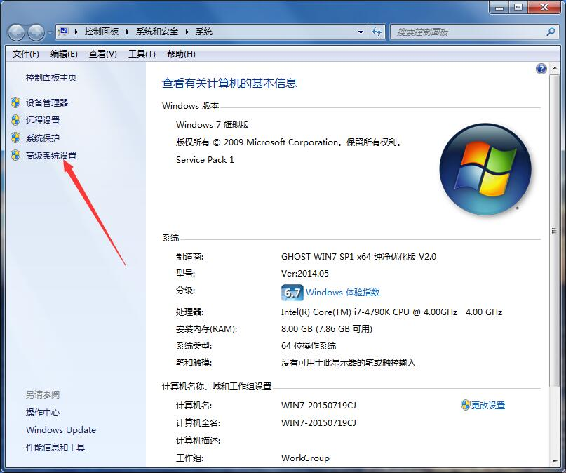

然后点“高级系统设置”；

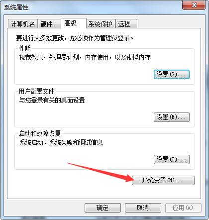

我们再点击“环境变量”；

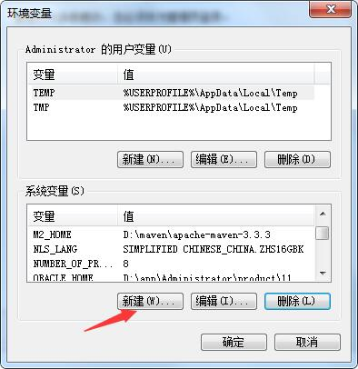

OK 这里的话，我们要点击“新建”；

首先第一个，配置 JAVA_HOME 值是 D:\jdk1.8 也就是jdk的安装目录；

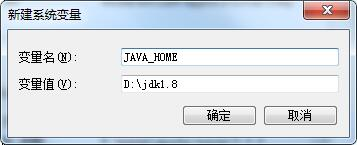

然后点 确定；

接下来是 classpath 类加载路径 值是 .;%JAVA_HOME%\lib;%JAVA_HOME%\lib\tools.jar

继续点击新建 

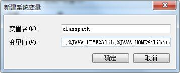

最后一个是 path变量修改（主要是告诉操作系统某些路径下有一些命令）；这个path变量已经存在，我们要在这个值的最前面加 %JAVA_HOME%\bin;%JAVA_HOME%\jre\bin; 

我们可以按 home键，让光标跑到最前面；然后粘贴；

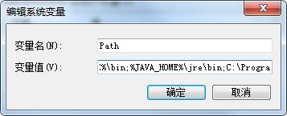

OK最后全部点 OK 完成配置；

## 测试

配置完后我们需要进行验证有么有配置OK；

进行cmd命令行；

输入java运行命令；

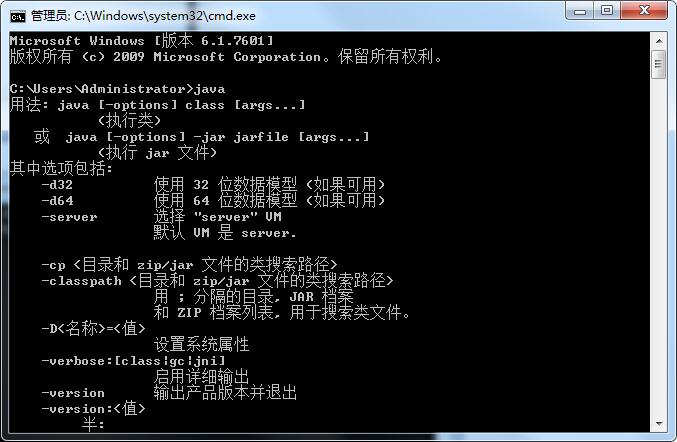

输入javac编译命令；

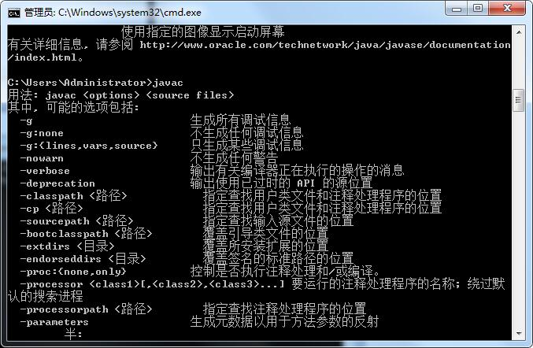

输入java -version 版本命令；

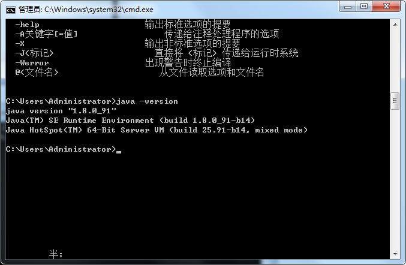

OK至此，说明我们JDK已经配置OK；