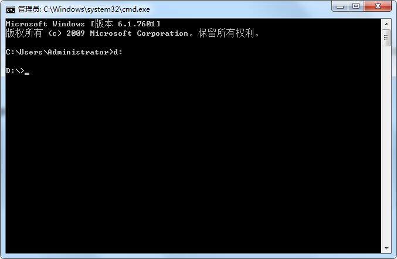
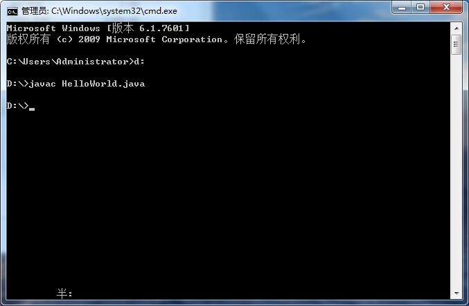
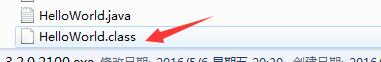
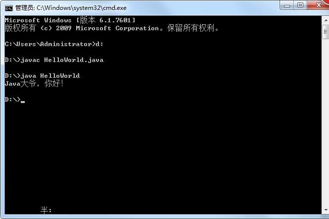
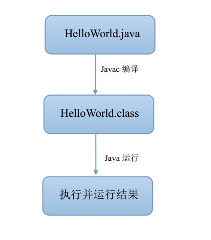

## 创建文件

首先我们新建一个后缀是java的HelloWorld文件；必须**和代码里面的类同名**

## 书写代码

然后编写HelloWorld代码；（代码暂时不需要全部理解，后面会详细讲到）

上代码：

```java
public class HelloWorld{
    public static void main(String args[]){
        System.out.println("Java大爷，你好！");
    }
}
```

这里我们对上述HelloWorld简单讲解下：

public是类修饰，表示公有，class是关键字 类 ，HelloWorld是类名；

内部是一个main方法，是一个执行入口方法，方法上的public也是修饰，表示公有，static是静态修饰关键字，void是方法返回值，标识返回空，

main是方法名，特殊方法，表示执行入口，括号里的String args[] 是方法参数，这里是指字符串数组；

方法是一个输出语句；（大体了解，后续会详解讲解）

## 编译

我们把这个HelloWorld.java源文件放D盘


进入命令行，D: 进行D盘目录




然后我们用javac命令编译源文件：




执行完 在D盘下会多一个HelloWorld.class文件 也就是java可运行文件；




## 运行

我们运行java命令运行HelloWorld.class文件；



## 原理

下面我们再说下java程序基本运行原理：




HelloWorld这个程序，首先我们编写HelloWorld.java源程序，然后我们用Javac编译，编译成HelloWorld.class可执行文件，最后我们通过Java命令运行HelloWorld.class文件，执行并运行结果；


具体java虚拟机的底层执行情况，写代码2年后，可以阅读 深入Java虚拟；