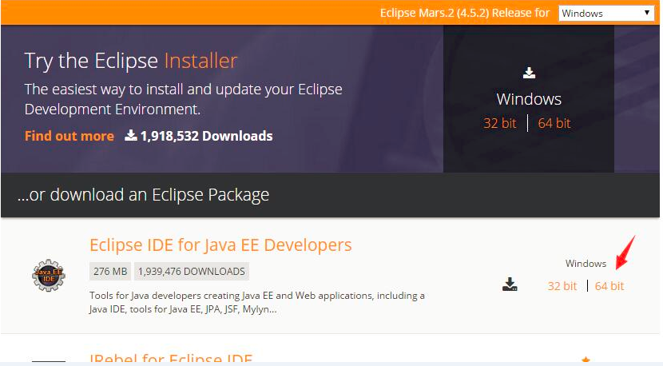
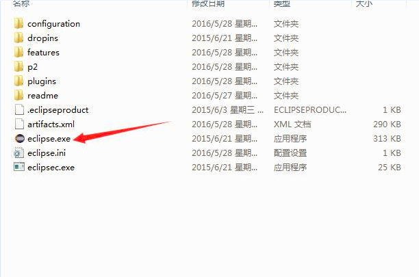
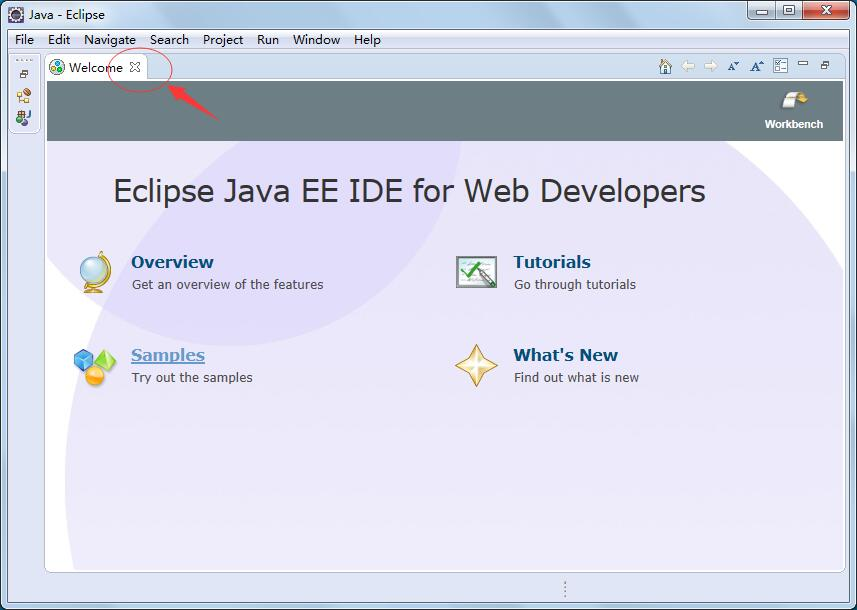
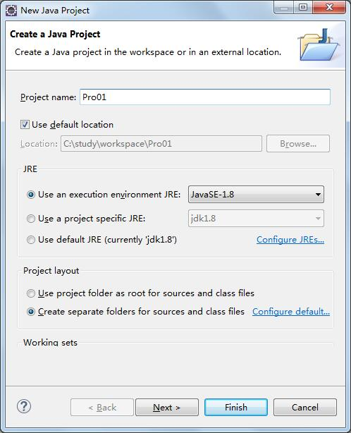
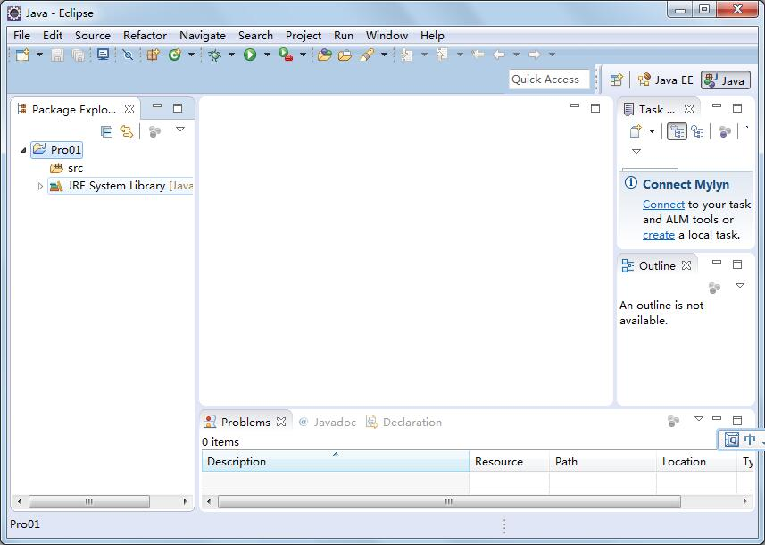
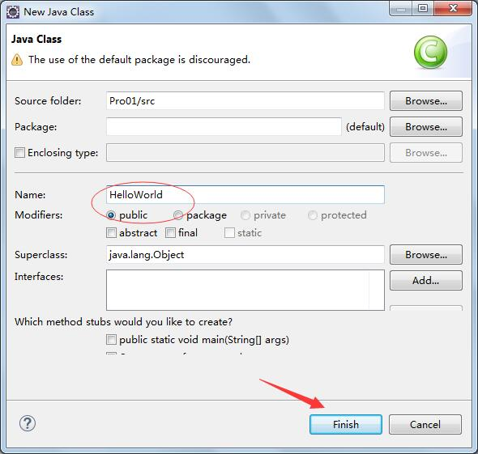
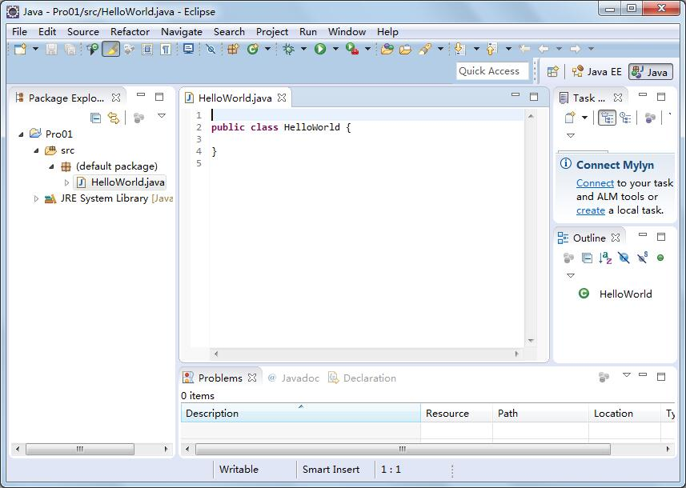
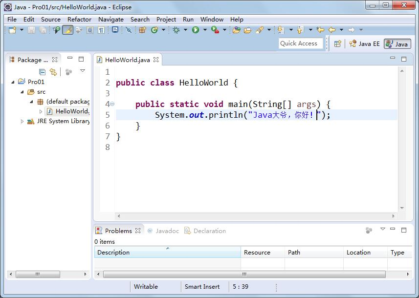
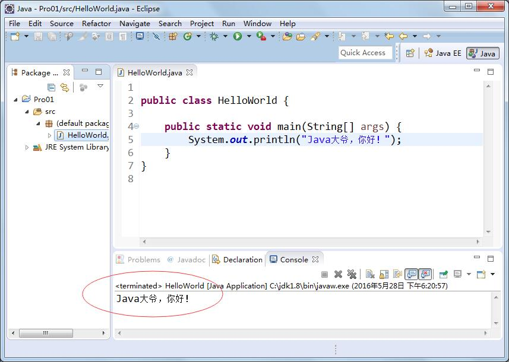

## 主流编辑器

前面我们用记事本写了个HelloWorld，并且运行了。

实际开发的话，我们还是得借助 IDE (Integrated Development Environment)集成开发环境。开发效率高；

主流的是Eclipse 和 intellij idea，绝对部分企业在用。当然少部分用myeclipse，NetBeansa等等

## 下载Eclipse

我们就用主流的Eclipse；

首先下载Eclipse，Eclipes分了好多版本，有标准版本，只能开发j2se项目；我们用j2ee版本，可以开发j2ee项目；

进入Eclipse下载地址：<http://www.eclipse.org/downloads/>

这里选 for java ee; 根据自身电脑操作系统的位数，下载对应的，我这边是64位 所以选择 64bit；

这里我提供下百度云下载地址：<http://pan.baidu.com/s/1ntzhAmH>

## 使用

我们解压，双击eclipse.exe即可运行eclipse；

这个是eclipse第一个运行的欢迎界面；我们点叉叉关掉欢迎界面；

## 创建项目

这里我们先建一个项目Pro01 :

菜单File -> New-> Java Project 

Project Name 我们输入 Pro01即可，然后点击Finish按钮，既可完成项目的创建；

## 创建Class

然后我们在src上右击 new -> Class 新建一个HelloWorld类；

我们在Name上输入 HelloWorld，然后点击 “Finish”按钮，即可完成 类的创建；

## 编写代码

然后我们编写代码：

## 运行

最后我们 右击HelloWorld类 Run As -> Java Application 运行即可

在Console控制台 我们会看到运行结果；

这里的编译过程 eclipse帮我们自动完成了；所以会很方便；