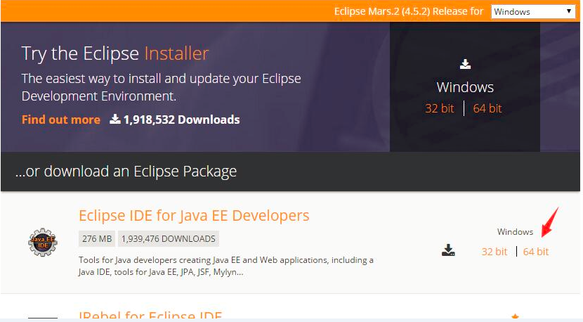
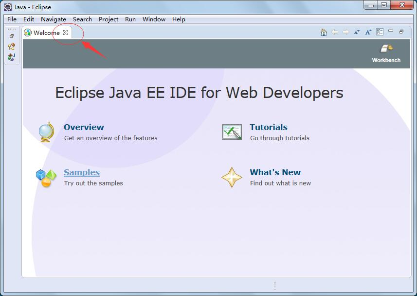
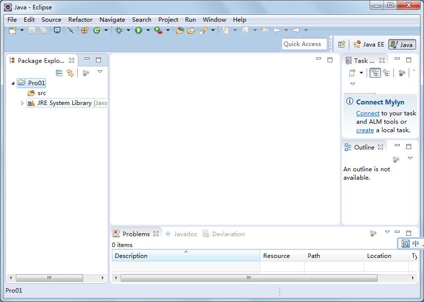

# 开发工具

前面我们用记事本写了个HelloWorld，并且运行了。


实际开发的话，我们还是得借助 IDE (Integrated Development Environment)集成开发环境。开发效率高；


主流的是Eclipse 和 intellij idea，绝对部分企业在用。当然少部分用myeclipse，NetBeansa等等


## Eclipse


### 简单使用


#### 下载Eclipse

我们就用主流的Eclipse；


首先下载Eclipse，Eclipes分了好多版本，有标准版本，只能开发j2se项目；我们用j2ee版本，可以开发j2ee项目；


进入Eclipse下载地址：<http://www.eclipse.org/downloads/>





这里选 for java ee; 根据自身电脑操作系统的位数，下载对应的，我这边是64位 所以选择 64bit；


这里我提供下百度云下载地址：<http://pan.baidu.com/s/1ntzhAmH>


#### 使用

我们解压，双击eclipse.exe即可运行eclipse；





这个是eclipse第一个运行的欢迎界面；我们点叉叉关掉欢迎界面；

#### 创建项目

这里我们先建一个项目Pro01 :

菜单File -> New-> Java Project 


Project Name 我们输入 Pro01即可，然后点击Finish按钮，既可完成项目的创建；



#### 创建Class

然后我们在src上右击 new -> Class 新建一个HelloWorld类；


我们在Name上输入 HelloWorld，然后点击 “Finish”按钮，即可完成 类的创建；


#### 编写代码

然后我们编写代码：


#### 运行

最后我们 右击HelloWorld类 Run As -> Java Application 运行即可


在Console控制台 我们会看到运行结果；


这里的编译过程 eclipse帮我们自动完成了；所以会很方便；


### debug断点调试


#### debug断点调试的重要性


大伙初学的时候 遇到报错 ，通常是搞个System.out.println()输出语句进行变量输出，然后寻找问题。


这个和正常，笔者初学的时候也是这么干的，但是工作中 搞企业级开发的时候，如果还是一个一个搞输出，是低效的，而且会影响代码质量，因为代码最终都是要svn发布到服务器的。


所以掌握好debug断点调试，我们无需搞输出语句 直接打断点，程序执行到断点处停止，我们可以直接观察变量的值，以及表达式的值，我们甚至可以

动态修改变量的值来调试，非常方便，然后我们可以控制调试的执行，主要有F6 执行下一步，F8执行完成或者执行到下一个断点，F5进入方法内部；


#### debug使用基本操作

常见debug调试  F6 单步 F8完成 F5进入方法


我们先来看看debug怎么用；

```java
package com.java1234.chap11;
 
public class Demo {
 
     
    public static void main(String[] args) {
        int a=0;
        int b=3/a;
        System.out.println(b);
    }
}
```

比如搞一个最简单的实例，我们运行下：

直接报错：


我们在 int b=3/a;前面打个断点 看下a变量运行时候的值；


第一步：双击打断点


第二步：选择debug模式 启动项目


有提示 是否进去debug视图，我们点“Yes”


第三步：程序运行到断点处，我们鼠标移动到a上去 ，会看到a变量的值；


第四步：我们可以按F8 或者按钮，完成程序的执行；


这个是最基本的一个调试步骤；


#### debug常见调试  


> F6 单步 F8完成 F5进入方法


eclipse 里debug调试主要三个快捷方式 

F6 单步执行 执行到下一行代码

F8是执行完 假如后面还有断点 执行到下一个断点处

F5是进入方法里执行

```java
package com.java1234.chap11;
 
public class Demo2 {
 
    private static int add(int a,int b){
        int c=a+b;
        return c;
    }
     
    public static void main(String[] args) {
        int a=1;
        int b=2;
        int c=add(a,b);
        System.out.println(c);
    }
}
```


我们在 int a=1;前面打个断点 


然后debug运行程序


已经执行到这里了，我们F6 可以执行到下一行；

按下F6


我们继续F6


这里 有方法 假如我们需要debug进入add方法里 就需要F5 

按下F5


假如需要看变量运行时候的值 我们只需要鼠标移动上去即可


我们按F8 可以执行完程序（前提是后面没有断点了，否则执行到下一个断点处）

按下F8 执行完了


#### 查看表示式值

> ctrl+shift+i查看表示式值


在eclipse里debug断点调试的时候，当我们需要查看某个表达式的时候，可以用ctrl+shift+i快捷方式；


实例：

```java
package com.java1234.chap11;
 
public class Demo3 {
 
 
    public static void main(String[] args) {
        int a=1;
        int b=2;
        int c=a+b;
        System.out.println(c);
    }
}
```


这里 假如我们debug的时候 需要看a+b的表达式运行时候的值 


我们先打断点：


debug运行 执行到断点处：


我们选中a+b，然后ctrl+shift+i

即可看到运行时候的表达式值：


最后我们F8继续执行完即可；


这个获取表达式功能很有用 在实际项目开发调试的时候 经常用到 大伙要记住了。


#### 运行时动态修改变量值


这里讲一个高级点的debug功能，就是可以运行时候，动态修改变量的值。在企业级开发中，往往搞点测试数据麻烦，

所以直接debug的时候随便改数据，来进行各种测试，比较方便；

```java
package com.java1234.chap11;
 
public class Demo3 {
 
 
    public static void main(String[] args) {
        int a=1;
        int b=2;
        int c=a+b;
        System.out.println(c);
    }
}
```


还是前面这个实例；


假如我们要在运行的时候，修改下a变量的值；


我们在前面打断点 然后debug运行；


这里我们右上角会看到一个 varialbes变量视图，可以看到改行的所有变量以及值；


我们双击a变量的值


我们修改成2


修改完后立即生效，然后F8 


这里不做多解释；


### 常见问题


#### 解决eclipse控制台信息显示不全问题


eclipes控制台有默认的显示行数或者大小；


我们可以设置下，来增大显示行数；


菜单->windows->preferences


搜索console


根据你的电脑配置，适当的加几个0 我加了两个0 ；


#### 修改Eclipse工作空间默认编码


Eclipse工作空间默认编码是GBK，新建的项目默认编码也是GBK，一般情况没啥问题；

但是有时候引入源码的话 比如支付宝SDK源码，就发现是乱码了，因为支付宝SDK打包源码的时候，编码是UTF-8；


所以还是直接把工作空间默认编码改成UTF-8，所有项目编码都默认是UTF-8


具体操作：

eclipse    菜单  windows -> preferences


搜索workspace 然后编码改成UTF-8 然后  Apply  最后OK即可；

