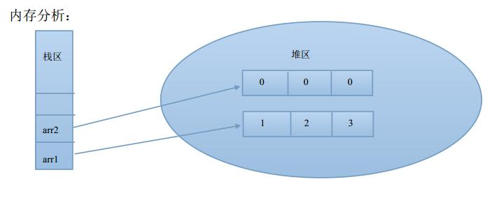
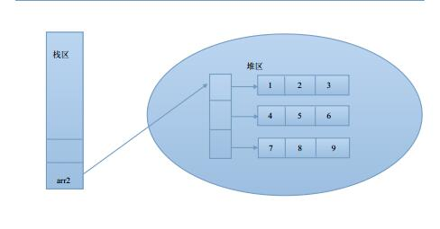

## 数组简介

数组是Java中最常见的一种数据结构，可用于存储多个数据；


## 一维数组

type []arrayName; 或者 type arrayName[];

实例： int []arr ;int arr[]


实例代码：

```java
package com.java1234.chap02;
 
public class Demo18 {
 
    public static void main(String[] args) {
        // 定义一个数组
        int []arr;
        // 定义一个数组
        int arr2[];
    }
}
```


### 一维数组的初始化


#### 静态初始化


格式 arrayName=new type[]{element1,element2,element3...}

实例：int arr[]=new int[]{1,2,3};

实例代码：

```java
package com.java1234.chap02;
 
public class Demo18 {
 
    public static void main(String[] args) {
        // 定义一个数组，并且静态初始化
        int arr[]=new int[]{1,2,3};
         
        // 普通的遍历数组方式
        for(int i=0;i<arr.length;i++){
            System.out.println(arr[i]);
        }
         
        System.out.println("---------------");
        // foreach方式
        for(int j:arr){
            System.out.println(j);
        }
    }
}
```


#### 动态初始化


格式 arrayName=new type[length];

实例：int arr2[]=new int[3]


实例代码：

```java

package com.java1234.chap02;
 
public class Demo18 {
 
    public static void main(String[] args) {
        // 定义一个数组，然后动态初始化，长度是3
        int arr[]=new int[3];
        // int类型的数组，默认是0
        for(int i=0;i<arr.length;i++){
            System.out.println(arr[i]);
        }
    }
}
```


运行输出：


0

0

0

### 一维数组内存分析



主要分为 栈区和堆区  栈区主要存放引用地址  堆区主要存放大块的实际数据，比如对象，数组；

我们可以把栈区理解成电视遥控器，堆区是电视机，我们用遥控器操作电视机总比直接操纵电视机方便，所以这个就是栈区的意义；栈区里的引用地址指向堆区的具体数据；

## 二位数组

二维数组静态初始化 格式：

arrayName=new type[]{{element1,element2},{element1,element2},{element1,element2}};

实例：int [][]arr=new int[][]{{1,2,3},{4,5,6},{7,8,9}};

二维数组动态初始化 格式：

arrayName=new type[length][length];

实例：int [][]arr2=new int[3][3];

### 二维数组的初始化

#### 静态初始化

静态初始化实例：

```java

package com.java1234.chap02;
 
public class Demo19 {
 
    public static void main(String[] args) {
        int [][]arr=new int[][]{{1,2,3},{4,5,6},{7,8,9}};
         
        for(int i=0;i<arr.length;i++){
            for(int j=0;j<arr[i].length;j++){
                System.out.print(arr[i][j]+" ");
            }
            System.out.println();
        }
    }
}
```


运行输出：

1 2 3 

4 5 6 

7 8 9 

#### 动态初始化

动态初始化实例：

```java
package com.java1234.chap02;
 
public class Demo19 {
 
    public static void main(String[] args) {
        int [][]arr=new int[3][3];
         
        for(int i=0;i<arr.length;i++){
            for(int j=0;j<arr[i].length;j++){
                System.out.print(arr[i][j]+" ");
            }
            System.out.println();
        }
    }
}
```


运行输出：

0 0 0 

0 0 0 

0 0 0 


### 二维数组内存分析

二维数组的内存分析：

