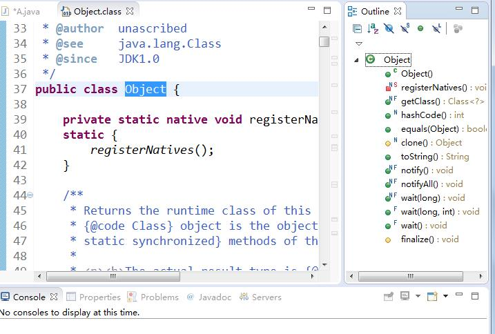
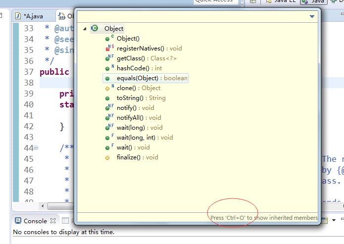
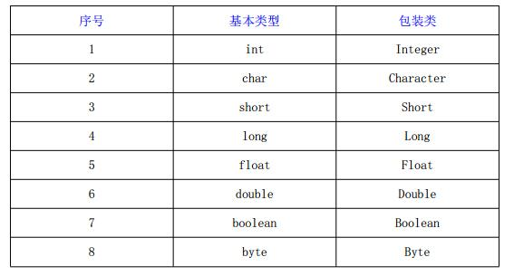

## 概念

面向对象这个概念，每本书上的说法定义很多。


我自己根据我的经验，自己归档总结了下，

所谓面向对象，就是 以基于对象的思维去分析和解决问题，万物皆对象；


面向对象经常和面向过程放一起讨论；


这里举例，

比如要造一辆自行车，假如以面向过程的思维搞，张三先搞轮子，

李四再搞车架，王五再搞链条，赵六再搞脚踏板...最终拼拼凑凑，搞出一辆勉强能骑的车；

但是，假如某个部件要调整下，其他部件要调整的东西太多了，有时候搞不好还得重头开始搞；

面向过程的缺点就是 扩展性 维护性差，但是也是有优点的，就是速度快；


假如以面向对象的思维造一辆自行车，说严谨点就是去设计一辆自行车；

我们首先要做的是分析一辆自行车所需要的部件，比如轮子，车架，链条，脚踏板等等；

然后分析和设计出每个部件的尺寸和用料；

然后是分配按照部件去实现，把每个部件分配给指定的人去做；

最后就是把所有已经完成的部件组装起来，就是一辆自行车；

这样做出来的自行车，维护性和扩展性都要比面向过程思维做出来的强；

唯一的缺点就是前期投入的时间长一点；


## 特性

Java面向对象三大特性；

 

**封装**：我们可以类，类里有方法，属性，可以封装很多功能 仅仅对外暴露一些接口，来实现模块化，组建化，和安全性；


**继承**：Java中的类可以继承，类似子女可以继承父母的东西；来实现可扩展；


**多态**：Java中的父类接口可以指向子类实现的引用；这个我们后面通过实例详细讲解；


以后三个特性很重要，我们后续章节通过实例详解；


## 类与对象

### 类与对象的关系

我们通俗的举个例子，比如人类是一种类，张三这个人就是人类的具体的一个个体，也就是java中的对象；这就是一个类与对象的关系；

### 类的定义

下面看实例

类的创建和使用

看下面实例

```java
package com.java1234.chap03.sec01;
 
/**
 * Person类 文件名和类名必须一致
 * @author user
 *
 */
public class Person {
 
    String name; // 在类中，定义一个姓名name字符串属性 可以存在字符串 类似"张三"
    int age; // 在类中，定义一个年龄age属性
     
    /**
     * 定义一个方法  public表示共有 权限最大  void表示返回值是空  speak是方法名 括号里可以加参数
     */
    public void speak(){
        System.out.println("我叫"+name+" 我今年"+age);
    }
     
    public static void main(String[] args) {
        // 定义一个Person类的对象zhangsan
        Person zhangsan;
        // 实例化对象
        zhangsan=new Person();
        // 给对象的name属性赋值
        zhangsan.name="张三";
        // 给对象的age属性赋值
        zhangsan.age=23;
        zhangsan.speak(); // 调用对象的方法
    }
}
```


### 内存分析


### 方法


方法是对象的一部分，也称为行为；


先来一个简单实例：

```java
package com.java1234.chap03.sec03;
 
public class Person {
 
    void speak(){
        System.out.println("我是张三");
    }
     
    public static void main(String[] args) {
        Person person=new Person();
        person.speak();
    }
}
```


上面这个是无参的方法，我们改下，改成有参数的，姓名我们调用方法的时候确定。加个姓名参数；


上代码：

```java
package com.java1234.chap03.sec03;
 
public class Person {
 
    void speak(String name){
        System.out.println(name);
    }
     
    public static void main(String[] args) {
        Person person=new Person();
        person.speak("张三");
    }
}
```


方法话，我们还可以有多个参数，逗号隔开，我们加一个年龄参数：

上代码：

```java
package com.java1234.chap03.sec03;
 
public class Person {
 
    void speak(String name,int age){
        System.out.println("我叫"+name+",我今年"+age+"岁了");
    }
     
    public static void main(String[] args) {
        Person person=new Person();
        person.speak("张三",23);
    }
}
```


还有我们假如要添加爱好，爱好个数不固定，这时候我们可以用不固定参数 

上代码：

```java

package com.java1234.chap03.sec03;
 
public class Person {
 
    void speak(String name,int age,String ...hobbies){
        System.out.println("我叫"+name+",我今年"+age+"岁了");
        for(String hobby:hobbies){
            System.out.println(hobby+" ");
        }
    }
     
    public static void main(String[] args) {
        Person person=new Person();
        person.speak("张三",23,"游泳","唱歌");
    }
}
```


方法的返回值：返回爱好的个数

上代码：

```java

package com.java1234.chap03.sec03;
 
public class Person {
 
    int speak(String name,int age,String ...hobbies){
        System.out.println("我叫"+name+",我今年"+age+"岁了");
        for(String hobby:hobbies){
            System.out.println(hobby+" ");
        }
        // 获取爱好的长度
        int totalHobbies=hobbies.length;
        return totalHobbies;
    }
     
    public static void main(String[] args) {
        Person person=new Person();
        int n=person.speak("张三",23,"游泳","唱歌");
        System.out.println("有"+n+"个爱好");
    }
}
```


当然返回类型这里是Int，也可以是String ,float等等 包括对象


### 方法的重载


所谓方法的重载，

类里面有两个或者多个重名的方法，但是方法的参数个数、类型、顺序至少有一个不一样，这时候局构成方法重载；


上代码：

```java
package com.java1234.chap03.sec03;
 
public class Demo01 {
 
    int add(int a,int b){
        System.out.println("方法一");
        return a+b;
    }
     
    /**
     * 方法的重载，参数个数不一样
     * @param a
     * @param b
     * @param c
     * @return
     */
    int add(int a,int b,int c){
        System.out.println("方法二");
        return a+b+c;
    }
     
    /**
     * 方法的重载，参数的类型不一样
     * @param a
     * @param b
     * @return
     */
    int add(int a,String b){
        System.out.println("方法三");
        return a+Integer.parseInt(b);
    }
     
    /**
     * 参数类型个数一样，返回值类型不一样 不算重载，直接会报错，说方法重名
     * @param args
     */
    /*long add(int a,int b){
        return a+b;
    }*/
     
    public static void main(String[] args) {
        Demo01 demo=new Demo01();
        System.out.println(demo.add(1, 2));
        System.out.println(demo.add(1, 2,3));
        System.out.println(demo.add(1, "3"));
    }
}
```


这里有个注意点 假如参数个数和类型一样，返回值不一样，不能算重载，直接是编译出错，编译器认为是方法重复了。


具体原因：我们给下实例代码：

```java

package com.java1234.chap03.sec03;
 
public class Demo01 {
 
    int add(int a,int b){
        System.out.println("方法一");
        return a+b;
    }
 
    /**
     * 参数类型个数一样，返回值类型不一样 不算重载，直接会报错，说方法重名
     * @param args
     */
    long add(int a,int b){
        return a+b;
    }
     
    public static void main(String[] args) {
        Demo01 demo=new Demo01();
        int m=demo.add(1, 2);  // 调用返回值是int类型的方法
        long n=demo.add(1, 2); // 调用返回值是long类型的方法
         
        demo.add(1, 2); // 假如这样些  编译器晕了，你TM是调用返回值是int类型还是long类型的方法
         
    }
}
```


假如调用方法 指定返回值类型，我们可以确定是调用的是某个方法，比如int m=demo.add(1,2) 因为是返回值m是int类型 那肯定

调用的是int add(int a,int b){ 方法  long n=demo.add(1, 2) 因为返回值n是long类型，那肯定调用的long add(int a,int b){


但是


假如直接 demo.add(1,2); 编译器就SB了，你TM是调用返回值是int类型的方法，还是返回值是long类型的方法；


### 静态方法和普通方法


所谓静态方法 是加了static修饰词的方法，我们使用的时候 一般用类名.方法 方式调用；

当然也可以用对象.方法 调用； 一般java里的工具类里的工具方法 用static修饰，作为静态方法；


上代码：

```java
package com.java1234.chap03.sec03;
 
public class Demo02 {
 
    void fun1(){
        System.out.println("这是一个普通方法");
    }
     
    static void fun2(){
        System.out.println("这是一个静态方法");
    }
     
    public static void main(String[] args) {
        Demo02 demo=new Demo02();
        // 调用普通方法  对象.方法
        demo.fun1();
         
        // 调用静态方法 类名.方法
        Demo02.fun2();
        demo.fun2();
    }
}
```


### 递归


递归，就是程序调用自身，我们讲的是方法递归调用，也就是在方法里自己调用自己；


我们给出一个案例，求阶乘  1*2*3*...*(n-1)*n 


我们用非递归和递归方式分别实现下，大家可以比较下；


我们先用非递归方式 大家肯定会想到用循环实现，


上代码：

```java

package com.java1234.chap03.sec03;
 
public class Demo03 {
 
    /**
     * 非递归
     * @param n
     * @return
     */
    static long notDiGui(int n){
        long result=1;
        for(int i=1;i<=n;i++){
            result=result*i;
        }
        return result;
    }
     
     
     
    public static void main(String[] args) {
        System.out.println(Demo03.notDiGui(5));
    }
}
```


递归的话 我们首先要找到规律 还有必须有一个出口；


我们来先说说规律 比如求5的阶乘


我们会发现规律 

n=5   F(n)=F(n-1)*5  即F(5)=F(4)*5

n=4   F(n)=F(n-1)*4  即F(4)=F(3)*4

n=3   F(n)=F(n-1)*3  即F(3)=F(2)*3

n=2   F(n)=F(n-1)*2  即F(2)=F(1)*2

n=1   1


上代码：

```java

package com.java1234.chap03.sec03;
 
public class Demo03 {
 
    /**
     * 递归方式
     * @param n
     * @return
     */
    static long diGui(int n){
        if(n==1){
            return 1;
        }
        return diGui(n-1)*n;
    }
     
     
    public static void main(String[] args) {
        System.out.println(Demo03.diGui(5));
    }
}
```


### 构造方法

概念：构造方法是一个特殊的方法，这个特殊方法用于创建实例时执行初始化操作；


上代码：

```java

package com.java1234.chap03.sec04;
 
/**
 * 定义人类
 * @author user
 *
 */
public class People {
 
    // 定义属性 
    private String name; // 实例化对象时，默认值是null
    private int age; // 实例化对象时，默认值是0
     
    /**
     * 默认构造方法
     */
    People(){
        System.out.println("默认构造方法！");
    }
     
 
     
    public void say(){
        System.out.println("我叫："+name+"，我今年："+age);
    }
     
    public static void main(String[] args) {
        People people=new People();
        people.say();
    }
}
```


运行输出：

```

默认构造方法！
我叫：null，我今年：0
```


这里我们发现： 实例化对象的时候，String类型的默认值是null，int基本类型的默认值是0 ;

People(){} 构造方法 

特点 1，没有返回值类型，区别于其他一般方法；

   2，方法名和类名一样；


我们现在可以写一个有参数的构造方法，用来初始化对象属性；

```java

package com.java1234.chap03.sec04;
 
/**
 * 定义人类
 * @author user
 *
 */
public class People {
 
    // 定义属性 
    private String name; // 实例化对象时，默认值是null
    private int age; // 实例化对象时，默认值是0
     
    /**
     * 默认构造方法
     */
    People(){
        System.out.println("默认构造方法！");
    }
     
    /**
     * 有参数的构造方法
     * @param name2
     * @param age2
     */
    People(String name2,int age2){
        System.out.println("调用的是有参数的构造方法");
        name=name2;
        age=age2;
    }
     
    public void say(){
        System.out.println("我叫："+name+"，我今年："+age);
    }
     
    public static void main(String[] args) {
        // People people=new People();
        People people=new People("张三",20);
        people.say();
    }
}
```


运行输出：

```
调用的是有参数的构造方法
我叫：张三，我今年：20
```


这里我们定义了一个有参数的构造方法，参数有name2 age2，当调用构造方法的时候，用于赋值给name和age属性；


注意点：

1，假如没有构造方法，系统会自动生成一个默认的无参构造方法；


上代码，我们去掉刚才定义的People(){} 

```java

package com.java1234.chap03.sec04;
 
/**
 * 定义人类
 * @author user
 *
 */
public class People {
 
    // 定义属性 
    private String name; // 实例化对象时，默认值是null
    private int age; // 实例化对象时，默认值是0
     
    /**
     * 默认构造方法
     */
    /*People(){
        System.out.println("默认构造方法！");
    }*/
     
    /**
     * 有参数的构造方法
     * @param name2
     * @param age2
     */
    /*People(String name2,int age2){
        System.out.println("调用的是有参数的构造方法");
        name=name2;
        age=age2;
    }*/
     
    public void say(){
        System.out.println("我叫："+name+"，我今年："+age);
    }
     
    public static void main(String[] args) {
        People people=new People();
        //People people=new People("张三",20);
        people.say();
    }
}
```


我们把两个构造方法备注了，运行的话，依然没问题。


2，假如有构造方法，系统不会自动生成构造方法；


假如我们单独去掉无参数的构造方法，上代码：

```java

package com.java1234.chap03.sec04;
 
/**
 * 定义人类
 * @author user
 *
 */
public class People {
 
    // 定义属性 
    private String name; // 实例化对象时，默认值是null
    private int age; // 实例化对象时，默认值是0
     
     
    /**
     * 有参数的构造方法
     * @param name2
     * @param age2
     */
    People(String name2,int age2){
        System.out.println("调用的是有参数的构造方法");
        name=name2;
        age=age2;
    }
     
    public void say(){
        System.out.println("我叫："+name+"，我今年："+age);
    }
     
    public static void main(String[] args) {
        People people=new People();
        //People people=new People("张三",20);
        people.say();
    }
}
```


我们会发现编译报错了：


The constructor People() is undefined

说找不到People()构造方法 


### this关键字

this表示当前对象

1，使用this调用本类中的属性；

2，使用this调用构造方法；


我们上面的例子

```java
People(String name2,int age2){
    System.out.println("调用的是有参数的构造方法");
    name=name2;
    age=age2;
}
```


构造方法的属性名和类里的属性名不一致； 假如说我们搞成一致；


这里警告的意思 是自己赋值给自己 没有意义，这里的name和age变量 作用范围在方法里 所以和类里的属性名搭不上边；

我们如何才行指定类里的属性呢，这时候this关键字派上用场了。


我们可以用this关键字类执行当前对象  this.属性 实现；


上代码：

```java
package com.java1234.chap03.sec04;
 
/**
 * 定义人类
 * @author user
 *
 */
public class People {
 
    // 定义属性 
    private String name; // 实例化对象时，默认值是null
    private int age; // 实例化对象时，默认值是0
     
    /**
     * 默认构造方法
     */
    /*People(){
        System.out.println("默认构造方法！");
    }*/
     
    /**
     * 有参数的构造方法
     * @param name
     * @param age
     */
    People(String name,int age){
        System.out.println("调用的是有参数的构造方法");
        this.name=name;
        this.age=age;
    }
     
    public void say(){
        System.out.println("我叫："+name+"，我今年："+age);
    }
     
    public static void main(String[] args) {
        // People people=new People();
        People people=new People("张三",20);
        people.say();
    }
}
```


假如在我们还有需求，在构造方法中调用另外一个构造方法，比如默认构造方法里是基本的初始化，有参数的构造方法是附加初始化，

再调用有参数的构造方法时候，我们先调用无参数构造方法，实现基本初始化，然后再进行附加初始化，这时候this关键字又派上用场了，

我们调用this()就是调用无参数构造方法，括号里也可以加参数，来调用有参数的构造方法，上代码：

```java

package com.java1234.chap03.sec04;
 
/**
 * 定义人类
 * @author user
 *
 */
public class People {
 
    // 定义属性 
    private String name; // 实例化对象时，默认值是null
    private int age; // 实例化对象时，默认值是0
     
    /**
     * 默认构造方法
     */
    People(){
        System.out.println("默认构造方法！");
    }
     
    /**
     * 有参数的构造方法
     * @param name
     * @param age
     */
    People(String name,int age){
        this(); // 调用无参数的构造方法
        System.out.println("调用的是有参数的构造方法");
        this.name=name;
        this.age=age;
    }
     
    public void say(){
        System.out.println("我叫："+name+"，我今年："+age);
    }
     
    public static void main(String[] args) {
        // People people=new People();
        People people=new People("张三",20);
        people.say();
    }
}
```


运行输出：

```

默认构造方法！
调用的是有参数的构造方法
我叫：张三，我今年：20
```


### 访问控制权限


Java中，可以通过一些Java关键字，来设置访问控制权限；

主要有 private(私有)， package(包访问权限)，protected(子类访问权限)，public(公共访问权限)


上图中，清晰的罗列了不同的访问控制权限在 类 包 子类的访问权限；

子类我们后面会讲解到，所以现在了解即可；


这里我们在讲下这个private，既然是私有的，那外界如何来访问它呢；


这时候我们要引入public 共有的get set方法；


比如我们定义一个类，类中有一个私有属性，我们可以定义他的get set方法；

上代码：

```java
package com.java1234.chap03.sec05;
 
public class Demo1 {
 
    /**
     * 定义一个私有的属性a
     */
    private int a;
 
    public int getA() {
        return a;
    }
 
    public void setA(int a) {
        this.a = a;
    }
     
     
}
```


我们写个测试类：

```java
package com.java1234.chap03.sec05;
 
public class TestDemo1 {
 
    public static void main(String[] args) {
        Demo1 demo1=new Demo1();
        demo1.setA(2);
        int a=demo1.getA();
        System.out.println(a);
    }
}
```


我们先设置，然后取值即可；


### 内部类


内部类定义：在类的内部定义的类；


内部类优点：可以方便的额使用外部类的属性；


内部类缺点：破坏类的基本结构；


个人建议，慎用内部类；


我们先来看一个示例：

```java

package com.java1234.chap03.sec06;
 
/**
 * 外部类
 * @author user
 *
 */
public class Outer {
 
    private int a=1;
     
    /**
     * 内部类
     * @author user
     *
     */
    class Inner{
        public void show(){
            System.out.println(a); // 可以方便的额使用外部类的属性；
        }
    }
     
    public void show(){
        Inner inner=new Inner();
        inner.show();
    }
     
    public static void main(String[] args) {
        Outer outer=new Outer();
        outer.show();
    }
}
```


这里我们间接的使用了调用了内部类里的方法；


我们下面再来写一个直接使用内部类里的方法的实例：


我们新建一个TestInner类：

写一个main方法 我们现在不使用Outer里的show()方法 我们要直接调用Inner里的show()方法，

```java
package com.java1234.chap03.sec06;
 
public class TestInner {
 
    public static void main(String[] args) {
        Outer outer=new Outer();
        Outer.Inner inner=outer.new Inner();
        inner.show();
    }
}
```


本来的话 Inner inner=new Inner()； 即可 但是Inner是内部类 所以java语法规则要求 要加下Outer.  以及outer.  前缀 一个是类名前缀 一个是对象前缀；


### 代码块


代码块主要就是通过{}花括号 括起来的代码；

主要分为 普通代码块 构造块 静态代码块三类。后面学到线程还有一个同步代码块，到时候再说；


#### 普通代码块

仅仅是花括号括起来的代码块，个人感觉作用不大，我们来看一个实例：

```java

package com.java1234.chap03.sec07;
 
public class Demo1 {
 
    public static void main(String[] args) {
        int a=1;
        /**
         * 普通代码块
         */
        {
            a=2;
            System.out.println("普通代码块");
        }
        System.out.println("a="+a);
    }
}
```


运行输出：

普通代码块

a=2


#### 构造块

 构造块作用就是扩展构造器功能 每次实例化对象都会执行构造块里的内容：

我们来看一个实例：

```java

package com.java1234.chap03.sec07;
 
public class Demo2 {
 
    /**
     * 构造块
     */
    {
        System.out.println("通用构造块！");
    }
     
    /**
     * 构造方法一
     */
    public Demo2(){
        System.out.println("构造方法一");
    }
     
    /**
     * 构造方法二
     */
    public Demo2(int i){
        System.out.println("构造方法二");
    }
     
    /**
     * 构造方法三
     */
    public Demo2(int i,int j){
        System.out.println("构造方法三");
    }
     
    public static void main(String[] args) {
        new Demo2();
        new Demo2(1);
        new Demo2(1,2);
    }
}
```


运行输出：

通用构造块！

构造方法一

通用构造块！

构造方法二

通用构造块！

构造方法三


我们发现 每次调用构造方法 都会先执行 构造块


#### 静态代码块

{}花括号前加static修饰词 在类加载的时候执行 而且只执行一次

我们看一个实例：

```java
package com.java1234.chap03.sec07;
 
public class Demo3 {
 
    /**
     * 静态代码块 类加载的时候执行
     */
    static{
        System.out.println("静态代码块！");  
    }
     
    /**
     * 构造块
     */
    {
        System.out.println("通用构造块！");
    }
     
    /**
     * 构造方法一
     */
    public Demo3(){
        System.out.println("构造方法一");
    }
     
    /**
     * 构造方法二
     */
    public Demo3(int i){
        System.out.println("构造方法二");
    }
     
    /**
     * 构造方法三
     */
    public Demo3(int i,int j){
        System.out.println("构造方法三");
    }
     
    public static void main(String[] args) {
        new Demo3();
        new Demo3(1);
        new Demo3(1,2);
    }
}
```


输出：

静态代码块！

通用构造块！

构造方法一

通用构造块！

构造方法二

通用构造块！

构造方法三


### package import关键字


package包关键字，在java中，有包的概念，主要是用来归类 分类作用；

便于项目的开发和维护；


这里截取随便截取一个我最近在开发的一个开源工作流项目：


这里的话 我们会看到dao service util controller包 这些包里都放着一些类，通过分包，可以很清晰的来管理类；


我们新建一个类Demo2：


在开头有个 package com.java1234.chap03.sec05; 指定了该类的包路径；


假如我们这个类里要引入sec04里的People类，我们要用到import导入包关键字；

我们先把People类里的构造方法改成公有，不然外面不能访问；


上代码：

```java
package com.java1234.chap03.sec05;
 
import com.java1234.chap03.sec04.People;
 
public class Demo2 {
 
    public static void main(String[] args) {
        People zhangsan=new People();
    }
}
```


这里的import com.java1234.chap03.sec04.People; 就是我们导入的包路径；


假如是同一个包中的类 是不需要用import导入的；

上代码：

```java
package com.java1234.chap03.sec05;
 
import com.java1234.chap03.sec04.People;
 
public class Demo2 {
 
    public static void main(String[] args) {
        // 不同的包下，则需要用import导入
        People zhangsan=new People();
        // 相同的包下，则不需要用import导入
        Demo1 demo1=new Demo1();
    }
}
```


### 类的继承

#### 继承定义以及基本使用

定义：子类能够继承父类的属性和方法；

注意点：Java中只支持单继承；

​     私有方法不能继承；

上代码：

```java
package com.java1234.chap03.sec09;
 
/**
 * 动物类
 * @author user
 *
 */
public class Animal {
 
    private String name; // 姓名
    private int age;  // 年龄
     
    public String getName() {
        return name;
    }
    public void setName(String name) {
        this.name = name;
    }
    public int getAge() {
        return age;
    }
    public void setAge(int age) {
        this.age = age;
    }
     
    public void say(){
        System.out.println("我是一个动物，我叫："+this.name+",我的年龄是："+this.age);
    }
}
```


我们定义一个Animal类 定义两个私有属性 name和age 然后给出共有的set get接口  以及一个共有的say()方法；


```java
package com.java1234.chap03.sec09;
 
/**
 * 定义Dog类，继承自Animal类
 * @author user
 *
 */
public class Dog extends Animal{
 
    public static void main(String[] args) {
        Dog dog=new Dog();
        dog.setName("Pick");
        dog.setAge(1);
        dog.say();
    }
}
```


我们再定义一个Dog类 通过extends关键字 继承Animal类；

我们实际上把父类Animal的共有方法get set以及say()方法都继承了；

运行输出：

我是一个动物，我叫：Pick,我的年龄是：1


#### 方法重写

所谓方法的重写 我们可以在子类中根据实际业务把父类的方法重写；

上代码：

```java
package com.java1234.chap03.sec09;
 
/**
 * 定义一个Cat类，继承自Animal
 * @author user
 *
 */
public class Cat extends Animal{
 
    /**
     * 重写父类的say方法
     */
    public void say(){
        System.out.println("我是一个猫，我叫："+this.getName()+",我的年龄是："+this.getAge());
    }
     
    public static void main(String[] args) {
        Cat cat=new Cat();
        cat.setName("Mini");
        cat.setAge(2);
        cat.say();
    }
}
```

这里 我们重写父类的say方法  改成 是猫  以及用getName和getAge，因为当前对象里继承不到父类的私有字段；


运行输出：

我是一个猫，我叫：Mini,我的年龄是：2


#### 对象实例过程以及super关键字

对象实例化 先实例化调用父类构造方法，再调用子类实例化构造方法；

super关键主要是调用父类方法或者属性；


我们修改下上面的实例：

```java
package com.java1234.chap03.sec09;
 
/**
 * 动物类
 * @author user
 *
 */
public class Animal {
 
    private String name; // 姓名
    private int age;  // 年龄
     
     
    /**
     * 无参父类构造方法
     */
    public Animal() {
        System.out.println("无参父类构造方法");
    }
     
    /**
     * 有参父类构造方法
     * @param name 姓名
     * @param age 年龄
     */
    public Animal(String name,int age) {
        System.out.println("有参父类构造方法");
        this.name=name;
        this.age=age;
    }
     
    public String getName() {
        return name;
    }
    public void setName(String name) {
        this.name = name;
    }
    public int getAge() {
        return age;
    }
    public void setAge(int age) {
        this.age = age;
    }
     
    public void say(){
        System.out.println("我是一个动物，我叫："+this.name+",我的年龄是："+this.age);
    }
}
```


```java

package com.java1234.chap03.sec09;
 
/**
 * 定义一个Cat类，继承自Animal
 * @author user
 *
 */
public class Cat extends Animal{
 
    private String address;
     
 
    public String getAddress() {
        return address;
    }
 
    public void setAddress(String address) {
        this.address = address;
    }
 
    public Cat() {
        super();
        System.out.println("子类无参构造方法");
    }
 
    public Cat(String name, int age,String address) {
        super(name, age);
        this.address=address;
        System.out.println("子类有参构造方法");
    }
 
    /**
     * 重写父类的say方法
     */
    public void say(){
        super.say(); // 调用父类的say()方法
        System.out.println("我是一个猫，我叫："+this.getName()+",我的年龄是："+this.getAge()+"，我来自："+this.getAddress());
    }
     
    public static void main(String[] args) {
        Cat cat=new Cat("Mini",2,"火星");
        /*cat.setName("Mini");
        cat.setAge(2);*/
        cat.say();
    }
}
```


运行输出：

有参父类构造方法

子类有参构造方法

我是一个动物，我叫：Mini,我的年龄是：2

我是一个猫，我叫：Mini,我的年龄是：2，我来自：火星


### final关键字


final是终结 完结的意思；


使用final声明的类不能被继承；

使用final声明的方法不能被子类覆盖；

使用final声明的变量不能被修改，即为常量；


1，final修饰类


我们建一个僵尸类：

```java
package com.java1234.chap03.sec10;
 
/**
 * 僵尸类
 * @author user
 *
 */
public final class JiangShi {
 
}
```


这类是final修饰的，我们再建一个Test类 继承JiangShi类：


我们发现 编译报错了 说不能继承final类；


2，final修饰方法


我们再新建一个类 ，加一个final方法：

```java
package com.java1234.chap03.sec10;
 
public class People {
 
    public final void action(){
        System.out.println("做一个良好公民！");
    }
}
```


我们搞一个类继承下People类：


我们发现，编译出错，说不能重写父类final方法；


3，final修饰的变量


我们在People类搞一个final属性，然后在方法里修改这个属性；


我们发现，编译出错，说final字段不能修改；


final修饰字段的时候 一般和static一起使用，来定义一些不可变的静态常量 方便程序使用；

```java

package com.java1234.chap03.sec10;
 
public class Common {
 
    /**
     * 静态常量
     */
    public static final String CHINA_CAPITAL="北京";
}
```


我们调用的话 直接类名.属性 即可；

```java
package com.java1234.chap03.sec10;
 
public class Test{
 
    public static void main(String[] args) {
        System.out.println(Common.CHINA_CAPITAL);
    }
}
```


### 抽象类


定义：在java中，含有抽象方法的类称为抽象类，同样不能生成对象；

注意点：

1，包含一个抽象方法的类是抽象类；

2，抽象类和抽象方法都要用abstract关键字修饰；

3，抽象方法只需要声明而不需要实现；

4，抽象类必须被子类（假如不是抽象类）必须重写抽象中的全部抽象方法；

5，抽象类不能被实例化；


我们先来定义一个抽象类：

```java
package com.java1234.chap03.sec11;
 
/**
 * 定义一个抽象类People
 * @author user
 *
 */
public abstract class People {
 
    private String name;
 
    public String getName() {
        return name;
    }
 
    public void setName(String name) {
        this.name = name;
    }
     
    public void say(){
        System.out.println("我的姓名是："+this.getName());
    }
     
    /**
     * 定义一个抽象方法 职业 让子类去具体实现
     */
    public abstract void profession();
     
}
```


抽象类，定义一个属性name 以及方法say() 再定义一个抽象方法 profession 具体实现让子类去实现；


我们搞一个测试类：

我么尝试下实例化下People类：


我们会看到 编译出错，不能实例化People类；


我们定义一个Student类，以及一个Teacher类：

```java
package com.java1234.chap03.sec11;
 
public class Student extends People{
 
    @Override
    public void profession() {
        System.out.println("职业是：学生");
    }
 
}
```


```java
package com.java1234.chap03.sec11;
 
public class Teacher extends People{
 
    @Override
    public void profession() {
        System.out.println("职业是：老师");
    }
 
}
```


我们搞一个测试类：

```java
package com.java1234.chap03.sec11;
 
public class Test {
 
    public static void main(String[] args) {
         
        Student student=new Student();
        student.profession();
         
        Teacher teacher=new Teacher();
        teacher.profession();
         
    }
}
```


运行输出：

职业是：学生

职业是：老师


### 接口


接口定义：一种特殊的“抽象类”，没有普通方法，由全局常量和公共的抽象方法所组成；


#### 接口的定义

接口定义用关键字 interface


我们给下实例代码：

```java
package com.java1234.chap03.sec12;
 
/**
 * 定义一个接口A
 * @author user
 *
 */
public interface A {
 
    /**
     * 全局常量
     */
    public static final String TITLE="www.java1234.com";
     
    /**
     * 定义一个抽象方法 abstract可以省略  
     */
    public abstract void a();
}
```


注意点：由于接口里的方法都是抽象的，所以abstract可以省略，实际开发一般都是省略的，开发者的习惯；


#### 实现接口 

可以实现一个或者多个接口

实现接口我们用implements关键字，我们来搞一个测试方法：

```java
package com.java1234.chap03.sec12;
 
public class Test implements A{
 
    @Override
    public void a() {
        System.out.println("a方法");
    }
 
    public static void main(String[] args) {
        Test t=new Test();
        t.a();
        System.out.println(Test.TITLE);
    }
}
```


实现接口 ，类里要实现接口里的抽象方法；

运行输出：

```
a方法
www.java1234.com
```


为了演示实现多个接口，我们这里再定义一个接口：

```java
package com.java1234.chap03.sec12;
 
/**
 * 定义一个接口B
 * @author user
 *
 */
public interface B {
 
    /**
     * 全局常量
     */
    public static final String TITLE2="java知识分享网";
     
    /**
     * 定义一个抽象方法 abstract可以省略  
     */
    public abstract void b();
}
```


我们修改下Test类：

```java
package com.java1234.chap03.sec12;
 
public class Test implements A,B{
 
    @Override
    public void a() {
        System.out.println("a方法");
    }
     
    @Override
    public void b() {
        System.out.println("b方法");
    }
 
    public static void main(String[] args) {
        Test t=new Test();
        t.a();
        t.b();
        System.out.println(Test.TITLE);
        System.out.println(Test.TITLE2);
    }
 
     
}
```


实现多个接口，中间用逗号隔开，并且实现所有抽象方法：

运行输出：

```
a方法

b方法

www.java1234.com

java知识分享网

```


#### 继承类和实现接口 

> 先继承，后实现接口

我们先定义一个类C：

```java
package com.java1234.chap03.sec12;
 
public class C {
 
    public void c(){
        System.out.println("c方法");
    }
}
```


我们再修改下测试类Test 继承C类，实现A,B接口，这里有个注意点，java规范，必须先继承后实现接口；

我们上下代码：

```java
package com.java1234.chap03.sec12;
 
public class Test extends C implements A,B{
 
    @Override
    public void a() {
        System.out.println("a方法");
    }
     
    @Override
    public void b() {
        System.out.println("b方法");
    }
 
    public static void main(String[] args) {
        Test t=new Test();
        t.a();
        t.b();
        t.c();
        System.out.println(Test.TITLE);
        System.out.println(Test.TITLE2);
    }
 
     
}
```


运行输出：

```
a方法

b方法

c方法

www.java1234.com

java知识分享网
```


#### 接口的继承  

> 接口可以多继承

我们定义一个D接口 继承A,B接口：

```java
package com.java1234.chap03.sec12;
 
public interface D extends A,B{
 
    public void d();
}
```

这里再加一个d方法；


我们重新搞一个测试方法 继承C类，实现D接口：

```java
package com.java1234.chap03.sec12;
 
public class Test2 extends C implements D{
 
    @Override
    public void a() {
        System.out.println("a方法");
    }
 
    @Override
    public void b() {
        System.out.println("b方法");
    }
 
    @Override
    public void d() {
        System.out.println("d方法");
    }
 
    public static void main(String[] args) {
        Test2 t=new Test2();
        t.a();
        t.b();
        t.c();
        t.d();
        System.out.println(Test2.TITLE);
        System.out.println(Test2.TITLE2);
    }
}
```


运行输出：

```
a方法

b方法

c方法

d方法

www.java1234.com

java知识分享网
```


### 对象的多态性


Java中的多态性表现：

1，方法的重载和重写；

2，可以用父类的引用指向子类的具体实现，而且可以随时更换为其他子类的具体实现；


我们先搞个父类Animal:

```java
package com.java1234.chap03.sec13;
 
public class Animal {
 
    public void say(){
        System.out.println("我是一个动物");
    }
}
```


再搞两个子类，分别是Dog和Cat类，重写父类方法say：

```java
package com.java1234.chap03.sec13;
 
public class Cat extends Animal{
 
    public void say(){
        System.out.println("我是一个猫");
    }
}
```


```java
package com.java1234.chap03.sec13;
 
public class Dog extends Animal{
 
    public void say(){
        System.out.println("我是一个狗");
    }
}
```


然后我们写个Test测试类：

```java
package com.java1234.chap03.sec13;
 
public class Test {
 
    public static void main(String[] args) {
        Dog dog=new Dog();
        dog.say();
         
        Cat cat=new Cat();
        cat.say();
    }
}
```


运行输出：

我是一个狗

我是一个猫


这个大家肯定能看明白 简单的子类继承 以及实例化对象 调用方法 ；


下面我来用多态测试，父类引用指向子类具体实现：

```java
package com.java1234.chap03.sec13;
 
public class Test {
 
    public static void main(String[] args) {
        // 父类引用指向Dog子类的具体实现
        Animal animal=new Dog();
        animal.say();
         
        // 更换实现
        animal=new Cat();
        animal.say();
    }
}
```


运行输出：

我是一个狗

我是一个猫


对象的转型：

向上转型：子类对象->父类对象 安全

向下转型：父类对象->子类对象 不安全


比如上面的实例：Animal animal=new Dog(); 就是后面的new Dog() 子类对象 向上  Animail animal 转型  是安全的；


向下转型 是父类对象强制转换成子类对象：我们来改下Test类：

```java
package com.java1234.chap03.sec13;
 
public class Test {
 
    public static void main(String[] args) {
        // 父类引用指向Dog子类的具体实现
        Animal animal=new Dog();
        animal.say();
         
        // 向下转型
        Dog dog=(Dog) animal;
        dog.say();
         
        // 向下转型  因为animal指向的是Dog具体实现 所以会报错
        Cat cat=(Cat)animal;
        cat.say();
    }
}
```


运行报错：

我是一个狗

我是一个狗

Exception in thread "main" java.lang.ClassCastException: com.java1234.chap03.sec13.Dog cannot be cast to com.java1234.chap03.sec13.Cat

​	at com.java1234.chap03.sec13.Test.main(Test.java:15)


转换异常 所以说向下转型是不安全的，我们必须知道具体的实现类；


我们上面用的继承方式演示了多态 其实在实际开发中 更多的是用接口：

我们再写一个实例：

我们先建一个父类接口People:

```java
package com.java1234.chap03.sec13;
 
public interface People {
 
    public void say();
}
```


接下来写两个具体实现类,Student Teacher：

```java
package com.java1234.chap03.sec13;
 
public class Student implements People{
 
    @Override
    public void say() {
        System.out.println("我是学生");
    }
 
}
```


```java
package com.java1234.chap03.sec13;
 
public class Teacher implements People{
 
    @Override
    public void say() {
        System.out.println("我是老师");
    }
 
}
```


我们来写一个测试类：

```java
package com.java1234.chap03.sec13;
 
public class Test2 {
 
    public static void main(String[] args) {
        People p1=new Student();
        p1.say();
         
        p1=new Teacher();
        p1.say();
    }
}
```


运行输出：

我是学生

我是老师


### Object类


Object类是所有类的父类；


Object类的常用方法

1，public String toString() 返回该对象的字符串表示。

2，public boolean equals(Object obj) 指示其他某个对象是否与此对象“相等”


我们上一个示例：

```java
package com.java1234.chap03.sec14;
 
public class A{
 
    /**
     * Object是所有类的父类
     */
    public A() {
        super();
        // TODO Auto-generated constructor stub
    }
 
}
```


我们alt+shift+s 弹出菜单 ，然后Generate Constructors from Superclass 自动从父类生成构造方法，这里的super() 我们鼠标先移动上去

然后按住ctrl，然后点进去，会进入到Object类：




我们可以看到父类Object所有的方法，当然我们也可以通过ctrl+o 弹出outline，




接下来讲toString()方法：

我们先上一个类：

```java
package com.java1234.chap03.sec14;
 
public class People {
 
    private String name;
 
    public People(String name) {
        super();
        this.name = name;
    }
 
    public String getName() {
        return name;
    }
 
    public void setName(String name) {
        this.name = name;
    }
 
    public static void main(String[] args) {
        People p1=new People("张三");
        System.out.println(p1);
        System.out.println(p1.toString());
    }
}
```


 

定义了一个name属性 生成了get set方法 以及main方法测试 


运行输出:

com.java1234.chap03.sec14.People@15db9742

com.java1234.chap03.sec14.People@15db9742


输出对象，默认调用的是toString()方法；


这里我们通过修改toString()实现，来实现输出对象的结果：

```java
@Override
public String toString() {
    // TODO Auto-generated method stub
    return super.toString();
}
```


这里调用的是Object默认实现，我们来修改下：

```java
package com.java1234.chap03.sec14;
 
public class People {
 
    private String name;
 
    public People(String name) {
        super();
        this.name = name;
    }
 
    public String getName() {
        return name;
    }
 
    public void setName(String name) {
        this.name = name;
    }
     
     
    @Override
    public String toString() {
        return this.getName();
    }
 
    public static void main(String[] args) {
        People p1=new People("张三");
        System.out.println(p1);
        System.out.println(p1.toString());
    }
}
```


运行输出：

张三

张三


实际开发中，有时候也会用到；需要掌握；


最后说下equals 是比较对象的引用，是否指向同一个堆内存；

我们上下代码：

```java
package com.java1234.chap03.sec14;
 
public class People {
 
    private String name;
 
    public People(String name) {
        super();
        this.name = name;
    }
 
    public String getName() {
        return name;
    }
 
    public void setName(String name) {
        this.name = name;
    }
     
 
    public static void main(String[] args) {
        People p1=new People("张三");
        People p2=new People("张三");
        System.out.println(p1.equals(p2));
    }
}
```


运行输出：

false


我们来重写下equals方法，来实现比较具体内容：

```java
package com.java1234.chap03.sec14;
 
public class People {
 
    private String name;
 
    public People(String name) {
        super();
        this.name = name;
    }
 
    public String getName() {
        return name;
    }
 
    public void setName(String name) {
        this.name = name;
    }
     
     
 
    @Override
    public boolean equals(Object obj) {
        String name=((People)obj).getName();
        return this.name==name;
    }
 
    public static void main(String[] args) {
        People p1=new People("张三");
        People p2=new People("张三");
        People p3=new People("李四");
        System.out.println("p1.equals(p2):"+p1.equals(p2));
        System.out.println("p1.equals(p3):"+p1.equals(p3));
    }
}
```


运行输出：

p1.equals(p2):true

p1.equals(p3):false


### instanceof关键字


作用：判断一个对象是否属于一个类

格式：对象 instanceof 类 返回布尔类型


我们先来建一个父类Animal，以及子类Dog，Cat类：

```java
package com.java1234.chap03.sec14;
 
public class Animal {
 
    public void say(){
        System.out.println("我是一个动物");
    }
}
```


```java

package com.java1234.chap03.sec14;
 
public class Dog extends Animal{
 
    public void say(){
        System.out.println("我是一只狗");
    }
}
```


```java
package com.java1234.chap03.sec14;
 
public class Cat extends Animal{
 
    public void say(){
        System.out.println("我是一只猫");
    }
}
```


我们搞个测试类：

```java

package com.java1234.chap03.sec14;
 
public class Test {
 
    public static void main(String[] args) {
        Animal dog=new Dog();
        System.out.println("dog对象是否属于Animal类："+(dog instanceof Animal));
        System.out.println("dog对象是否属于Dog类："+(dog instanceof Dog));
        System.out.println("dog对象是否属于Cat类："+(dog instanceof Cat));
    }
}
```


运行输出：

dog对象是否属于Animal类：true

dog对象是否属于Dog类：true

dog对象是否属于Cat类：false


通过instanceof我们可以确保向下转型的不出问题；


我们给Dog类，Cat类加各自的方法；

```java
package com.java1234.chap03.sec14;
 
public class Dog extends Animal{
 
    public void say(){
        System.out.println("我是一只狗");
    }
     
    public void f1(){
        System.out.println("汪汪...");
    }
}
```


```java
package com.java1234.chap03.sec14;
 
public class Cat extends Animal{
 
    public void say(){
        System.out.println("我是一只猫");
    }
     
    public void f2(){
        System.out.println("我喜欢吃鱼");
    }
}
```


```java
package com.java1234.chap03.sec14;
 
public class Test {
 
    public static void doSomeThing(Animal animal){
        animal.say();
        if(animal instanceof Dog){
            ((Dog) animal).f1();
        }else if(animal instanceof Cat){
            ((Cat) animal).f2();
        }
    }
     
    public static void main(String[] args) {
        Animal dog=new Dog();
        System.out.println("dog对象是否属于Animal类："+(dog instanceof Animal));
        System.out.println("dog对象是否属于Dog类："+(dog instanceof Dog));
        System.out.println("dog对象是否属于Cat类："+(dog instanceof Cat));
         
        doSomeThing(new Dog());
        doSomeThing(new Cat());
    }
}
```


运行输出：

dog对象是否属于Animal类：true

dog对象是否属于Dog类：true

dog对象是否属于Cat类：false

我是一只狗

汪汪...

我是一只猫

我喜欢吃鱼


### 匿名内部类


内部类前面我们讲过了 就是类的内部再定义类；

匿名内部类 这里指的是实例化内部对象 就是没有名字的内部类；


作用：假如某个类只使用一次，则可以使用匿名内部类；


我们来看一个具体实例：

先定义一个接口：

```java
package com.java1234.chap03.sec16;
 
public interface A {
 
    public void a();
}
```


在定义一个具体实现类：

```java
package com.java1234.chap03.sec16;
 
public class B implements A{
 
    @Override
    public void a() {
        System.out.println("a方法");
    }
 
}
```


我们来写个简单的测试类：

```java

package com.java1234.chap03.sec16;
 
public class Test {
 
    public void test(A a){
        a.a();
    }
     
    public static void main(String[] args) {
        Test t=new Test();
        t.test(new B());
         
         
    }
}
```


运行输出：

a方法


假如，我们这个地方仅仅调用一次一个test，并且没有A接口的具体实现类，这时候，匿名内部类就派上用场了；

```java
package com.java1234.chap03.sec16;
 
public class Test {
 
    public void test(A a){
        a.a();
    }
     
    public static void main(String[] args) {
        Test t=new Test();
        t.test(new B());
         
        // 匿名内部类
        t.test(new A(){
 
            @Override
            public void a() {
                System.out.println("匿名内部类，一次性使用");
            }
             
        });
    }
}
```


运行输出：

a方法

匿名内部类，一次性使用


这里我们直接new 接口名字即可 然后写上实现方法  之所以说匿名内部类，我们这里压根没有定义类似 A a=new B()的a对象；


### 包装类


每个基本类型都有一个对应的类；就是所谓的包装类；



#### 装箱和拆箱

基本类型和类类型可以相互转换；

基本类型到类类型的转换叫做装箱；

类类型到基本类型的转换叫做拆箱；


我们上下示例代码：

```java
package com.java1234.chap03.sec17;
 
public class Demo1 {
 
    public static void main(String[] args) {
        int a=1;
        Integer i=new Integer(a); // 装箱
        int b=i.intValue(); // 拆箱
        System.out.println("a="+a);
        System.out.println("i="+i);
        System.out.println("b="+b);
    }
}
```


运行输出：

a=1

i=1

b=1


#### 自动装箱和拆箱

在类类型和基本类型的转换中，是自动转换的 无需强制类型转换；

我们上下示例代码：

```java
package com.java1234.chap03.sec17;
 
public class Demo2 {
 
    public static void main(String[] args) {
        Integer i=1; // 自动装箱的过程 自动把基本类型转换成类类型
        int i2=i; // 自动拆箱的过程 自动把类类型转成基本类型
        System.out.println("i="+i);
        System.out.println("i2="+i2);
    }
}
```


运行输出：

i=1

i2=1


#### 包装类的作用

这里说说包装类的作用，因为包装类是类类型 所有jdk里提供了很多有用的方法给我们用；

比如从用户界面来两个字符串数据a,b 然后我们程序里要进行相加运算。这时候包装类就派上用场了，

我们可以用包装类的方法类进行类型转换。我们看下示例代码：

```java
package com.java1234.chap03.sec17;
 
public class Demo3 {
 
    public static void main(String[] args) {
        String a="3";
        String b="5";
        int m=Integer.valueOf(a); // 调用Integer类的valueOf方法 把字符串类型转换成int类型
        int n=Integer.valueOf(b);
        System.out.println("a+b="+(m+n));
    }
}
```


运行输出：

a+b=8


### 设计模式

#### 单例模式


在长期的程序设计过程中，开发者们总结出了很多设计经验，最终经过整理和优化，变成了如今的设计模式；


设计模式有很多 有单例，工厂，代理等等。这里推荐一本关于Java设计模式的书籍 Head First设计模式


今天我们这里讲解的是最常用的单例模式；


在Java应用中，单例对象能保证在一个JVM中，该对象只有一个实例存在；

有两种实现，一种是饿汉式，一种是懒汉式；


我们上下代码，先上 饿汉式实现：

```java
package com.java1234.chap03.sec18;
 
public class Singleton {
 
    /**
     * 构造方法私有
     */
    private Singleton(){
         
    }
     
    /**
     * 饿汉式单例实现
     */
    private static final Singleton single=new Singleton();
     
    /**
     * 获取实例
     */
    public static Singleton getInstance(){
        return single;
    }
}
```


这里我们构造方法私有 这样就保证了在外部是无法来实例化对象；

然后我们先在内部定义一个静态常量对象，然后再写一个static方法 来返回这个对象，这样就保证是一个对象了；


```java
package com.java1234.chap03.sec18;
 
public class Test {
 
    public static void main(String[] args) {
        Singleton singleton1=Singleton.getInstance();
        Singleton singleton2=Singleton.getInstance();
        System.out.println(singleton1==singleton2);
    }
}
```


运行输出：

true


这里获取里两个对象 我们前面讲过 用“==”来判断对象是否指向同一个内存区域，这里返回true，说明是同一个对象；


我们这里再来实现下 懒汉式子：

```java
package com.java1234.chap03.sec18;
 
public class Singleton2 {
 
    /**
     * 构造方法私有
     */
    private Singleton2(){
         
    }
     
    /**
     * 懒汉式单例实现 在第一次调用的时候实例化
     */
    private static Singleton2 single;
     
    /**
     * 获取实例
     */
    public synchronized static Singleton2 getInstance(){
        if(single==null){
            System.out.println("第一次调用的实例化");
            single=new Singleton2();
        }
        return single;
    }
}
```


我们可以看到 区别  饿汉式是先定义实例的 而懒汉式是先定义引用，当第一次调用getInstance的时候 进行对象实例化操作；

当然这里我们考虑到多并发的情况 多个线程同时调用这个方法的时候，会出现问题，所以我们加了同步锁 synchronized 来保证

同一时刻只有一个线程进入方法；


再上下测试类：

```java
package com.java1234.chap03.sec18;
 
public class Test {
 
    public static void main(String[] args) {
        Singleton singleton1=Singleton.getInstance();
        Singleton singleton2=Singleton.getInstance();
        System.out.println("饿汉式："+(singleton1==singleton2));
         
        Singleton2 singleton3=Singleton2.getInstance();
        Singleton2 singleton4=Singleton2.getInstance();
        System.out.println("懒汉式："+(singleton3==singleton4));
         
    }
}
```


运行输出：

饿汉式：true

第一次调用的实例化

懒汉式：true