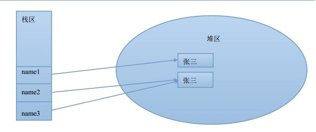
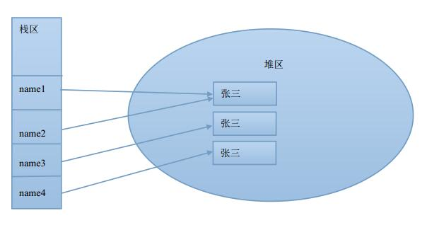
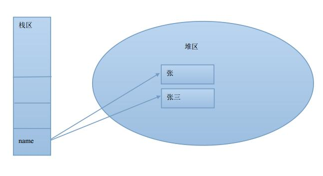
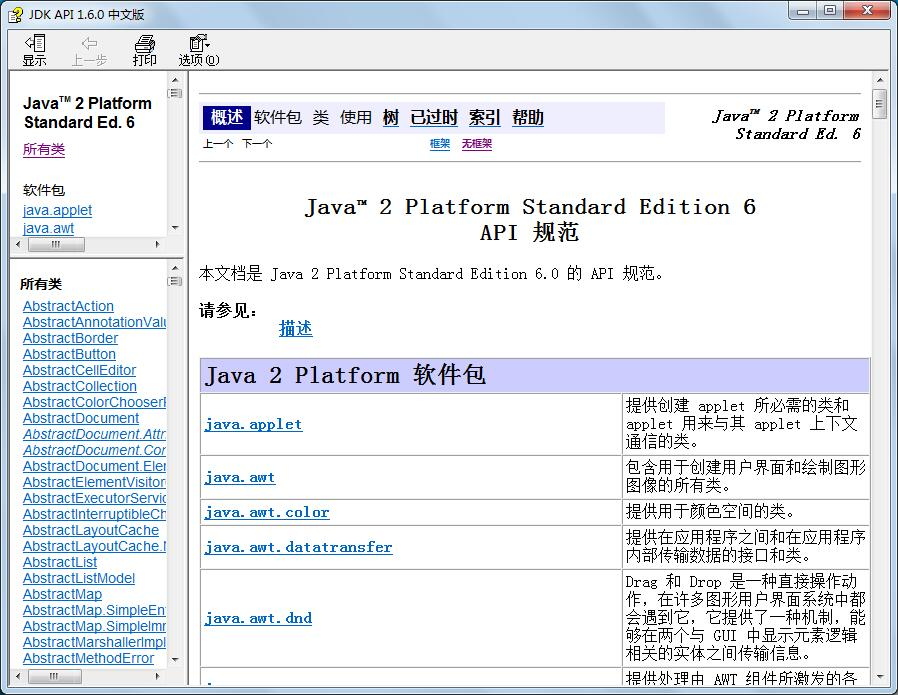
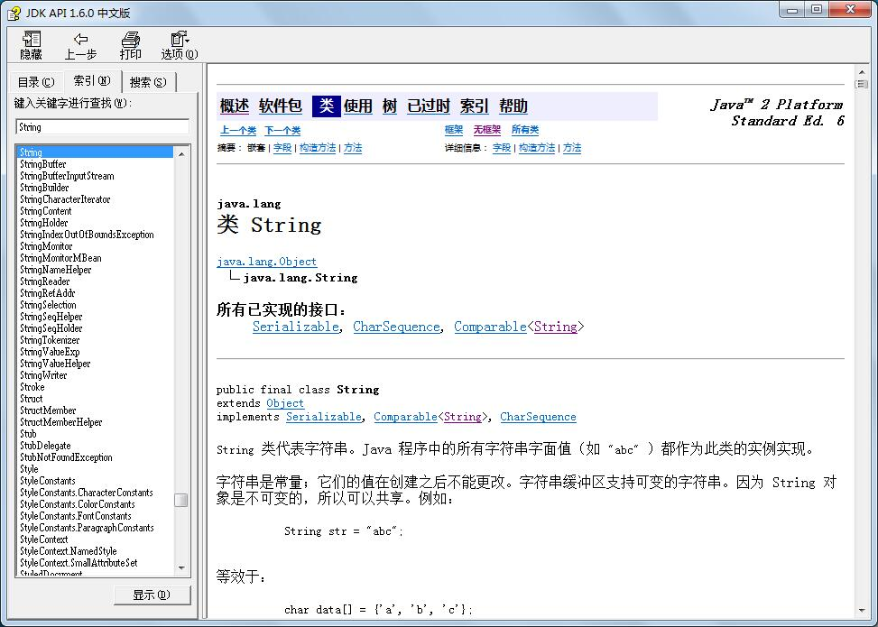

## 实例化String对象

有两种方式，我们直接看代码：

```java
package com.java1234.chap03.sec08;
 
public class Demo1 {
 
    public static void main(String[] args) {
        // 实例化String的方式一
        String name1="张三";
        System.out.println("name1="+name1);
         
        // 实例化String的方式二
        String name2=new String("李四");
        System.out.println("name2="+name2);
    }
}
```


运行输出：

name1=张三

name2=李四


## “==” 和 “equals()”

“==” 比较的是引用(是否指向同一个内存块)  “equals”比较的是具体内容

我们上下代码：

```java
package com.java1234.chap03.sec08;
 
public class Demo2 {
 
    public static void main(String[] args) {
        String name1="张三";  // 直接赋值方式
        String name2=new String("张三"); // new方式
        String name3=name2; // 传递引用
         
        // ==比较的是引用
        System.out.println("name1==name2:"+(name1==name2));
        System.out.println("name1==name3:"+(name1==name3));
        System.out.println("name2==name3:"+(name2==name3));
         
        // equals比较的是具体内容
        System.out.println("name1.equals(name2):"+(name1.equals(name2)));
        System.out.println("name1.equals(name3:"+(name1.equals(name3)));
        System.out.println("name2.equals(name3):"+(name2.equals(name3)));
    }
}
```


运行输出：

name1==name2:false

name1==name3:false

name2==name3:true

name1.equals(name2):true

name1.equals(name3:true

name2.equals(name3):true


我们给下内存示意图：



## 两种实例化方式的区别

直接赋值方式，创建的对象存放到字符串对象池里，假如存在的，就不会再创建；

new对象方式，每次都创建一个新的对象；

我们上一个示例：

```java
package com.java1234.chap03.sec08;
 
public class Demo3 {
 
    public static void main(String[] args) {
        String name1="张三";
        String name2="张三";
        String name3=new String("张三");
        String name4=new String("张三");
         
        System.out.println("name1==name2:"+(name1==name2));
        System.out.println("name1==name3:"+(name1==name3));
        System.out.println("name3==name4:"+(name3==name4));
    }
     
}
```

运行输出：

name1==name2:true

name1==name3:false

name3==name4:false

我们给下内存示意图：




## 字符串的内容不可变性

字符串的特性：不能改变字符串的内容；

要想改变，只能通过指向一个新的内存地址；

我们给下代码：

```java
package com.java1234.chap03.sec08;
 
public class Demo4 {
 
    public static void main(String[] args) {
        String name="张";
        name+="三";
        System.out.println(name);
    }
}
```


这里我们修改了name，本质的话name指向了一个新的内存区域，我们给下内存示意图：



## 常用方法及基本使用


我们首先来学习基本使用Jdk api chm文档：

我们这里推荐使用1.6 是中文的。下载地址：<http://www.java1234.com/a/javaziliao/shuji/2013/0506/355.html>


我们双击打开：




我们点击 左上角 显示：




输入String 搜索 然后我们会在右侧找到String类的描述，可以查到String类的所有信息 包括描述 方法 属性；


这里介绍一些String类的常用方法：


### char chartAt(int index)

####  返回指定索引处的char值

这里的index 是从0开始的；

我们先上下实例：

```java
package com.java1234.chap03.sec08;
 
public class Demo5 {
 
    public static void main(String[] args) {
        String name="张三";
        char ming=name.charAt(1);
        System.out.println(ming);
         
        String str="我是中国人";
        for(int i=0;i<str.length();i++){
            System.out.println(str.charAt(i));
        }
    }
}
```


运行输出：

三

我

是

中

国

人


### int length() 

#### 返回字符串的长度

在前面一个例子里我们已经演示了；


### int indexOf(int ch) 

#### 返回指定字符在此字符串中第一次出现处的索引

```java
package com.java1234.chap03.sec08;
 
public class Demo06 {
 
    public static void main(String[] args) {
        // indexOf方法使用实例
        String str="abcdefghijdklmoqprstuds";
        System.out.println("d在字符串str中第一次出现的索引位置："+str.indexOf('d'));
        System.out.println("d在字符串str中第一次出现的索引位置,从索引4位置开始："+str.indexOf('d',4));
    }
}
```


### String substring(int beginIndex)   

#### 返回一个新的字符串，它是此字符串的一个子字符串

```java
package com.java1234.chap03.sec08;
 
public class Demo07 {
 
    public static void main(String[] args) {
        // substring方式读取
        String str="不开心每一天";
        String str2="不开心每一天，不可能";
        String newStr=str.substring(1);
        System.out.println(newStr);
        String newStr2=str2.substring(1, 6);
        System.out.println(newStr2);
    }
}
```


### public String toUpperCase() 

####  String 中的所有字符都转换为大写

```java

package com.java1234.chap03.sec08;
 
public class Demo08 {
 
    public static void main(String[] args) {
        String str="I'm a boy!";
        String upStr=str.toUpperCase(); // 转成大写
        System.out.println(upStr);
        String lowerStr=upStr.toLowerCase(); // 转成小写
        System.out.println(lowerStr);
    }
}
```

