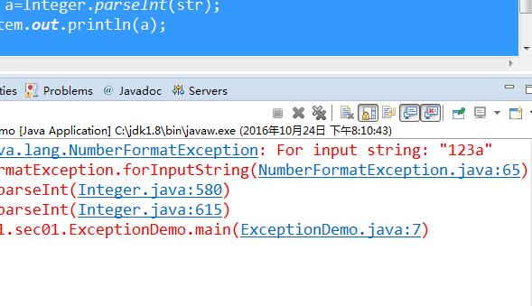
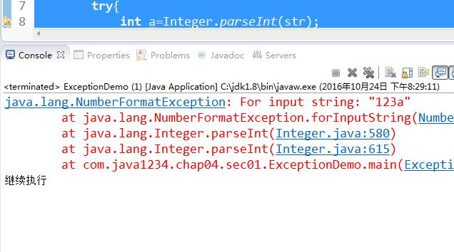
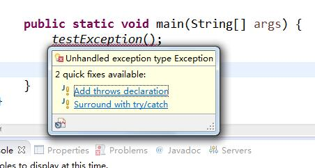

## 异常的概念


程序在执行过程中，出现意外，我们专业属于叫做出现了异常；类似开车路上出了交通事故；


举例：

```java
package com.java1234.chap01.sec01;
 
public class ExceptionDemo {
 
    public static void main(String[] args) {
        String str="123";
        int a=Integer.parseInt(str);
        System.out.println(a);
    }
}
```


这个代码执行是没问题的，运行输出：

123


假如我们把123改成123a

```java
package com.java1234.chap01.sec01;
 
public class ExceptionDemo {
 
    public static void main(String[] args) {
        String str="123a";
        int a=Integer.parseInt(str);
        System.out.println(a);
    }
}
```


运行 报错了：




数字格式化异常，只要出了异常 ，下面的输出语句也没执行 程序终止了。


## 捕获和处理异常


java程序中的异常我们可以捕获然后处理，这样后面的程序就可以继续执行了；

类似出了交通事故，交警立马出动 拖车的拖车 调解的调解 很快恢复路段行驶；


在java中，我们用try-catch来捕获异常 

try...cacth...finally


前面的代码我们用try...catch...来捕获下

```java
package com.java1234.chap04.sec01;
 
public class ExceptionDemo {
 
    public static void main(String[] args) {
        String str="123a";
        try{
            int a=Integer.parseInt(str);          
        }catch(NumberFormatException e){
            e.printStackTrace();
        }
        System.out.println("继续执行");
    }
}
```


运行结果：




我们发现 虽然报错了 但是程序依然继续执行了；


当然通过查看jdk api，我们发现Exception是异常类的老祖宗，在捕获异常的时候，假如我们不确定会抛出什么异常，

我们可以写多个异常捕获：

类似如下代码：

```java
package com.java1234.chap04.sec02;
 
public class Demo1 {
 
    public static void main(String[] args) {
        String str="123a";
        try{
            int a=Integer.parseInt(str);          
        }catch(NullPointerException e){
            e.printStackTrace();
        }catch(NumberFormatException e){
            e.printStackTrace();
        }catch(Exception e){
            e.printStackTrace();
        }
        System.out.println("继续执行");
    }
}
```


注意 由上往下的异常 必须范围同级别或者更高；否则编译报错；


try...cacth...finally 假如我们有种需求，不管有没有发生异常，比如执行某些代码，这时候，

finally就派上用场了；

我们给下实例，视频中会详细讲述：

```java
package com.java1234.chap04.sec02;
 
public class Demo2 {
 
    public static void testFinally(){
        String str="123a";
        try{
            int a=Integer.parseInt(str);
            System.out.println(a);
        }catch(Exception e){
            e.printStackTrace();
            System.out.println("exception");
            return;
        }finally{
            System.out.println("finally end");
        }
        System.out.println("end");
    }
     
    public static void main(String[] args) {
        testFinally();
    }
}
```


运行输出：

```

java.lang.NumberFormatException: For input string: "123a"
    at java.lang.NumberFormatException.forInputString(NumberFormatException.java:65)
    at java.lang.Integer.parseInt(Integer.java:580)
    at java.lang.Integer.parseInt(Integer.java:615)
    at com.java1234.chap04.sec02.Demo2.testFinally(Demo2.java:8)
    at com.java1234.chap04.sec02.Demo2.main(Demo2.java:21)
exception
finally end
```


我们发现 finally里面的都会执行 但是try catch后面的代码未必会执行；


## throws和throw关键字


throws表示当前方法不处理异常，而是交给方法的调用出去处理；

throw表示直接抛出一个异常；


我们来写下实例：

```java
package com.java1234.chap04.sec03;
 
public class Demo1 {
 
    /**
     * 把异常向外面抛
     * @throws NumberFormatException
     */
    public static void testThrows()throws NumberFormatException{
        String str="123a";
        int a=Integer.parseInt(str);
        System.out.println(a);
    }
     
    public static void main(String[] args) {
        try{
            testThrows();  
            System.out.println("here");
        }catch(Exception e){
            System.out.println("我们在这里处理异常");
            e.printStackTrace();
        }
        System.out.println("I'm here");
    }
}
```


这里我们直接把异常抛出了。


运行输出：

```
我们在这里处理异常
java.lang.NumberFormatException: For input string: "123a"
    at java.lang.NumberFormatException.forInputString(NumberFormatException.java:65)
    at java.lang.Integer.parseInt(Integer.java:580)
    at java.lang.Integer.parseInt(Integer.java:615)
    at com.java1234.chap04.sec03.Demo1.testThrows(Demo1.java:11)
    at com.java1234.chap04.sec03.Demo1.main(Demo1.java:17)
I'm here
```


throw表示直接抛出一个异常；

我们可以根据业务在代码任何地方抛出异常：

```java
package com.java1234.chap04.sec03;
 
public class Demo2 {
 
    public static void testThrow(int a) throws Exception{
        if(a==1){
            // 直接抛出一个异常类
            throw new Exception("有异常");
        }
        System.out.println(a);
    }
     
    public static void main(String[] args) {
        try {
            testThrow(1);
        } catch (Exception e) {
            // TODO Auto-generated catch block
            e.printStackTrace();
        }
    }
}
```


运行输出：

```

java.lang.Exception: 有异常
    at com.java1234.chap04.sec03.Demo2.testThrow(Demo2.java:8)
    at com.java1234.chap04.sec03.Demo2.main(Demo2.java:15)
```


## Exception 和 RuntimeException 区别


Exception是检查型异常，在程序中必须使用try...catch进行处理；

RuntimeException是非检查型异常，例如NumberFormatException，可以不使用try...catch进行处理，

但是如果产生异常，则异常将由JVM进行处理；

RuntimeException最好也用try...catch捕获；


上代码：

```java
package com.java1234.chap04.sec04;
 
public class Demo1 {
 
    /**
     * 运行时异常，编译时不检查，可以不使用try...catch捕获
     * @throws RuntimeException
     */
    public static void testRuntimeException()throws RuntimeException{
        throw new RuntimeException("运行时异常");
    }
     
    /**
     * Exception异常，编译时会检查，必须使用try...catch捕获
     * @throws Exception
     */
    public static void testException()throws Exception{
        throw new Exception("Exception异常");
    }
     
    public static void main(String[] args) {
        testException();
         
        testRuntimeException();
    }
}
```


我们会发现 testException()报错了 编译不通过 但是testRuntimeException()就编译通过了。





我们对testException()加下try...catch即可；

```java
package com.java1234.chap04.sec04;
 
public class Demo1 {
 
    /**
     * 运行时异常，编译时不检查，可以不使用try...catch捕获
     * @throws RuntimeException
     */
    public static void testRuntimeException()throws RuntimeException{
        throw new RuntimeException("运行时异常");
    }
     
    /**
     * Exception异常，编译时会检查，必须使用try...catch捕获
     * @throws Exception
     */
    public static void testException()throws Exception{
        throw new Exception("Exception异常");
    }
     
    public static void main(String[] args) {
        try {
            testException();
        } catch (Exception e) {
            // TODO Auto-generated catch block
            e.printStackTrace();
        }
         
        testRuntimeException();
    }
}
```


运行输出：

java.lang.Exception: Exception异常

​	at com.java1234.chap04.sec04.Demo1.testException(Demo1.java:18)

​	at com.java1234.chap04.sec04.Demo1.main(Demo1.java:23)

Exception in thread "main" java.lang.RuntimeException: 运行时异常

​	at com.java1234.chap04.sec04.Demo1.testRuntimeException(Demo1.java:10)

​	at com.java1234.chap04.sec04.Demo1.main(Demo1.java:29)


当然，我们一般建议 testRuntimeException()也加下try...catch；\


## 自定义异常


JDK里给我们内置了一套程序级别的异常体系，但是我们在业务开发过程中，我们可以自定义自己的一套关于业务性的异常体系，来满足程序的开发需求；


自定义异常要继承自Exception；


我们给下实例：

```java
package com.java1234.chap04.sec05;
 
/**
 * 自定义异常，继承自Exception
 * @author user
 *
 */
public class CustomException extends Exception{
 
    public CustomException(String message) {
        super(message);
    }
 
}
```


测试类：

```java
package com.java1234.chap04.sec05;
 
public class TestCustomException {
 
    public static void test()throws CustomException{
        throw new CustomException("自定义异常");
    }
     
    public static void main(String[] args) {
        try {
            test();
        } catch (CustomException e) {
            // TODO Auto-generated catch block
            e.printStackTrace();
        }
    }
}
```


运行输出：

com.java1234.chap04.sec05.CustomException: 自定义异常

​	at com.java1234.chap04.sec05.TestCustomException.test(TestCustomException.java:6)

​	at com.java1234.chap04.sec05.TestCustomException.main(TestCustomException.java:11)