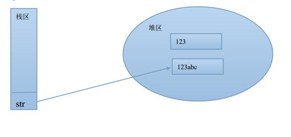
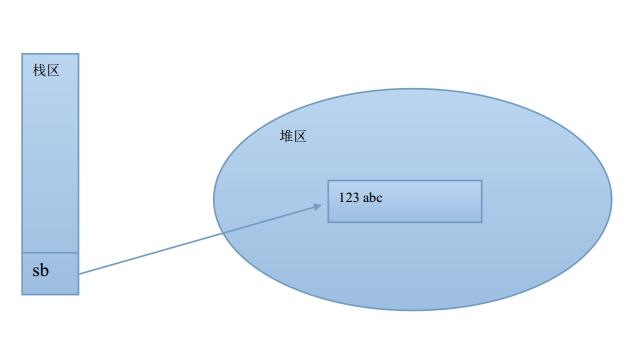

## 日期处理类


### Date

Date类是jdk给我们提高的标准日期类，在java.util包下；

给下示例代码：

```java
package com.java1234.chap05.sec01;
 
import java.util.Date;
 
public class TestDate {
 
    public static void main(String[] args) {
        Date date=new Date();
        System.out.println("当前日期："+date);
    }
}
```


运行输出:

当前日期：Wed Nov 02 16:54:01 CST 2016


输出了当前日期和时间 但是我们发现 格式不怎么好。


### Calendar

Calendar是日历类，也是java.util包下的，功能比较强大，能获取到年月日时分秒的具体值；

我们给下示例：打印当前日期时间 年月日时分秒：

```java
package com.java1234.chap05.sec01;
 
import java.util.Calendar;
 
public class TestCalendar {
 
    public static void main(String[] args) {
        Calendar calendar=Calendar.getInstance();
        System.out.println(calendar.get(Calendar.YEAR));
        System.out.println(calendar.get(Calendar.MONTH)+1); // 月份从0开始 要+1
         
        System.out.println("现在是："+calendar.get(Calendar.YEAR)+"年"
                +(calendar.get(Calendar.MONTH)+1)+"月"
                +calendar.get(Calendar.DAY_OF_MONTH)+"日"
                +calendar.get(Calendar.HOUR_OF_DAY)+"时"
                +calendar.get(Calendar.MINUTE)+"分"
                +calendar.get(Calendar.SECOND)+"秒");
    }
}
```


运行输出：

2016

11

现在是：2016年11月2日17时15分17秒


### SimpleDateFormat

SimpleDateFormat类主要是用作日期类型转换用的，在java.text包下：

我们写个示例，把日期对象和日期字符串相互转换：

```java
package com.java1234.chap05.sec01;
 
import java.text.ParseException;
import java.text.SimpleDateFormat;
import java.util.Date;
 
public class TestSimpleDateFormat {
 
    /**
     * 将日期对象格式化为指定格式的日期字符串
     * @param date 传入的日期对象
     * @param format 格式
     * @return
     */
    public static String formatDate(Date date,String format){
        String result="";
        SimpleDateFormat sdf=new SimpleDateFormat(format);
        if(date!=null){
            result=sdf.format(date);
        }
        return result;
    }
     
    /**
     * 将日期字符串转换成一个日期对象 
     * @param dateStr 日期字符串
     * @param format 格式
     * @return
     * @throws ParseException 
     */
    public static Date formatDate(String dateStr,String format) throws ParseException{
        SimpleDateFormat sdf=new SimpleDateFormat(format);
        return sdf.parse(dateStr);
    }
     
    public static void main(String[] args) throws ParseException {
        Date date=new Date();
         
        System.out.println(formatDate(date,"yyyy-MM-dd"));
        System.out.println(formatDate(date,"yyyy-MM-dd HH:mm:ss"));
        System.out.println(formatDate(date,"yyyy年MM月dd日HH时mm分ss秒"));
         
        String dataStr="1989-11-02 18:01:41";
        Date date2=formatDate(dataStr,"yyyy-MM-dd HH:mm:ss");
        System.out.println(formatDate(date2,"yyyy-MM-dd HH:mm:ss"));
    }
}
```


运行输出：

2016-11-02

2016-11-02 18:06:50

2016年11月02日18时06分50秒

1989-11-02 18:01:41


## 字符串类

### StringBuffer


String VS StringBuffer


String：对String类型的对象操作，等同于重新生成一个新对象，然后讲引用指向它；

StringBuffer：对StringBuffer类型的对象操作，操作的始终是同一个对象；


举例：

```java
package com.java1234.chap05.sec02;
 
public class TestString {
 
    public static void main(String[] args) {
        String str="123";
        str+="abc";
        System.out.println(str);
    }
}
```


运行输出：

123abc




str原先指向的是123 通过+= 重新指向了123abc；


这里再举例StringBuffer：

```java
package com.java1234.chap05.sec02;
 
public class TestStringBuffer {
 
    public static void main(String[] args) {
        StringBuffer sb=new StringBuffer("123");
        sb.append("abc");
        System.out.println(sb.toString());
    }
}
```


运行输出：

123abc


这两个实例的内部运行有本质区别的：




StringBuffer里始终是一个对象；


总结下：假如定义的字符串内容基本不变或者很少变化，用String效率高；假如定义的字符串内容经常变动，要用StringBuffer；


## 数学类

### Math


Math类是一个数学工具类方法，里面有很多静态工具方法；方便开发者直接调用；


这里举例，具体的可以查看api文档；


1，max方法 求最大值；

2，min方法 求最小值；

3，round方法 四舍五入；

4，pow方法 求次幂；


给下实例：

```java
package com.java1234.chap05.sec03;
 
public class TestMath {
 
    public static void main(String[] args) {
        System.out.println("最大值："+Math.max(1, 2));
        System.out.println("最小值："+Math.min(1, 2));
        System.out.println("四舍五入："+Math.round(4.5));
        System.out.println("3的4次方："+Math.pow(3, 4));
    }
}
```


运行输出：

最大值：2

最小值：1

四舍五入：5

3的4次方：81.0


## 数组类

### Arrays


Arrays类主要是封装了很多操作数组的工具方法，方便开发者直接调用；


这里举例一些常用的；

1，toString()方法 返回指定数组内容的字符串表示形式；

2，sort()方法 对指定的类型数组按数字升序进行排序；

3，binarySearch()方法 使用二分搜索法来搜索指定类型数组，以获取指定值；

4，fill()方法，将指定类型值分配给指定类型数组的每个元素；


给下实例：

```java
package com.java1234.chap05.sec04;
 
import java.util.Arrays;
 
public class TestArrays {
 
    public static void main(String[] args) {
        int arr[]={1,7,3,8,2};
        System.out.println(arr);
        System.out.println("以字符串形式输出数组："+Arrays.toString(arr));
        Arrays.sort(arr); // 给数组排序
        System.out.println("排序后的数组："+Arrays.toString(arr));
        System.out.println(Arrays.binarySearch(arr, 1));
        Arrays.fill(arr, 0); // 将指定内容填充到数组中
        System.out.println("填充数组后的字符串："+Arrays.toString(arr));
    }
}
```

