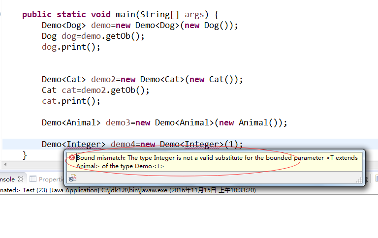

## 泛型引入

定义：使用泛型可以指代任意对象类型；


我们来先看一个实例：

定义一个C1类：里面有个Integer属性  给出构造方法 以及打印类型 和get set方法 

```java
package com.java1234.chap06.sec01;
 
public class C1 {
 
    private Integer a;
 
     
     
    public C1(Integer a) {
        super();
        this.a = a;
    }
 
    public Integer getA() {
        return a;
    }
 
    public void setA(Integer a) {
        this.a = a;
    }
     
    /**
     * 打印a的类型
     */
    public void print(){
        System.out.println("a的类型是："+a.getClass().getName());
    }
     
}
```


类似的再定义一个C2类，里面定义一个String类型属性：

```java

package com.java1234.chap06.sec01;
 
public class C2 {
 
    private String a;
 
    public String getA() {
        return a;
    }
 
    public void setA(String a) {
        this.a = a;
    }
 
    public C2(String a) {
        super();
        this.a = a;
    }
     
    /**
     * 打印a的类型
     */
    public void print(){
        System.out.println("a的类型是："+a.getClass().getName());
    }
}
```


我们来写个测试类：

```java
package com.java1234.chap06.sec01;
 
public class Test1 {
 
    public static void main(String[] args) {
        // begin test c1
        C1 c1=new C1(1);
        c1.print();
        int i=c1.getA();
        System.out.println("i="+i);
        // end test c1
         
        // begin test c2
        C2 c2=new C2("Hi");
        c2.print();
        String s1=c2.getA();
        System.out.println("s1="+s1);
        // end test c2
         
     
    }
}
```


运行输出：

a的类型是：java.lang.Integer

i=1

a的类型是：java.lang.String

s1=Hi


假如有100个类型，类似的我们要写100个类似的类，很麻烦，这时候我们会想到多态，我们改写下试下：

用一个类实现：因为所有类都继承自Object类，所以直接定义成Object类型的属性；

```java
package com.java1234.chap06.sec01;
 
public class C12 {
 
    private Object object;
 
    public Object getObject() {
        return object;
    }
 
    public void setObject(Object object) {
        this.object = object;
    }
 
    public C12(Object object) {
        super();
        this.object = object;
    }
     
    /**
     * 打印object的类型
     */
    public void print(){
        System.out.println("object的类型是："+object.getClass().getName());
    }
}
```


写下测试类：

```java
package com.java1234.chap06.sec01;
 
public class Test1 {
 
    public static void main(String[] args) {
        // begin test c1
        C1 c1=new C1(1);
        c1.print();
        int i=c1.getA();
        System.out.println("i="+i);
        // end test c1
         
        // begin test c2
        C2 c2=new C2("Hi");
        c2.print();
        String s1=c2.getA();
        System.out.println("s1="+s1);
        // end test c2
         
        // begin test c12
        C12 c12=new C12(1); // 向上转型
        c12.print();
        int i12=(Integer) c12.getObject(); // 向下转型
        System.out.println("i12="+i12);
         
        C12 c122=new C12("你好");// 向上转型
        c122.print();
        String s122=(String) c122.getObject();   // 向下转型
        System.out.println("s122="+s122);
        // end test c12
         
    }
}
```


运行输出：

a的类型是：java.lang.Integer

i=1

a的类型是：java.lang.String

s1=Hi

object的类型是：java.lang.Integer

i12=1

object的类型是：java.lang.String

s122=你好


## 定义泛型

我们发现测试类里需要转型，类简便了，但是测试类复杂了，有没有一种类简单，测试也简单的方式呢，这时候，泛型诞生了；

我们先定义一个泛型类：

```java

package com.java1234.chap06.sec01;
 
/**
 * 定义泛型类
 * @author caofeng
 *
 * @param <T>
 */
public class CC<T>{
 
    private T ob;
 
     
    public CC(T ob) {
        super();
        this.ob = ob;
    }
 
    public T getOb() {
        return ob;
    }
 
    public void setOb(T ob) {
        this.ob = ob;
    }
     
    /**
     * 打印T的类型
     */
    public void print(){
        System.out.println("T的实际类型是："+ob.getClass().getName());
    }
     
}
```


用<T>指代任意类型，当然也可以用其他字母，但是一般用T，Type的意思；


我们写个测试类：

```java
package com.java1234.chap06.sec01;
 
public class Test1 {
 
    public static void main(String[] args) {
        // begin test c1
        C1 c1=new C1(1);
        c1.print();
        int i=c1.getA();
        System.out.println("i="+i);
        // end test c1
         
        // begin test c2
        C2 c2=new C2("Hi");
        c2.print();
        String s1=c2.getA();
        System.out.println("s1="+s1);
        // end test c2
         
        // begin test c12
        C12 c12=new C12(1); // 向上转型
        c12.print();
        int i12=(Integer) c12.getObject(); // 向下转型
        System.out.println("i12="+i12);
         
        C12 c122=new C12("你好");// 向上转型
        c122.print();
        String s122=(String) c122.getObject();   // 向下转型
        System.out.println("s122="+s122);
        // end test c12
         
        // begin test CC
        CC<Integer> cc=new CC<Integer>(1);
        cc.print();
        int icc=cc.getOb();
        System.out.println("icc="+icc);
         
        CC<String> cc2=new CC<String>("我是泛型，好简单啊");
        cc2.print();
        String icc2=cc2.getOb();
        System.out.println("icc2="+icc2);
        // end test CC
    }
}
```


运行输出：

a的类型是：java.lang.Integer

i=1

a的类型是：java.lang.String

s1=Hi

object的类型是：java.lang.Integer

i12=1

object的类型是：java.lang.String

s122=你好

T的实际类型是：java.lang.Integer

icc=1

T的实际类型是：java.lang.String

icc2=我是泛型，好简单啊


## 限制泛型类型


前面我们讲的泛型，可以是任意类型，但是我们有时候，需要限制类型，这样更加安全。


我们通过实例理解下，我们新建一个Animal类，然后再搞两个子类Dog和Cat类：

```java
package com.java1234.chap06.sec02;
 
public class Animal {
 
    public void print(){
        System.out.println("动物");
    }
}
```


```java
package com.java1234.chap06.sec02;
 
public class Dog extends Animal{
 
    public void print(){
        System.out.println("Dog");
    }
}
```


```java
package com.java1234.chap06.sec02;
 
public class Cat extends Animal{
 
    public void print(){
        System.out.println("Cat");
    }
}
```


然后我们定义一个泛型类：

```java

package com.java1234.chap06.sec02;
 
public class Demo <T extends Animal>{
 
    private T ob;
 
    public T getOb() {
        return ob;
    }
 
    public void setOb(T ob) {
        this.ob = ob;
    }
 
    public Demo(T ob) {
        super();
        this.ob = ob;
    }
     
    public void print(){
        System.out.println("T的类型是："+ob.getClass().getName());
    }
}
```


这里我们要求  比如是Animal类或者Animal类的子类


我们再搞个测试类：

```java
package com.java1234.chap06.sec02;
 
public class Test {
 
    public static void main(String[] args) {
        Demo<Dog> demo=new Demo<Dog>(new Dog());
        Dog dog=demo.getOb();
        dog.print();
         
         
        Demo<Cat> demo2=new Demo<Cat>(new Cat());
        Cat cat=demo2.getOb();
        cat.print();
         
        Demo<Animal> demo3=new Demo<Animal>(new Animal());
    }
}
```

运行输出：

Dog

Cat


这里假如我们放其他类型：



直接编译报错，说类型不对；


## 通配符泛型


通配符泛型在使用泛型 特殊的场景下用到，比如把泛型对象作为方法参数传入方法的时候，就用到通配符泛型；

举例：

```java
package com.java1234.chap06.sec03;
 
import com.java1234.chap06.sec02.Animal;
import com.java1234.chap06.sec02.Cat;
import com.java1234.chap06.sec02.Demo;
import com.java1234.chap06.sec02.Dog;
 
public class Test {
     
    /**
     * 通配符泛型
     * @param a
     */
    private static void take(Demo<?> a){
        a.print();
    }
     
    public static void main(String[] args) {
        Demo<Dog> dog=new Demo<Dog>(new Dog());
        take(dog);
        Demo<Cat> cat=new Demo<Cat>(new Cat());
        take(cat);
        Demo<Animal> animal=new Demo<Animal>(new Animal());
        take(animal);
    }
}
```


## 泛型方法


泛型方法指返回值和参数都用泛型表示的方法；


我们给下实例：

```java
package com.java1234.chap06.sec04;
 
public class Test {
 
    /**
     * 泛型方法
     * @param t
     */
    public static <T> void f(T t){
        System.out.println("T的类型是："+t.getClass().getName());
    }
     
    public static void main(String[] args) {
        f("");
        f(1);
        f(1.0f);
        f(new Object());
    }
}
```


运行输出:

T的类型是：java.lang.String

T的类型是：java.lang.Integer

T的类型是：java.lang.Float

T的类型是：java.lang.Object