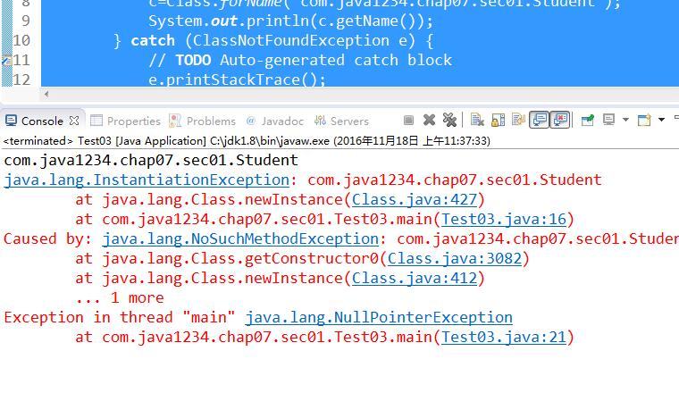

## 反射的基本概念


一般情况下，我们知道一个类，那可定可以通过这个类创建对象；

但是如果要求通过一个对象找到一个类，这时候反射就派上用场了。

java反射实现的核心就是Class类 java.lang包下的。


## java Class基本使用


通过Class类获取对象完整包类名：

我们新建一个Student类：

```java
package com.java1234.chap07.sec01;
 
public class Student {
 
}
```


我们新建一个测试类：

```java
package com.java1234.chap07.sec01;
 
public class Test01 {
 
    public static void main(String[] args) {
        Student student=new Student();
        System.out.println(student.getClass().getName());
    }
}
```


运行输出：

com.java1234.chap07.sec01.Student


这里对象.getClass() 调用的是Object类的getClass() 得到Class对象 然后再调用Class里的getName()方法，获取到完整包路径类；


通过完整包路径类型来实例化Class对象：

```java
package com.java1234.chap07.sec01;
 
public class Test02 {
 
    public static void main(String[] args) {
        try {
            Class<?> c=Class.forName("com.java1234.chap07.sec01.Student");  
            System.out.println(c.getName());
        } catch (ClassNotFoundException e) {
            // TODO Auto-generated catch block
            e.printStackTrace();
        }
    }
}
```


运行输出：

com.java1234.chap07.sec01.Student


通过得到Class对象，我们可以通过Class对象得到com.java1234.chap07.sec01.Student类的完整结构；


通过完整包路径类型来实例化Class对象，再通过Class对象获取Student类实例：

我们先改写下Student类：

```java
package com.java1234.chap07.sec01;
 
public class Student {
 
    private String name;
    private Integer age;
     
    public String getName() {
        return name;
    }
    public void setName(String name) {
        this.name = name;
    }
    public Integer getAge() {
        return age;
    }
    public void setAge(Integer age) {
        this.age = age;
    }
    @Override
    public String toString() {
        return "Student [name=" + name + ", age=" + age + "]";
    }
     
     
}
```


我们写个测试类：

```java
package com.java1234.chap07.sec01;
 
public class Test03 {
 
    public static void main(String[] args) {
        Class<?> c=null;
        try {
            c=Class.forName("com.java1234.chap07.sec01.Student");  
            System.out.println(c.getName());
        } catch (ClassNotFoundException e) {
            // TODO Auto-generated catch block
            e.printStackTrace();
        }
        Student s=null;
        try {
            s=(Student) c.newInstance();
        } catch (InstantiationException | IllegalAccessException e) {
            // TODO Auto-generated catch block
            e.printStackTrace();
        }
        s.setName("小锋");
        s.setAge(28);
        System.out.println(s);
    }
}
```


我们改下上面的Student 加下有参构造方法，这样使得Student类没有默认无参构造方法：

```java
package com.java1234.chap07.sec01;
 
public class Student {
 
    private String name;
    private Integer age;
     
     
     
    public Student(String name, Integer age) {
        super();
        this.name = name;
        this.age = age;
    }
    public String getName() {
        return name;
    }
    public void setName(String name) {
        this.name = name;
    }
    public Integer getAge() {
        return age;
    }
    public void setAge(Integer age) {
        this.age = age;
    }
    @Override
    public String toString() {
        return "Student [name=" + name + ", age=" + age + "]";
    }
     
     
}
```


然后我们再运行上面的测试类：




报错了 找不到默认构造方法；


在这种情况下，我们可以通过Class类来获取Student类里的构造方法，再调用构造方法即可，我们前面说过，可以通过反射获取整个类的结构，

包括 属性 方法 构造方法 等等。


我们给下测试代码：

```java

package com.java1234.chap07.sec01;
 
import java.lang.reflect.Constructor;
 
public class Test04 {
 
    public static void main(String[] args) {
        Class<?> c=null;
        try {
            c=Class.forName("com.java1234.chap07.sec01.Student");  
            System.out.println(c.getName());
        } catch (ClassNotFoundException e) {
            // TODO Auto-generated catch block
            e.printStackTrace();
        }
        Student s=null;
        Constructor<?>[] cons=c.getConstructors();
        try {
            s=(Student) cons[0].newInstance("小锋",28);
        } catch (Exception e) {
            // TODO Auto-generated catch block
            e.printStackTrace();
        }
        System.out.println(s);
    }
}
```


运行输出:

com.java1234.chap07.sec01.Student

Student [name=小锋, age=28]


## 通过反射获取类的基本结构

通过反射获取类的基本结构,我们来讲解下如果通过反射获取类的构造方法，普通方法以及属性；


先把Student类改写下，加点方法；

```java
package com.java1234.chap07.sec02;
 
public class Student {
 
    private String name;
    private Integer age;
     
    public Student(String name) {
        super();
        this.name = name;
    }
     
    public Student(String name, Integer age) {
        super();
        this.name = name;
        this.age = age;
    }
     
    public String getName() {
        return name;
    }
    public void setName(String name) {
        this.name = name;
    }
    public Integer getAge() {
        return age;
    }
    public void setAge(Integer age) {
        this.age = age;
    }
     
    public void say(){
        System.out.println("我的姓名："+name);
    }
     
    @Override
    public String toString() {
        return "Student [name=" + name + ", age=" + age + "]";
    }
     
     
}
```


1，通过getConstructors()方法获取所有构造方法，getDeclaredConstructors()方法获取当前类定义的构造方法，测试类：

```java
package com.java1234.chap07.sec02;
 
import java.lang.reflect.Constructor;
 
public class Test1 {
 
    public static void main(String[] args) {
        Class<?> c=null;
        try {
            c=Class.forName("com.java1234.chap07.sec02.Student");
            System.out.println(c.getName());
        } catch (ClassNotFoundException e) {
            // TODO Auto-generated catch block
            e.printStackTrace();
        }
        Constructor<?> cons[]=c.getConstructors();
        for(Constructor<?> con:cons){
            System.out.println("构造方法："+con);
        }
    }
}
```


运行输出：

com.java1234.chap07.sec02.Student

构造方法：public com.java1234.chap07.sec02.Student(java.lang.String)

构造方法：public com.java1234.chap07.sec02.Student(java.lang.String,java.lang.Integer)


2，通过getMethods()方法获取所有普通方法，getDeclaredMethods()方法获取当前类定义的普通方法，测试类：

```java
package com.java1234.chap07.sec02;
 
import java.lang.reflect.Method;
 
public class Test2 {
 
    public static void main(String[] args) {
        Class<?> c=null;
        try {
            c=Class.forName("com.java1234.chap07.sec02.Student");
            System.out.println(c.getName());
        } catch (ClassNotFoundException e) {
            // TODO Auto-generated catch block
            e.printStackTrace();
        }
        Method mds[]=c.getMethods();
        for(Method m:mds){
            System.out.println(m);
        }
    }
}
```


运行输出：

com.java1234.chap07.sec02.Student

public java.lang.String com.java1234.chap07.sec02.Student.toString()

public java.lang.String com.java1234.chap07.sec02.Student.getName()

public void com.java1234.chap07.sec02.Student.setName(java.lang.String)

public java.lang.Integer com.java1234.chap07.sec02.Student.getAge()

public void com.java1234.chap07.sec02.Student.setAge(java.lang.Integer)

public void com.java1234.chap07.sec02.Student.say()

public final void java.lang.Object.wait() throws java.lang.InterruptedException

public final void java.lang.Object.wait(long,int) throws java.lang.InterruptedException

public final native void java.lang.Object.wait(long) throws java.lang.InterruptedException

public boolean java.lang.Object.equals(java.lang.Object)

public native int java.lang.Object.hashCode()

public final native java.lang.Class java.lang.Object.getClass()

public final native void java.lang.Object.notify()

public final native void java.lang.Object.notifyAll()


3，通过getFields()方法获取所有属性，getDeclaredFields()方法获取当前类定义的普通属性，测试类：

```java
package com.java1234.chap07.sec02;
 
import java.lang.reflect.Field;
 
public class Test3 {
 
    public static void main(String[] args) {
        Class<?> c=null;
        try {
            c=Class.forName("com.java1234.chap07.sec02.Student");
            System.out.println(c.getName());
        } catch (ClassNotFoundException e) {
            // TODO Auto-generated catch block
            e.printStackTrace();
        }
        Field fs[]=c.getDeclaredFields();
        for(Field f:fs){
            System.out.println(f);
        }
    }
}
```


运行输出：

com.java1234.chap07.sec02.Student

private java.lang.String com.java1234.chap07.sec02.Student.name

private java.lang.Integer com.java1234.chap07.sec02.Student.age


## 通过反射调用方法和操作属性


为了演示，我们先改下Student类：

```java
package com.java1234.chap07.sec04;
 
public class Student {
 
    private String name;
    private Integer age;
     
    public String getName() {
        return name;
    }
    public void setName(String name) {
        this.name = name;
    }
    public Integer getAge() {
        return age;
    }
    public void setAge(Integer age) {
        this.age = age;
    }
     
    public void say(){
        System.out.println("我的姓名："+name);
    }
     
    @Override
    public String toString() {
        return "Student [name=" + name + ", age=" + age + "]";
    }
     
     
}
```


1，通过反射调用方法，主要通过invoke方法，我们给下演示代码：

```java
package com.java1234.chap07.sec04;
 
import java.lang.reflect.Method;
 
public class Test1 {
 
    public static void main(String[] args) {
        Class<?> c=null;
        try {
            c=Class.forName("com.java1234.chap07.sec04.Student");
            System.out.println(c.getName());
        } catch (ClassNotFoundException e) {
            // TODO Auto-generated catch block
            e.printStackTrace();
        }
     
        try {
            Object obj=c.newInstance();
            Method m2=obj.getClass().getMethod("setName", String.class);
            m2.invoke(obj, "小锋");
            Method m=obj.getClass().getMethod("getName");
            String name=(String) m.invoke(obj);
            System.out.println("name="+name);
        } catch (Exception e) {
            // TODO Auto-generated catch block
            e.printStackTrace();
        } 
    }
}

```


2，通过反射操作属性，java里反射可以操作私有属性，只需要设置下，我们给下演示代码：

```java
package com.java1234.chap07.sec04;
 
import java.lang.reflect.Field;
 
public class Test2 {
 
    public static void main(String[] args) {
        Class<?> c=null;
        try {
            c=Class.forName("com.java1234.chap07.sec04.Student");
            System.out.println(c.getName());
        } catch (ClassNotFoundException e) {
            // TODO Auto-generated catch block
            e.printStackTrace();
        }
     
        try {
            Object obj=c.newInstance();
            Field nameField=c.getDeclaredField("name");
            nameField.setAccessible(true);//私有属性需要这行代码才能进行设置
            nameField.set(obj, "小锋");
            System.out.println("name="+nameField.get(obj));
        } catch (Exception e) {
            // TODO Auto-generated catch block
            e.printStackTrace();
        } 
    }
}
```


运行输出：

com.java1234.chap07.sec04.Student

name=小锋

