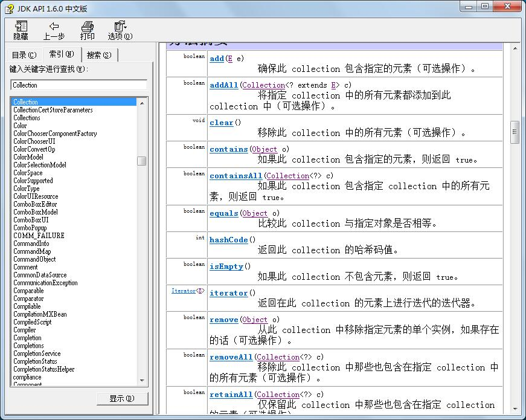

## 集合的引入


当我们有种需求，需要存储多个元素的结构时，我们前面讲过数组，数组可以存储。但是数组也有它的弊端，使用的时候，

必须先定义好长度，也就是数组的长度是固定，不能根据我们的需求自动变长或者变短。


我们看一个实例：

先定义一个Student类：

```java
package com.java1234.chap08.sec01;
 
public class Student {
 
    private String name;
    private Integer age;
     
    public Student() {
        super();
        // TODO Auto-generated constructor stub
    }
    public Student(String name, Integer age) {
        super();
        this.name = name;
        this.age = age;
    }
    public String getName() {
        return name;
    }
    public void setName(String name) {
        this.name = name;
    }
    public Integer getAge() {
        return age;
    }
    public void setAge(Integer age) {
        this.age = age;
    }
     
     
}
```


然后我们需要存储三个学生信息：

我们给下测试类:

```java

package com.java1234.chap08.sec01;
 
public class Test {
 
    public static void main(String[] args) {
        Student students[]=new Student[3];
        students[0]=new Student("张三",1);
        students[1]=new Student("李四",2);
        students[2]=new Student("王五",3);
    }
}
```

这里我们很好的实现了用数组结构存储了三个学生，但是，

假如我们需要再存储一个学生，就懵逼了，因为长度固定了。

所以就引入了可变化长度的集合。


## List集合


Collection接口是集合的老祖宗，定义了接口的基本方法，我们查看api 文档：



List是Collection接口的子接口，也是最常用的接口，此接口对Collection接口进行了大量的扩展，List集合里的元素是可以重复的。


List接口的主要实现类有ArrayList，和LinkedList。

在数据量不大的情况下，这两个类性能差别不大，

一般情况下，集合里的元素很少变化的，一般用ArrayList，

假如集合里元素经常变动，要用LinkedList；底层实现有差别的。


我们给下实例：

```java
package com.java1234.chap08.sec02;
 
import java.util.ArrayList;
 
public class TestArrayLit {
 
    private static void pringArrayList(ArrayList<String> arrayList){
        System.out.println("当前的集合元素：");
        for(int i=0;i<arrayList.size();i++){
            System.out.println(arrayList.get(i));
        }
    }
     
    public static void main(String[] args) {
        ArrayList<String> arrayList=new ArrayList<String>();
        // 添加元素
        arrayList.add("张三");
        arrayList.add("李四");
        pringArrayList(arrayList);
        // 在指定位置插入元素
        arrayList.add(1, "小张三");
        pringArrayList(arrayList);
        // 元素的替换
        arrayList.set(2, "小李四");
        pringArrayList(arrayList);
        // 移除元素
        arrayList.remove(0);
        pringArrayList(arrayList);
    }
}

```


运行输出：

当前的集合元素：

张三

李四

当前的集合元素：

张三

小张三

李四

当前的集合元素：

张三

小张三

小李四

当前的集合元素：

小张三

小李四


```java
package com.java1234.chap08.sec02;
 
import java.util.LinkedList;
 
public class TestLinkedList {
 
    private static void pringLinkedList(LinkedList<String> linkedList){
        System.out.println("当前元素的集合：");
        for(int i=0;i<linkedList.size();i++){
            System.out.print(linkedList.get(i)+" ");
        }
        System.out.println();
    }
     
    public static void main(String[] args) {
        LinkedList<String> linkedList=new LinkedList<String>();
        linkedList.add("张三");
        linkedList.add("李四");
        linkedList.add("王五");
        linkedList.add("李四");
        linkedList.add("赵六");
        pringLinkedList(linkedList);
         
        // indexOf 寻找位置
        System.out.println(linkedList.indexOf("李四"));
        pringLinkedList(linkedList);
         
        // peekFirst 获取第一个元素
        System.out.println(linkedList.peekFirst());
        pringLinkedList(linkedList);
         
        // peekLast 获取最后一个元素
        System.out.println(linkedList.peekLast());
        pringLinkedList(linkedList);
         
        // pollFirst 摘取第一个元素
        System.out.println(linkedList.pollFirst());
        pringLinkedList(linkedList);
         
        // pollLast 摘取最后一个元素
        System.out.println(linkedList.pollLast());
        pringLinkedList(linkedList);
    }
}
```


运行输出：

当前元素的集合：

张三 李四 王五 李四 赵六 

1

当前元素的集合：

张三 李四 王五 李四 赵六 

张三

当前元素的集合：

张三 李四 王五 李四 赵六 

赵六

当前元素的集合：

张三 李四 王五 李四 赵六 

张三

当前元素的集合：

李四 王五 李四 赵六 

赵六

当前元素的集合：

李四 王五 李四 


## Set集合


Set集合是Collection接口的子接口，没有对Collection接口进行扩展，里面不允许存在重复的内容；


演示代码：

```
package com.java1234.chap08.sec04;
 
import java.util.HashSet;
import java.util.Iterator;
 
public class TestHashSet {
 
    public static void main(String[] args) {
        /**
         * 1，HashSet是无序
         * 2，不循序有重复的值
         */
        HashSet<String> hs=new HashSet<String>();
        hs.add("21221");
        hs.add("112");
        hs.add("312");
        hs.add("421");
        hs.add("312");
         
        /**
         * 用Iterator遍历集合
         */
        Iterator<String> it=hs.iterator();
        while(it.hasNext()){
            String s=it.next();
            System.out.println(s+" ");
        }
    }
}
```


运行输出：

112 

421 

312 

21221 


## Map集合


是存放一对值的最大接口，即接口中的每一个元素都是一对，以key->value键值对的形式保存；

我们这里讲解下Map的常用实现类HashMap；

我们给下演示代码：

```java
package com.java1234.chap08.sec05;
 
import java.util.HashMap;
import java.util.Iterator;
 
public class TestHashMap {
 
    public static void main(String[] args) {
        HashMap<String,Student> hashMap=new HashMap<String,Student>();
        hashMap.put("1号", new Student("张三",10));
        hashMap.put("2号", new Student("李四",20));
        hashMap.put("3号", new Student("王五",30));
         
        // 通过key，获取value
        Student s=hashMap.get("1号");
        System.out.println(s.getName()+":"+s.getAge());
         
        Iterator<String> it=hashMap.keySet().iterator(); // 获取key的集合，再获取迭代器
        while(it.hasNext()){
            String key=it.next();  // 获取key
            Student student=hashMap.get(key);  // 通过key获取value
            System.out.println("key="+key+" value=["+student.getName()+","+student.getAge()+"]");
        }
    }
}
```


运行输出：

张三:10

key=3号 value=[王五,30]

key=2号 value=[李四,20]

key=1号 value=[张三,10]


## 集合的遍历


前面我们讲了最简单的集合遍历用for循环。

今天再介绍两个 Iterator和foreach；


### Iterator

首先是Iterator遍历器，我们给下实例：

先给一个Student类：

```java
package com.java1234.chap08.sec03;
 
public class Student {
 
    private String name;
    private Integer age;
     
     
     
    public Student() {
        super();
        // TODO Auto-generated constructor stub
    }
    public Student(String name, Integer age) {
        super();
        this.name = name;
        this.age = age;
    }
    public String getName() {
        return name;
    }
    public void setName(String name) {
        this.name = name;
    }
    public Integer getAge() {
        return age;
    }
    public void setAge(Integer age) {
        this.age = age;
    }
     
     
}
```


```java
package com.java1234.chap08.sec03;
 
import java.util.Iterator;
import java.util.LinkedList;
 
 
public class TestIterator {
 
    public static void main(String[] args) {
        LinkedList<Student> list=new LinkedList<Student>();
        list.add(new Student("张三",10));
        list.add(new Student("李四",20));
        list.add(new Student("王五",30));
         
        /**
         * 用Iterator遍历集合
         */
        Iterator<Student> it=list.iterator();  // 返回一个迭代器
        while(it.hasNext()){
            Student s=it.next();   // 返回迭代的下一个元素。
            System.out.println("姓名："+s.getName()+"年龄："+s.getAge());
        }
    }
}
```


运行输出：

姓名：张三年龄：10

姓名：李四年龄：20

姓名：王五年龄：30


### foreach

foreach遍历：

```java
package com.java1234.chap08.sec03;
 
import java.util.LinkedList;
 
 
public class TestForeach {
 
    public static void main(String[] args) {
        LinkedList<Student> list=new LinkedList<Student>();
        list.add(new Student("张三",10));
        list.add(new Student("李四",20));
        list.add(new Student("王五",30));
         
        /**
         * 用foreach遍历
         */
        for(Student s:list){
            System.out.println("姓名："+s.getName()+"年龄："+s.getAge());
        }
    }
}
```


运行输出：

姓名：张三年龄：10

姓名：李四年龄：20

姓名：王五年龄：30