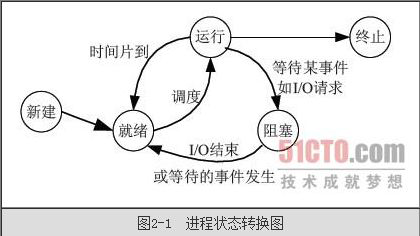

## 多线程的引入


定义：同时对多项任务加以控制；


什么是多线程呢，我可以简单的理解成 一边吃饭，一边听音乐 这个是多线程；假如  吃完饭再听音乐，或者先听音乐再吃饭，这个是单线程。


程序里同时执行多个任务并且加以控制 这个是java多线程的含义。同时干多个事，能充分利用cpu 内存等硬件设备，提高程序运行效率。


下面我们通过一个实例来体验下多线程：

```java
package com.java1234.chap09.sec01;
 
public class Test01 {
 
    /**
     * 听音乐
     */
    private static void music(){
        for(int i=0;i<100;i++){
            System.out.println("听音乐");
        }
    }
     
    /**
     * 吃饭
     */
    private static void eat(){
        for(int i=0;i<100;i++){
            System.out.println("吃饭");
        }
    }
     
    public static void main(String[] args) {
        music();
        eat();
    }
}
```


这个代码应该很简单理解。先听音乐，再吃饭，运行输出类似：

听音乐

听音乐

.

.

.

听音乐

吃饭

吃饭

.

.

.

吃饭

吃饭


我们用上多线程，一般吃饭，一边听音乐，


Eat线程类：

```java
package com.java1234.chap09.sec01;
 
public class Eat extends Thread{
 
    @Override
    public void run() {
        for(int i=0;i<100;i++){
            try {
                Thread.sleep(100);
                System.out.println("吃饭");
            } catch (InterruptedException e) {
                // TODO Auto-generated catch block
                e.printStackTrace();
            }
        }
    }
 
     
}

```


Music线程类：

```java
package com.java1234.chap09.sec01;
 
public class Music extends Thread{
 
    @Override
    public void run() {
        for(int i=0;i<100;i++){
            try {
                Thread.sleep(100);
                System.out.println("听音乐");
            } catch (InterruptedException e) {
                // TODO Auto-generated catch block
                e.printStackTrace();
            }
        }
    }
 
}
```


测试类：

```java
package com.java1234.chap09.sec01;
 
public class Test02 {
 
    public static void main(String[] args) {
        Music musicThread=new Music();
        Eat eatThread=new Eat();
        musicThread.start();
        eatThread.start();
    }
}

```


运行输出类似：

吃饭

听音乐

.

.

.

吃饭

听音乐

.

.

吃饭

听音乐


## 多线程实现

1,继承Thread类

2,实现Runnable接口

3,多线程实现数据共享


### 继承Thread类

```java
package com.java1234.chap09.sec02;

public class Thread1 extends Thread{

	private int baoZi=1;
	
	private String threadName;

	public Thread1(String threadName) {
		super();
		this.threadName = threadName;
	}

	@Override
	public void run() {
		while(baoZi<=10){
			System.out.println(threadName+" 吃"+baoZi+"第个包子");
			baoZi++;
		}
	}
	
	public static void main(String[] args) {
		// 张三 李四一起吃包子 每人吃10个
		Thread1 t1=new Thread1("张三线程");
		Thread1 t2=new Thread1("李四线程");
		t1.start();
		t2.start();
	}
	
	
	
}
```

运行输出：

张三线程 吃1第个包子

张三线程 吃2第个包子

张三线程 吃3第个包子

张三线程 吃4第个包子

张三线程 吃5第个包子

张三线程 吃6第个包子

张三线程 吃7第个包子

张三线程 吃8第个包子

张三线程 吃9第个包子

张三线程 吃10第个包子

李四线程 吃1第个包子

李四线程 吃2第个包子

李四线程 吃3第个包子

李四线程 吃4第个包子

李四线程 吃5第个包子

李四线程 吃6第个包子

李四线程 吃7第个包子

李四线程 吃8第个包子

李四线程 吃9第个包子

李四线程 吃10第个包子


### 实现Runnable接口

```java
package com.java1234.chap09.sec02;

public class Thread2 implements Runnable{

	private int baoZi=1;
	
	private String threadName;

	public Thread2(String threadName) {
		super();
		this.threadName = threadName;
	}

	@Override
	public void run() {
		while(baoZi<=10){
			System.out.println(threadName+" 吃"+baoZi+"第个包子");
			baoZi++;
		}
	}
	
	public static void main(String[] args) {
		// 张三 李四一起吃包子 每人吃10个
		Thread2 t1=new Thread2("张三线程");
		Thread2 t2=new Thread2("李四线程");
		Thread t11=new Thread(t1);
		Thread t12=new Thread(t2);
		t11.start();
		t12.start();
	}

}
```

运行输出：

张三线程 吃1第个包子

张三线程 吃2第个包子

李四线程 吃1第个包子

张三线程 吃3第个包子

李四线程 吃2第个包子

李四线程 吃3第个包子

李四线程 吃4第个包子

李四线程 吃5第个包子

李四线程 吃6第个包子

李四线程 吃7第个包子

李四线程 吃8第个包子

张三线程 吃4第个包子

李四线程 吃9第个包子

李四线程 吃10第个包子

张三线程 吃5第个包子

张三线程 吃6第个包子

张三线程 吃7第个包子

张三线程 吃8第个包子

张三线程 吃9第个包子

张三线程 吃10第个包子


### 多线程实现数据共享

```java
package com.java1234.chap09.sec02;

public class Thread3 implements Runnable{

	private int baoZi=1;
	
	private String threadName;

	public Thread3(String threadName) {
		super();
		this.threadName = threadName;
	}

	@Override
	public synchronized void run() {
		while(baoZi<=10){
			System.out.println(threadName+" 吃"+baoZi+"第个包子");
			baoZi++;
		}
	}
	
	public static void main(String[] args) {
		Thread3 t1=new Thread3("超级张三线程");
		Thread t11=new Thread(t1);
		Thread t12=new Thread(t1);
		Thread t13=new Thread(t1);
		t11.start();
		t12.start();
		t13.start();
	}

}
```

运行输出：

超级张三线程 吃1第个包子

超级张三线程 吃2第个包子

超级张三线程 吃3第个包子

超级张三线程 吃4第个包子

超级张三线程 吃5第个包子

超级张三线程 吃6第个包子

超级张三线程 吃7第个包子

超级张三线程 吃8第个包子

超级张三线程 吃9第个包子

超级张三线程 吃10第个包子


这里我们定义一个实例 然后用这个实例来是实例化三个Thread对象，run方法我们要加synchronized锁，否则会出现多个线程同时进入方法的情况，导致多个线程吃同一个包子；


## 线程的状态

总的执行图：



所有状态：

1，创建状态

在程序中用构造方法创建了一个线程对象后，新的线程对象便处于新建状态，此时，它已经有了相应的

内存空间和其他资源，但还处于不可运行状态。新建一个线程对象可采用Thread 类的构造方法来实现，例

如，“Thread thread=new Thread();”。

2，就绪状态

新建线程对象后，调用该线程的start()方法就可以启动线程。当线程启动时，线程进入就绪状态。此时，

线程将进入线程队列排队，等待CPU 服务，这表明它已经具备了运行条件。

3，运行状态

当就绪状态的线程被调用并获得处理器资源时，线程就进入了运行状态。此时，自动调用该线程对象

的run()方法。run()方法定义了该线程的操作和功能。

4，堵塞状态

一个正在执行的线程在某些特殊情况下，如被人为挂起或需要执行耗时的输入/输出操作时，将让出

CPU 并暂时中止自己的执行，进入堵塞状态。堵塞时，线程不能进入排队队列，只有当引起堵塞的原因被

消除后，线程才可以转入就绪状态。

5，死亡状态

线程调用stop()方法时或run()方法执行结束后，即处于死亡状态。处于死亡状态的线程不具有继续运

行的能力。


## 线程常用方法


1，getName(); 返回该线程的名称。

2，currentThread()；返回对当前正在执行的线程对象的引用。

3，isAlive()；测试线程是否处于活动状态。

4，sleep()；线程休眠。

5，setPriority(int newPriority)；更改线程的优先级。

6，yield()；暂停当前正在执行的线程对象，并执行其他线程。


下面给出一些实例：

```java
package com.java1234.chap09.sec04;
 
public class Demo1 implements Runnable{
 
    @Override
    public void run() {
        // TODO Auto-generated method stub
        for(int i=0;i<10;i++){
            // 获取当前线程
            Thread t=Thread.currentThread();
            System.out.println(t.getName()+":"+i); // 返回线程的名称
        }
    }
     
    public static void main(String[] args) {
        Demo1 demo1=new Demo1();
        new Thread(demo1).start();
        new Thread(demo1).start();
        new Thread(demo1,"线程3").start();
    }
 
}
```


运行输出：

Thread-1:0

Thread-1:1

Thread-1:2

Thread-1:3

Thread-1:4

Thread-1:5

Thread-1:6

Thread-1:7

Thread-1:8

Thread-1:9

线程3:0

线程3:1

线程3:2

线程3:3

线程3:4

线程3:5

线程3:6

线程3:7

线程3:8

线程3:9

Thread-0:0

Thread-0:1

Thread-0:2

Thread-0:3

Thread-0:4

Thread-0:5

Thread-0:6

Thread-0:7

Thread-0:8

Thread-0:9


```java
package com.java1234.chap09.sec04;
 
public class Demo2 implements Runnable{
 
    @Override
    public void run() {
        // TODO Auto-generated method stub
        for(int i=0;i<10;i++){
            // 获取当前线程
            Thread t=Thread.currentThread();
            System.out.println(t.getName()+":"+i); // 返回线程的名称
        }
    }
     
    public static void main(String[] args) {
        Demo2 demo2=new Demo2();
        Thread t1=new Thread(demo2);
        System.out.println("t1是否活动:"+t1.isAlive());
        t1.start();
        System.out.println("t1是否活动:"+t1.isAlive());
    }
}
```


运行输出：

t1是否活动:false

t1是否活动:true

Thread-0:0

Thread-0:1

Thread-0:2

Thread-0:3

Thread-0:4

Thread-0:5

Thread-0:6

Thread-0:7

Thread-0:8

Thread-0:9


```java
package com.java1234.chap09.sec04;
 
public class Demo3 implements Runnable{
 
    @Override
    public void run() {
        // TODO Auto-generated method stub
        for(int i=0;i<10;i++){
            try {
                Thread.sleep(1000);
                // 获取当前线程
                Thread t=Thread.currentThread();
                System.out.println(t.getName()+":"+i); // 返回线程的名称
            } catch (InterruptedException e) {
                // TODO Auto-generated catch block
                e.printStackTrace();
            }
        }
    }
     
    public static void main(String[] args) {
        Demo3 demo1=new Demo3();
        new Thread(demo1).start();
    }
 
}
```

Thread-0:0

Thread-0:1

Thread-0:2

Thread-0:3

Thread-0:4

Thread-0:5

Thread-0:6

Thread-0:7

Thread-0:8

Thread-0:9


```java
package com.java1234.chap09.sec04;
 
public class Demo4 implements Runnable{
 
    @Override
    public void run() {
        // TODO Auto-generated method stub
        for(int i=0;i<10;i++){
            try {
                Thread.sleep(1000);
                // 获取当前线程
                Thread t=Thread.currentThread();
                System.out.println(t.getName()+":"+i); // 返回线程的名称
            } catch (InterruptedException e) {
                // TODO Auto-generated catch block
                e.printStackTrace();
            }
        }
    }
     
    public static void main(String[] args) {
        Demo4 demo4=new Demo4();
        Thread t1=new Thread(demo4,"线程A");
        Thread t2=new Thread(demo4,"线程B");
        Thread t3=new Thread(demo4,"线程C");
        t1.setPriority(Thread.MAX_PRIORITY);
        t2.setPriority(Thread.MIN_PRIORITY);
        t3.setPriority(Thread.NORM_PRIORITY);
        t3.start();
        t1.start();
        t2.start();
    }
 
}
```

线程C:0

线程A:0

线程B:0

线程A:1

线程C:1

线程B:1

线程A:2

线程B:2

线程C:2

线程A:3

线程C:3

线程B:3

线程A:4

线程C:4

线程B:4

线程A:5

线程B:5

线程C:5

线程A:6

线程C:6

线程B:6

线程A:7

线程C:7

线程B:7

线程A:8

线程C:8

线程B:8

线程A:9

线程C:9

线程B:9


```java
package com.java1234.chap09.sec04;
 
public class Demo5 implements Runnable{
 
    @SuppressWarnings("static-access")
    @Override
    public void run() {
        // TODO Auto-generated method stub
        for(int i=0;i<10;i++){
            try {
                Thread.sleep(100);
                // 获取当前线程
                Thread t=Thread.currentThread();
                System.out.println(t.getName()+":"+i); // 返回线程的名称
                if(i==5){
                    System.out.println("线程礼让：");
                    Thread.currentThread().yield();
                }
            } catch (InterruptedException e) {
                // TODO Auto-generated catch block
                e.printStackTrace();
            }
        }
    }
     
    public static void main(String[] args) {
        Demo5 demo1=new Demo5();
        new Thread(demo1,"线程A").start();
        new Thread(demo1,"线程B").start();
    }
 
}
```

线程A:0

线程B:0

线程A:1

线程B:1

线程A:2

线程B:2

线程A:3

线程B:3

线程A:4

线程B:4

线程A:5

线程礼让：

线程B:5

线程礼让：

线程A:6

线程B:6

线程A:7

线程B:7

线程A:8

线程B:8

线程A:9

线程B:9


## 线程同步

前面的实例已经设计到同步问题：

上代码：

```java
package com.java1234.chap09.sec05;
 
public class Thread1 implements Runnable{
 
    private int baoZi=1;
     
    private String threadName;
 
    public Thread1(String threadName) {
        super();
        this.threadName = threadName;
    }
 
    @Override
    public void run() {
        while(baoZi<=10){
            System.out.println(threadName+" 吃第"+baoZi+"个包子");
            baoZi++;
        }
    }
     
    public static void main(String[] args) {
        Thread1 t1=new Thread1("超级张三线程");
 
        Thread t11=new Thread(t1);
        Thread t12=new Thread(t1);
        Thread t13=new Thread(t1);
         
        t11.start();
        t12.start();
        t13.start();
    }
 
}
```


运行输出：

超级张三线程 吃第1个包子

超级张三线程 吃第1个包子

超级张三线程 吃第2个包子

超级张三线程 吃第3个包子

超级张三线程 吃第4个包子

超级张三线程 吃第5个包子

超级张三线程 吃第6个包子

超级张三线程 吃第7个包子

超级张三线程 吃第8个包子

超级张三线程 吃第9个包子

超级张三线程 吃第11个包子

超级张三线程 吃第8个包子


我们发现 会有多个线程同时进入方法吃包子的情况发生，这时候，就引入了线程同步。可以给方法加同步，同一时刻，只允许一个线程进入方法；

关键字 synchronized

```java
package com.java1234.chap09.sec05;
 
public class Thread3 implements Runnable{
 
    private int baoZi=1;
     
    private String threadName;
 
    public Thread3(String threadName) {
        super();
        this.threadName = threadName;
    }
 
    @Override
    public synchronized void run() {
        while(baoZi<=10){
            System.out.println(threadName+" 吃第"+baoZi+"个包子");
            baoZi++;
        }
    }
     
    public static void main(String[] args) {
        Thread3 t1=new Thread3("超级张三线程");
 
        Thread t11=new Thread(t1);
        Thread t12=new Thread(t1);
        Thread t13=new Thread(t1);
         
        t11.start();
        t12.start();
        t13.start();
    }
 
}
```


运行输出：

超级张三线程 吃第1个包子

超级张三线程 吃第2个包子

超级张三线程 吃第3个包子

超级张三线程 吃第4个包子

超级张三线程 吃第5个包子

超级张三线程 吃第6个包子

超级张三线程 吃第7个包子

超级张三线程 吃第8个包子

超级张三线程 吃第9个包子

超级张三线程 吃第10个包子


也可以用同步块：

```java
package com.java1234.chap09.sec05;
 
public class Thread4 implements Runnable{
 
    private int baoZi=1;
     
    private String threadName;
 
    public Thread4(String threadName) {
        super();
        this.threadName = threadName;
    }
 
    @Override
    public void run() {
        /**
         * 同步块
         */
        synchronized (this) {
            while(baoZi<=10){
                System.out.println(threadName+" 吃第"+baoZi+"个包子");
                baoZi++;
            }
        }
    }
     
    public static void main(String[] args) {
        Thread4 t1=new Thread4("超级张三线程");
 
        Thread t11=new Thread(t1);
        Thread t12=new Thread(t1);
        Thread t13=new Thread(t1);
         
        t11.start();
        t12.start();
        t13.start();
    }
 
}
```


运行结果一样；


