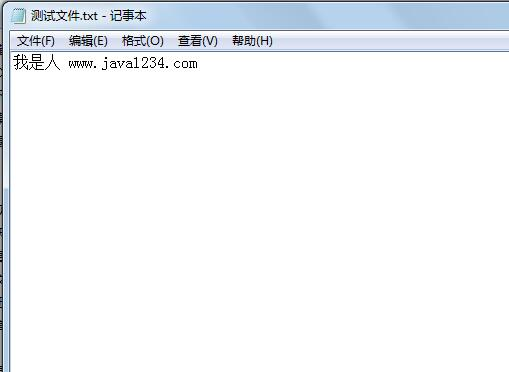

## IO流简介

### 定义

流是一组有顺序的，有起点和终点的字节集合，是对数据传输的总称或抽象。即数据在两设备间的传输称为

流，流的本质是数据传输，根据数据传输特性将流抽象为各种类，方便更直观的进行数据操作。


### 分类

根据处理数据类型的不同分为：字符流和字节流

根据数据流向不同分为：输入流和输出流


## 文件操作 File类


1，public boolean mkdir() 创建此抽象路径名指定的目录。

2，public boolean createNewFile() 创建一个文件

3，public boolean delete() 删除此抽象路径名表示的文件或目录。如果此路径名表示一个目录，则该目录

必须为空才能删除。

4，public boolean exists() 测试此抽象路径名表示的文件或目录是否存在。

5，public File[] listFiles() 返回一个抽象路径名数组，这些路径名表示此抽象路径名表示的目录中的文

件。

6，public boolean isDirectory() 测试此抽象路径名表示的文件是否是一个目录。


### 创建文件目录和文件

```java
package com.java1234.chap10;
 
import java.io.File;
import java.io.IOException;
 
public class Demo1 {
 
    public static void main(String[] args) throws IOException {
        File file=new File("c://java创建的目录");
        boolean b=file.mkdir();  // 创建虚拟目录
        if(b){
            System.out.println("目录创建成功！");
            file=new File("c://java创建的目录//java创建的文件.txt");
            boolean b2=file.createNewFile();  // 创建文件
            if(b2){
                System.out.println("文件创建成功！");
            }else{
                System.out.println("文件创建失败！");
            }
        }else{
            System.out.println("目录创建失败！");
        }
    }
}
```


运行输出：

目录创建成功！

文件创建成功！


### 删除文件和文件目录

```java
package com.java1234.chap10;
 
import java.io.File;
import java.io.IOException;
 
public class Demo2 {
 
    public static void main(String[] args) throws IOException {
        File file=new File("c://java创建的目录//java创建的文件.txt");
        if(file.exists()){  // 假如文件存在
            boolean b=file.delete();  // 删除文件
            if(b){
                System.out.println("删除文件成功！");
            }else{
                System.out.println("删除文件失败！");
            }
        }
        file=new File("c://java创建的目录");
        if(file.exists()){
            boolean b=file.delete();  // 删除目录
            if(b){
                System.out.println("删除目录成功！");
            }else{
                System.out.println("删除目录失败！");
            }
        }
    }
}
```


运行输出：

删除文件成功！

删除目录成功！


### 遍历目录

```java
package com.java1234.chap10;
 
import java.io.File;
 
public class Demo3 {
 
    public static void main(String[] args) {
        File file=new File("C://apache-cxf-3.1.5");
        File files[]=file.listFiles();  // 遍历目录
        for(int i=0;i<files.length;i++){
            System.out.println(files[i]);
        }
    }
}
```


运行输出：

C:\apache-cxf-3.1.5\bin

C:\apache-cxf-3.1.5\docs

C:\apache-cxf-3.1.5\etc

C:\apache-cxf-3.1.5\lib

C:\apache-cxf-3.1.5\LICENSE

C:\apache-cxf-3.1.5\licenses

C:\apache-cxf-3.1.5\NOTICE

C:\apache-cxf-3.1.5\README

C:\apache-cxf-3.1.5\release_notes.txt

C:\apache-cxf-3.1.5\samples


### 递归遍历所有文件

```java
package com.java1234.chap10;
 
import java.io.File;
 
public class Demo4 {
 
    /**
     * 打印文件
     * @param file
     */
    public static void listFile(File file){
        if(file!=null){
            if(file.isDirectory()){  // 是目录
                System.out.println(file);  // 打印下目录
                File f[]=file.listFiles();  // 遍历目录
                if(f!=null){
                    for(int i=0;i<f.length;i++){
                        listFile(f[i]);  // 递归调用
                    }
                }
            }else{   // 是文件
                System.out.println(file);  // 是文件，直接打印文件的路径
            }
        }
    }
     
    public static void main(String[] args) {
        File file=new File("C://apache-tomcat-7.0.63");
        listFile(file);
    }
}
```


运行输出：

C:\apache-tomcat-7.0.63

C:\apache-tomcat-7.0.63\bin

C:\apache-tomcat-7.0.63\bin\bootstrap.jar

C:\apache-tomcat-7.0.63\bin\catalina-tasks.xml

C:\apache-tomcat-7.0.63\bin\catalina.bat

C:\apache-tomcat-7.0.63\bin\catalina.sh

C:\apache-tomcat-7.0.63\bin\commons-daemon-native.tar.gz

C:\apache-tomcat-7.0.63\bin\commons-daemon.jar

C:\apache-tomcat-7.0.63\bin\configtest.bat

C:\apache-tomcat-7.0.63\bin\configtest.sh

C:\apache-tomcat-7.0.63\bin\daemon.sh

C:\apache-tomcat-7.0.63\bin\digest.bat

C:\apache-tomcat-7.0.63\bin\digest.sh

C:\apache-tomcat-7.0.63\bin\service.bat

C:\apache-tomcat-7.0.63\bin\setclasspath.bat

C:\apache-tomcat-7.0.63\bin\setclasspath.sh

C:\apache-tomcat-7.0.63\bin\shutdown.bat

C:\apache-tomcat-7.0.63\bin\shutdown.sh

C:\apache-tomcat-7.0.63\bin\startup.bat

C:\apache-tomcat-7.0.63\bin\startup.sh

C:\apache-tomcat-7.0.63\bin\tcnative-1.dll

C:\apache-tomcat-7.0.63\bin\tomcat-juli.jar

C:\apache-tomcat-7.0.63\bin\tomcat-native.tar.gz

C:\apache-tomcat-7.0.63\bin\tomcat7.exe

C:\apache-tomcat-7.0.63\bin\tomcat7w.exe

C:\apache-tomcat-7.0.63\bin\tool-wrapper.bat

C:\apache-tomcat-7.0.63\bin\tool-wrapper.sh

C:\apache-tomcat-7.0.63\bin\version.bat

C:\apache-tomcat-7.0.63\bin\version.sh

C:\apache-tomcat-7.0.63\conf

C:\apache-tomcat-7.0.63\conf\catalina.policy

C:\apache-tomcat-7.0.63\conf\catalina.properties

C:\apache-tomcat-7.0.63\conf\context.xml

C:\apache-tomcat-7.0.63\conf\logging.properties

C:\apache-tomcat-7.0.63\conf\server.xml

C:\apache-tomcat-7.0.63\conf\tomcat-users.xml

C:\apache-tomcat-7.0.63\conf\web.xml


## InputStream

### OutputStream


InputStream是输入流  OutputStream是输出流；

InputStream输入流可以把文件从硬盘读取到内存；

OutputStream输出流可以把文件从内存写入到硬盘；


我们实际使用的都是InputStream和OutputStream的子类；

比如文件操作方面用的是FileInputStream和FileOutputStream；

我们给下实例，视频教程里会详细讲解：

准备工作，我们在C盘建一个txt文件 测试文件.txt

随便加点内容：



```java
package com.java1234.chap10.sec03;
 
import java.io.File;
import java.io.FileInputStream;
import java.io.InputStream;
 
public class Demo1 {
 
    public static void main(String[] args) throws Exception {
        File file=new File("C://测试文件.txt");
        InputStream inputStream=new FileInputStream(file);  // 实例化FileInputStream
        byte b[]=new byte[1024];
        int len=inputStream.read(b);
        inputStream.close(); // 关闭输入流
        System.out.println("读取的内容是："+new String(b,0,len));
    }
}
```


把文件从硬盘读取到内存，并且输出：

运行结果：

```
读取的内容是：我是人 www.java1234.com
```


上面那个是定义了固定字节数组 一批读取的，我们现在改进下，获取文件长度，然后定义指定字节数组的长度；

```java
package com.java1234.chap10.sec03;
 
import java.io.File;
import java.io.FileInputStream;
import java.io.InputStream;
 
public class Demo2 {
 
    public static void main(String[] args) throws Exception {
        File file=new File("C://测试文件.txt");
        InputStream inputStream=new FileInputStream(file);  // 实例化FileInputStream
        int fileLength=(int)file.length();
        byte b[]=new byte[fileLength];
        inputStream.read(b);
        inputStream.close(); // 关闭输入流
        System.out.println("读取的内容是："+new String(b));
    }
}
```


运行结果也一样；


我们再来一种方式 一个字节一个字节读取；

```java
package com.java1234.chap10.sec03;
 
import java.io.File;
import java.io.FileInputStream;
import java.io.InputStream;
 
public class Demo3 {
 
    public static void main(String[] args) throws Exception {
        File file=new File("C://测试文件.txt");
        InputStream inputStream=new FileInputStream(file);  // 实例化FileInputStream
        int fileLength=(int)file.length();
        byte b[]=new byte[fileLength];
        int temp=0;
        int len=0;
        while((temp=inputStream.read())!=-1){
            // 一个字节一个字节读取，放到b字节数组里
            b[len++]=(byte)temp;
        }
        inputStream.close(); // 关闭输入流
        System.out.println("读取的内容是："+new String(b));
    }
}
```


运行结果还是一样的；


下面是讲下输出流；

```java
package com.java1234.chap10.sec03;
 
import java.io.File;
import java.io.FileOutputStream;
import java.io.OutputStream;
 
public class Demo4 {
 
    public static void main(String[] args) throws Exception {
        File file=new File("C://测试文件.txt");
        OutputStream out=new FileOutputStream(file);
        String str="你好，我好，大家好，Java好";
        byte b[]=str.getBytes();
        out.write(b); //  将b字节数组写入到输出流
        out.close();  // 关闭输出流
    }
}
```


我们把指定文件写入到文件；


上面那种是直接覆盖的，我们再来一个追加的；

```java
package com.java1234.chap10.sec03;
 
import java.io.File;
import java.io.FileOutputStream;
import java.io.OutputStream;
 
public class Demo5 {
 
    public static void main(String[] args) throws Exception {
        File file=new File("C://测试文件.txt");
        OutputStream out=new FileOutputStream(file,true);
        String str="你好，我好，大家好，Java好";
        byte b[]=str.getBytes();
        out.write(b); //  将b字节数组写入到输出流
        out.close();  // 关闭输出流
    }
}


```


## BufferedInputStream

### BufferedOutputStream


带缓冲的输入和输出流；


这里缓冲的概念，就是在A,B之间建立内存缓冲区，读取得快，就先放缓冲区，然后再从缓冲区写入指定目标，和没有缓冲比，效率快很多。


我们给个实例比对下：

```java
package com.java1234.chap10.sec03;
 
import java.io.BufferedInputStream;
import java.io.BufferedOutputStream;
import java.io.FileInputStream;
import java.io.FileOutputStream;
import java.io.InputStream;
import java.io.OutputStream;
 
public class Demo6 {
 
    /**
     * 缓冲
     * @throws Exception
     */
    public static void bufferStream()throws Exception{
        // 定义了一个带缓冲的字节输入流
        BufferedInputStream bufferedInputStream=new BufferedInputStream(new FileInputStream("C://《一头扎进J2SE》V2.0视频笔录2.doc"));
        // 定义了一个带缓冲的字节输出流
        BufferedOutputStream bufferedOutputStream=new BufferedOutputStream(new FileOutputStream("C://复制的《一头扎进J2SE》V2.0视频笔录2.doc"));
        int b=0;
        long startTime=System.currentTimeMillis(); // 开始时间
        while((b=bufferedInputStream.read())!=-1){
            bufferedOutputStream.write(b);
        }
        bufferedInputStream.close();
        bufferedOutputStream.close();
        long endTime=System.currentTimeMillis();  // 结束时间
        System.out.println("缓冲花费的时间是："+(endTime-startTime));
    }
     
    /**
     * 非缓冲
     * @throws Exception
     */
    public static void stream() throws Exception{
        InputStream inputStream=new FileInputStream("C://《一头扎进J2SE》V2.0视频笔录.doc");  // 定义一个输入流
        OutputStream outputStream=new FileOutputStream("C://复制的《一头扎进J2SE》V2.0视频笔录.doc");
        int b=0;
        long startTime=System.currentTimeMillis(); // 开始时间
        while((b=inputStream.read())!=-1){
            outputStream.write(b);
        }
        inputStream.close();
        outputStream.close();
        long endTime=System.currentTimeMillis();  // 结束时间
        System.out.println("非缓冲花费的时间是："+(endTime-startTime));
    }
     
    public static void main(String[] args)throws Exception {
        stream();
        bufferStream();
    }
}
```


把文件从A地址复制到B地址，运行输出：

非缓冲花费的时间是：2368

缓冲花费的时间是：31


我们明显发现 带缓冲的效率高；


## Reader

### Writer


主要用于文本的读取和写入，一般使用的实现类是FileReader和FileWriter；

我们给出一些实例：

```java
package com.java1234.chap10.sec04;
 
import java.io.File;
import java.io.FileReader;
import java.io.Reader;
 
public class Demo1 {
 
    public static void main(String[] args) throws Exception {
        File file=new File("C://测试文件.txt");
        Reader reader=new FileReader(file);
        char c[]=new char[1024]; // 字符数组
        int len=reader.read(c);
        reader.close();  // 关闭输入流
        System.out.println("读取的内容是："+new String(c,0,len));
    }
}
```

直接读取；


```java
package com.java1234.chap10.sec04;
 
import java.io.File;
import java.io.FileReader;
import java.io.Reader;
 
public class Demo2 {
 
    public static void main(String[] args) throws Exception {
        File file=new File("C://测试文件.txt");
        Reader reader=new FileReader(file);
        char c[]=new char[1024]; // 字符数组
        int temp=0;
        int len=0;
        while((temp=reader.read())!=-1){
            c[len++]=(char)temp;
        }
        reader.close();  // 关闭输入流
        System.out.println("读取的内容是："+new String(c,0,len));
    }
```

一个一个字符读取；


```java
package com.java1234.chap10.sec04;
 
import java.io.File;
import java.io.FileWriter;
import java.io.Writer;
 
public class Demo3 {
 
    public static void main(String[] args) throws Exception {
        File file=new File("C://测试文件.txt");
        Writer out=new FileWriter(file);
        String str="我爱中华";
        out.write(str);  // 将字符串写入输出流
        out.close();  // 关闭输出流
    }
}
```

写入文件；


```java

package com.java1234.chap10.sec04;
 
import java.io.File;
import java.io.FileWriter;
import java.io.Writer;
 
public class Demo4 {
 
    public static void main(String[] args) throws Exception {
        File file=new File("C://测试文件.txt");
        Writer out=new FileWriter(file,true);
        String str="我爱中华2";
        out.write(str);  // 将字符串写入输出流
        out.close();  // 关闭输出流
    }
}
```

追加写入；