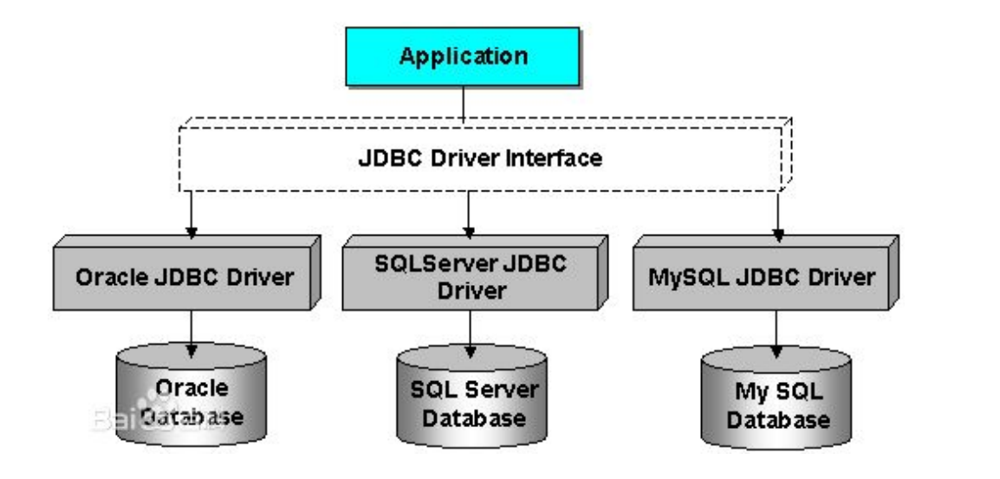
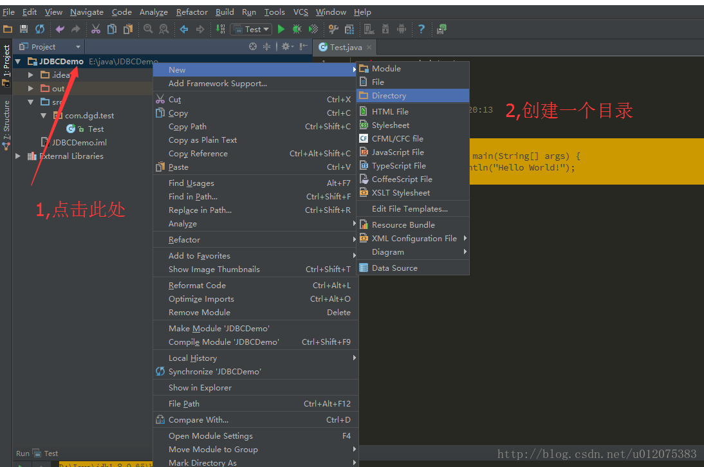
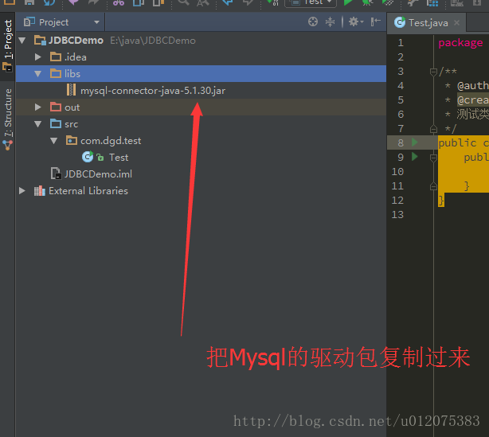
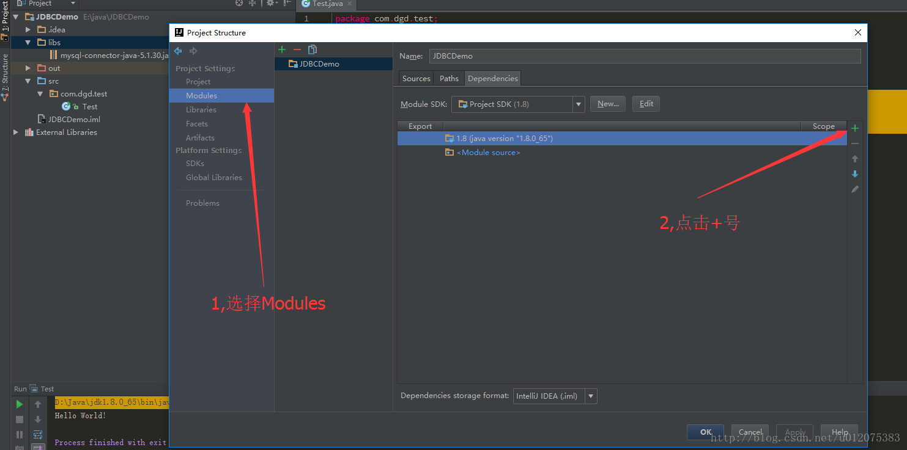
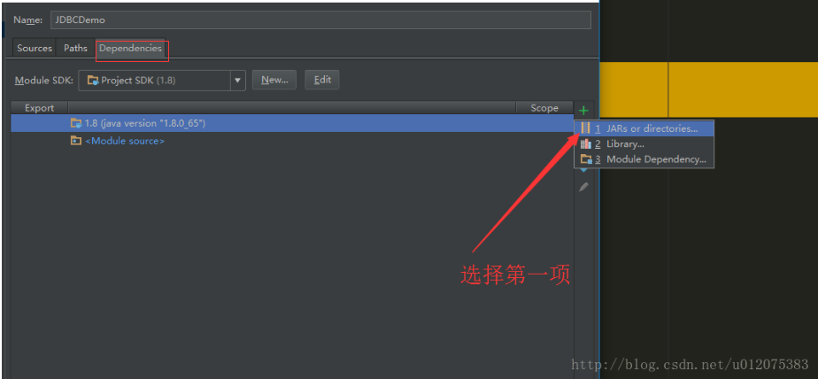
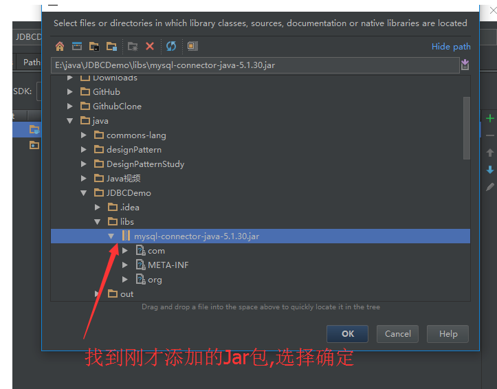
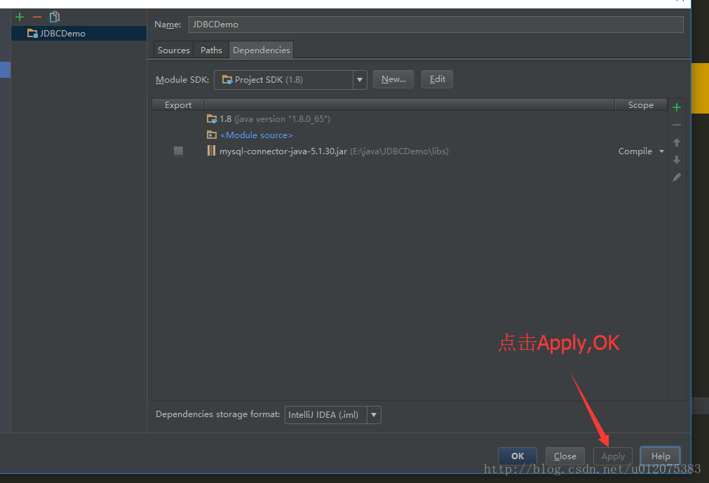
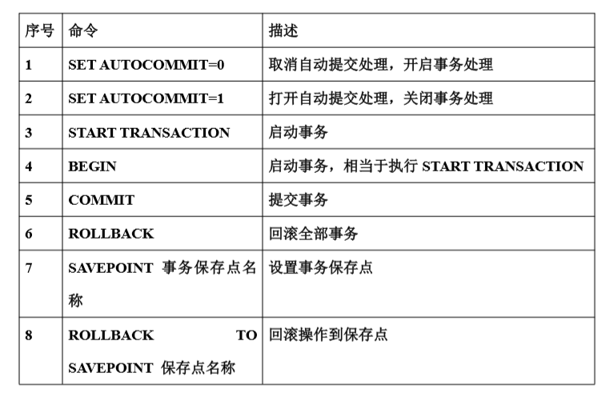

## 简介

JDBC（Java Data Base Connectivity，java 数据库连接）是一种用于执行 SQL 语句的 JavaAPI，可以为多种关系
数据库提供统一访问，它由一组用 Java 语言编写的类和接口组成。JDBC 提供了一种基准，据此可以构建更高
级的工具和接口，使数据库开发人员能够编写数据库应用程序


## 原理



JDBC 是以前 SUN 公司定义的一套访问数据库的接口（没有具体实现），一套标准，具体的实现是由
各大数据库厂家去实现，每个数据库厂家都有自己的 JDBC 实现，也就是 JDBC 驱动实现类，Java 应用程序连接
指定数据库，需要使用厂家提供的 JDBC 驱动才能连接。（这里其实就是 java 多态的一种体现，一个接口可以有
很多具体的实现）


## 连接数据库

注意：如果是tomcat项目，则直接把jdbc包拷贝到项目的WEB-INF/lib/目录下，或者放到tomcat的lib目录下，不需要进行下面的操作。

第一步：加载驱动；
第二步：连接数据库；
第三步：使用语句操作数据库；
第四步：关闭数据库连接，释放资源；

> 在项目里配置数据库驱动

eclipse：右击项目 -> Build Path -> Configure Build Path -> Add Exteranl JARs...

IntelliJ IDEA：

1、创建一个目录,用来放mysql的驱动包，类似eclipse的lib目录：JDBCDemo->New->Directory。

 

2、把mysql的jar包复制过来。 



3、把jar包添加到项目里，类似eclipse的add to build path功能，快捷键：Ctrl+Alt+Shift+S,弹出图示菜单。 



4、选择第一项：JARs or directories。 



5、找到刚才添加的jar包，点击确定。 



6、点击Apply,OK。 



---------------------


> 加载数据驱动

Mysql 驱动名：com.mysql.jdbc.Driver
加载方式： Class.forName(驱动名)；

```java
package com.java1234.jdbc.chap02.sec03;

public class Demo1 {

	private static String jdbcName="com.mysql.jdbc.Driver";
			
	public static void main(String[] args) {
		try {
			Class.forName(jdbcName);
			System.out.println("加载驱动成功！");
		} catch (ClassNotFoundException e) {
			// TODO Auto-generated catch block
			e.printStackTrace();
			System.out.println("加载驱动失败！");
		}
	}
}

```

>连接及关闭数据库

1，DriverManager 驱动管理类，主要负责获取一个数据库的连接；
static Connection getConnection(String url, String user, String password) 试图建立到给定数据库 URL 的连
接。
2，MySQL 数据库的连接地址格式
jdbc:mysql://IP 地址:端口号/数据库名称
jdbc 协议：JDBC URL 中的协议总是 jdbc ；
子协议：驱动程序名或数据库连接机制（这种机制可由一个或多个驱动程序支持）的名称，如 mysql；
子名称：一种标识数据库的方法。必须遵循“//主机名：端口/子协议”的标准 URL 命名约定，如
//localhost:3306/db_book
3，Connection 接口 与特定数据库的连接（会话）。
void close()
立即释放此 Connection 对象的数据库和 JDBC 资源，而不是等待它们被自动释放。

```java
package com.java1234.jdbc.chap02.sec04;

import java.sql.Connection;
import java.sql.DriverManager;
import java.sql.SQLException;

public class Demo1 {

	// 数据库地址
	private static String dbUrl="jdbc:mysql://localhost:3306/db_book";
	// 用户名
	private static String dbUserName="root";
	// 密码
	private static String dbPassword="123456";
	// 驱动名称
	private static String jdbcName="com.mysql.jdbc.Driver";
			
	public static void main(String[] args) {
		try {
			Class.forName(jdbcName);
			System.out.println("加载驱动成功！");
		} catch (ClassNotFoundException e) {
			// TODO Auto-generated catch block
			e.printStackTrace();
			System.out.println("加载驱动失败！");
		}
		Connection con=null;
		try {
			// 获取数据库连接
			con=DriverManager.getConnection(dbUrl, dbUserName, dbPassword);
			System.out.println("获取数据库连接成功！");
			System.out.println("进行数据库操作！");
		} catch (SQLException e) {
			// TODO Auto-generated catch block
			e.printStackTrace();
		}finally{
			try {
				con.close();
			} catch (SQLException e) {
				// TODO Auto-generated catch block
				e.printStackTrace();
			}
		}
	}
}

```


## Statement接口

### createStatement

这个方法的作用是写原生sql语句

```java
package com.java1234.jdbc.chap03.sec02;

import java.sql.Connection;
import java.sql.Statement;

import com.java1234.jdbc.util.DbUtil;

public class Demo1 {

   public static void main(String[] args) throws Exception{
      DbUtil dbUtil=new DbUtil();
      String sql="insert into t_book values(null,'java牛逼',888,'B哥',1)";
      Connection con=dbUtil.getCon(); //获取数据连接
      Statement stmt=con.createStatement(); // 获取Statement
      int result=stmt.executeUpdate(sql);
      System.out.println("操作的结果："+result+"数据");
      stmt.close();  // 关闭statement
      con.close();   // 关闭连接
   }
}
```


### 操作数据库

下面用createStatement封装操作数据库的一些方法

先写一个数据库连接的工具类：

```java
package com.java1234.jdbc.util;

import java.sql.CallableStatement;
import java.sql.Connection;
import java.sql.DriverManager;
import java.sql.Statement;

import com.mysql.jdbc.PreparedStatement;

public class DbUtil {

   // 数据库地址
   private static String dbUrl="jdbc:mysql://localhost:3306/db_bank";
   // 用户名
   private static String dbUserName="root";
   // 密码
   private static String dbPassword="123456";
   // 驱动名称
   private static String jdbcName="com.mysql.jdbc.Driver";
   
   /**
    * 获取数据库连接
    * @return
    * @throws Exception
    */
   public Connection getCon()throws Exception{
      Class.forName(jdbcName);
      Connection con=DriverManager.getConnection(dbUrl, dbUserName, dbPassword);
      return con;
   }
   
   /**
    * 关闭连接
    * @param con
    * @throws Exception
    */
   public void close(Statement stmt,Connection con)throws Exception{
      if(stmt!=null){
         stmt.close();
         if(con!=null){
            con.close();
         }
      }
   }
   
}
```


在写一个数据对象类：

```java
package com.java1234.jdbc.model;

import java.io.File;

/**
 * 图书对象
 * @author caofeng
 *
 */
public class Book {

   private int id;
   private String bookName;
   private float price;
   private String author;
   private int bookTypeId;
   private File context;
   private File pic;
   
   
   
   public Book(int id, String bookName, float price, String author,
         int bookTypeId) {
      super();
      this.id = id;
      this.bookName = bookName;
      this.price = price;
      this.author = author;
      this.bookTypeId = bookTypeId;
   }
   public Book(String bookName, float price, String author, int bookTypeId) {
      super();
      this.bookName = bookName;
      this.price = price;
      this.author = author;
      this.bookTypeId = bookTypeId;
   }
   
   
   public Book(String bookName, float price, String author, int bookTypeId,
         File context) {
      super();
      this.bookName = bookName;
      this.price = price;
      this.author = author;
      this.bookTypeId = bookTypeId;
      this.context = context;
   }
   
   
   public Book(String bookName, float price, String author, int bookTypeId,
         File context, File pic) {
      super();
      this.bookName = bookName;
      this.price = price;
      this.author = author;
      this.bookTypeId = bookTypeId;
      this.context = context;
      this.pic = pic;
   }
   public int getId() {
      return id;
   }
   public void setId(int id) {
      this.id = id;
   }
   public String getBookName() {
      return bookName;
   }
   public void setBookName(String bookName) {
      this.bookName = bookName;
   }
   public float getPrice() {
      return price;
   }
   public void setPrice(float price) {
      this.price = price;
   }
   public String getAuthor() {
      return author;
   }
   public void setAuthor(String author) {
      this.author = author;
   }
   public int getBookTypeId() {
      return bookTypeId;
   }
   public void setBookTypeId(int bookTypeId) {
      this.bookTypeId = bookTypeId;
   }
   
   
   public File getContext() {
      return context;
   }
   public void setContext(File context) {
      this.context = context;
   }
   
   
   public File getPic() {
      return pic;
   }
   public void setPic(File pic) {
      this.pic = pic;
   }
   @Override
   public String toString() {
      return "["+this.id+","+this.bookName+","+this.price+","+this.author+","+this.bookTypeId+"]";
   }
   
   
}
```


#### 增加

```java
package com.java1234.jdbc.chap03.sec02;

import java.sql.Connection;
import java.sql.Statement;

import com.java1234.jdbc.model.Book;
import com.java1234.jdbc.util.DbUtil;

public class Demo2 {

	private static DbUtil dbUtil=new DbUtil();
	
	/**
	 * 添加图书2（以对象的方式添加）
	 * @param book
	 * @return
	 * @throws Exception
	 */
	private static int addBook2(Book book)throws Exception{
		Connection con=dbUtil.getCon();  // 获取连接
		String sql="insert into t_book values(null,'"+book.getBookName()+"',"+book.getPrice()+",'"+book.getAuthor()+"',"+book.getBookTypeId()+")";
		Statement stmt=con.createStatement(); // 创建Statement
		int result=stmt.executeUpdate(sql);
		dbUtil.close(stmt, con);  // 关闭Statement和连接
		return result;
	}
	
	/**
	 * 添加图书
	 * @param bookName
	 * @param price
	 * @param author
	 * @param bookTypeId
	 * @return
	 * @throws Exception
	 */
	private static int addBook(String bookName,float price,String author,int bookTypeId)throws Exception{
		Connection con=dbUtil.getCon();  // 获取连接
		String sql="insert into t_book values(null,'"+bookName+"',"+price+",'"+author+"',"+bookTypeId+")";
		Statement stmt=con.createStatement(); // 创建Statement
		int result=stmt.executeUpdate(sql);
		dbUtil.close(stmt, con);  // 关闭Statement和连接
		return result;
	}
	
	public static void main(String[] args) throws Exception{
		/*int result=addBook("Java牛牛", 121, "牛哥", 1);
		if(result==1){
			System.out.println("添加成功！");
		}else{
			System.out.println("添加失败！");
		}*/   
		// 多行注释  ctrl+shift+/
		Book book=new Book("Java牛牛2", 1212, "牛哥2", 2);
		int result=addBook2(book);
		if(result==1){
			System.out.println("添加成功！");
		}else{
			System.out.println("添加失败！");
		}
	}
}

```


#### 更新

```java
package com.java1234.jdbc.chap03.sec03;

import java.sql.Connection;
import java.sql.Statement;

import com.java1234.jdbc.model.Book;
import com.java1234.jdbc.util.DbUtil;

public class Demo1 {

	private static DbUtil dbUtil = new DbUtil();

	/**
	 * 更新图书
	 * @param book
	 * @return
	 * @throws Exception
	 */
	private static int updateBook(Book book) throws Exception {
		Connection con = dbUtil.getCon(); // 获取连接
		String sql = "update t_book set bookName='" + book.getBookName()
				+ "',price=" + book.getPrice() + ",author='" + book.getAuthor()
				+ "',bookTypeId=" + book.getBookTypeId() + " where id="
				+ book.getId();  // ctrl+a 全选  ctrl+shift+F 格式化代码
		Statement stmt = con.createStatement(); // 创建Statement
		int result = stmt.executeUpdate(sql);
		dbUtil.close(stmt, con); // 关闭Statement和连接
		return result;
	}

	public static void main(String[] args) throws Exception{
		Book book=new Book(3,"Java牛牛2222", 121, "牛哥222", 1);
		int result=updateBook(book);
		if(result==1){
			System.out.println("更新成功！");
		}else{
			System.out.println("更新失败！");
		}
		
	}
}

```


#### 删除

```java
package com.java1234.jdbc.chap03.sec04;

import java.sql.Connection;
import java.sql.Statement;

import com.java1234.jdbc.util.DbUtil;

public class Demo1 {

	private static DbUtil dbUtil=new DbUtil();
	
	/**
	 * 删除图书
	 * @param id
	 * @return
	 * @throws Exception
	 */
	private static int deleteBook(int id)throws Exception{
		Connection con = dbUtil.getCon(); // 获取连接
		String sql ="delete from t_book where id="+id;
		Statement stmt = con.createStatement(); // 创建Statement
		int result = stmt.executeUpdate(sql);
		dbUtil.close(stmt, con); // 关闭Statement和连接
		return result;
	}
	
	public static void main(String[] args) throws Exception{
		int result=deleteBook(3);
		if(result==1){
			System.out.println("删除成功！");
		}else{
			System.out.println("删除失败！");
		}
	}
}

```


## PreparedStatement接口

PreparedStatement 是 Statement 的子接口，属于预处理操作，与直接使用 Statement 不同的是，PreparedStatement
在操作时，是先在数据表中准备好了一条 SQL 语句，但是此 SQL 语句的具体内容暂时不设置，而是之后再进
行设置。
**以后开发一般用 PreparedStatement，不用 Statement**

### 操作数据库

修改一下上面的连接数据库工具类

```java
package com.java1234.jdbc.util;

import java.sql.CallableStatement;
import java.sql.Connection;
import java.sql.DriverManager;
import java.sql.Statement;
import java.sql.PreparedStatement;

public class DbUtil {

   // 数据库地址
   private static String dbUrl="jdbc:mysql://localhost:3306/db_bank";
   // 用户名
   private static String dbUserName="root";
   // 密码
   private static String dbPassword="123456";
   // 驱动名称
   private static String jdbcName="com.mysql.jdbc.Driver";
   
   /**
    * 获取数据库连接
    * @return
    * @throws Exception
    */
   public Connection getCon()throws Exception{
      Class.forName(jdbcName);
      Connection con=DriverManager.getConnection(dbUrl, dbUserName, dbPassword);
      return con;
   }
   
   /**
    * 关闭连接
    * @param con
    * @throws Exception
    */
   public void close(PreparedStatement pstmt,Connection con)throws Exception{
      if(pstmt!=null){
         pstmt.close();
         if(con!=null){
            con.close();
         }
      }
   }
}
```


还是用上面的数据对象进行下面的操作


#### 增加

```java
package com.java1234.jdbc.chap04.sec02;

import java.sql.Connection;
import java.sql.PreparedStatement;

import com.java1234.jdbc.model.Book;
import com.java1234.jdbc.util.DbUtil;

public class Demo1 {

	private static DbUtil dbUtil=new DbUtil();
	
	/**
	 * 添加图书
	 * @param book
	 * @return
	 * @throws Exception
	 */
	private static int addBook(Book book)throws Exception{
		Connection con=dbUtil.getCon(); // 获取连接
		String sql="insert into t_book values(null,?,?,?,?)";
		PreparedStatement pstmt=con.prepareStatement(sql);
		pstmt.setString(1, book.getBookName());  // 给第一个坑设置值
		pstmt.setFloat(2, book.getPrice());  // 给第二个坑设置值
		pstmt.setString(3, book.getAuthor()); // 给第三个坑设置值
		pstmt.setInt(4, book.getBookTypeId());  // 给第四个坑设置值
		int result=pstmt.executeUpdate();
		dbUtil.close(pstmt, con);
		return result;
	}
	
	public static void main(String[] args) throws Exception{
		Book book=new Book("Java叉叉2", 1, "叉叉", 1);
		int result=addBook(book);
		if(result==1){
			System.out.println("添加成功！");
		}else{
			System.out.println("添加失败！");
		}
	}
}

```


#### 更新

```java
package com.java1234.jdbc.chap04.sec03;

import java.sql.Connection;
import java.sql.PreparedStatement;

import com.java1234.jdbc.model.Book;
import com.java1234.jdbc.util.DbUtil;

public class Demo1 {

	private static DbUtil dbUtil=new DbUtil();
	
	/**
	 * 更新图书
	 * @param book
	 * @return
	 * @throws Exception
	 */
	private static int updateBook(Book book)throws Exception{
		Connection con=dbUtil.getCon();
		String sql="update t_book set bookName=?,price=?,author=?,bookTypeId=? where id=?";
		PreparedStatement pstmt=con.prepareStatement(sql);
		pstmt.setString(1, book.getBookName());
		pstmt.setFloat(2, book.getPrice());
		pstmt.setString(3, book.getAuthor());
		pstmt.setInt(4, book.getBookTypeId());
		pstmt.setInt(5, book.getId());
		int result=pstmt.executeUpdate();
		dbUtil.close(pstmt, con);
		return result;
	}
	
	public static void main(String[] args) throws Exception{
		Book book=new Book(12,"K2", 2, "K", 2);
		int result=updateBook(book);
		if(result==1){
			System.out.println("更新成功！");
		}else{
			System.out.println("更新失败！");
		}
	}
}

```


#### 删除

```java
package com.java1234.jdbc.chap04.sec04;

import java.sql.Connection;
import java.sql.PreparedStatement;

import com.java1234.jdbc.util.DbUtil;

public class Demo1 {

	private static DbUtil dbUtil=new DbUtil();
	
	/**
	 * 删除图书
	 * @param id
	 * @return
	 * @throws Exception
	 */
	private static int deleteBook(int id)throws Exception{
		Connection con=dbUtil.getCon();
		String sql="delete from t_book where id=?";
		PreparedStatement pstmt=con.prepareStatement(sql);
		pstmt.setInt(1, id);
		int result=pstmt.executeUpdate();
		dbUtil.close(pstmt, con);
		return result;
	}
	
	public static void main(String[] args)throws Exception {
		int result=deleteBook(12);
		if(result==1){
			System.out.println("删除成功！");
		}else{
			System.out.println("删除失败！");
		}
	}
}

```


#### 查询

> ResultSet 结果集的引入

当我们查询数据库时，返回的是一个二维的结果集，我们这时候需要使用 ResultSet 来遍历结果集，获取每一行
的数据。

> 使用 ResultSet 遍历查询结果

boolean next() 将光标从当前位置向前移一行。
String getString(int columnIndex) 以 Java 编程语言中 String 的形式获取此 ResultSet 对象的当前行中指定列
的值。
String getString(String columnLabel) 以 Java 编程语言中 String 的形式获取此 ResultSet 对象的当前行中指
定列的值。**一般使用这个**

```java
package com.java1234.jdbc.chap05.sec02;

import java.sql.Connection;
import java.sql.PreparedStatement;
import java.sql.ResultSet;
import java.util.ArrayList;
import java.util.List;

import com.java1234.jdbc.model.Book;
import com.java1234.jdbc.util.DbUtil;

public class Demo1 {

	private static DbUtil dbUtil = new DbUtil();

	/**
	 * 遍历查询结果
	 * @throws Exception
	 */
	private static void listBook() throws Exception {
		Connection con = dbUtil.getCon(); // 获取连接
		String sql = "select * from t_book";
		PreparedStatement pstmt = con.prepareStatement(sql);
		ResultSet rs = pstmt.executeQuery(); // 返回结果集ResultSet
		while (rs.next()) {
			int id = rs.getInt(1); // 获取第一个列的值 编号id
			String bookName = rs.getString(2); // 获取第二个列的值 图书名称 bookName
			float price = rs.getFloat(3); // 获取第三列的值 图书价格 price
			String author = rs.getString(4); // 获取第四列的值 图书作者 author
			int bookTypeId = rs.getInt(5); // 获取第五列的值 图书类别id
			System.out.println("图书编号：" + id + " 图书名称：" + bookName + " 图书价格："
					+ price + " 图书作者：" + author + " 图书类别id：" + bookTypeId);
			System.out
					.println("=======================================================================");

		}
	}
	
	/**
	 * 遍历查询结果
	 * @throws Exception
	 */
	private static void listBook2() throws Exception {
		Connection con = dbUtil.getCon(); // 获取连接
		String sql = "select * from t_book";
		PreparedStatement pstmt = con.prepareStatement(sql);
		ResultSet rs = pstmt.executeQuery(); // 返回结果集ResultSet
		while (rs.next()) {
			int id = rs.getInt("id"); // 获取第一个列的值 编号id
			String bookName = rs.getString("bookName"); // 获取第二个列的值 图书名称 bookName
			float price = rs.getFloat("price"); // 获取第三列的值 图书价格 price
			String author = rs.getString("author"); // 获取第四列的值 图书作者 author
			int bookTypeId = rs.getInt("bookTypeId"); // 获取第五列的值 图书类别id
			System.out.println("图书编号：" + id + " 图书名称：" + bookName + " 图书价格："
					+ price + " 图书作者：" + author + " 图书类别id：" + bookTypeId);
			System.out
					.println("=======================================================================");

		}
	}
	
	private static List<Book> listBook3()throws Exception{
		List<Book> bookList=new ArrayList<Book>(); 
		Connection con = dbUtil.getCon(); // 获取连接
		String sql = "select * from t_book";
		PreparedStatement pstmt = con.prepareStatement(sql);
		ResultSet rs = pstmt.executeQuery(); // 返回结果集ResultSet
		while (rs.next()) {
			int id = rs.getInt("id"); // 获取第一个列的值 编号id
			String bookName = rs.getString("bookName"); // 获取第二个列的值 图书名称 bookName
			float price = rs.getFloat("price"); // 获取第三列的值 图书价格 price
			String author = rs.getString("author"); // 获取第四列的值 图书作者 author
			int bookTypeId = rs.getInt("bookTypeId"); // 获取第五列的值 图书类别id
			Book book=new Book(id, bookName, price, author, bookTypeId);
			bookList.add(book);
		}
		return bookList;
	}

	public static void main(String[] args) throws Exception {
		// listBook();
		// listBook2();
		List<Book> bookList=listBook3();
		for (Book book : bookList) {
			System.out.println(book);
		}
	}
}

```


#### 处理大数据对象

大数据对象处理主要有 CLOB（character large object）和 BLOB（binary large object）两种类型的字段；在 CLOB
中可以存储大字符数据对象，比如长篇小说；在 BLOB 中可以存放二进制大数据对象，比如图片，电影，音乐；

##### 处理 CLOB 数据

```java
package com.java1234.jdbc.chap06.sec01;

import java.io.File;
import java.io.FileInputStream;
import java.io.InputStream;
import java.sql.Clob;
import java.sql.Connection;
import java.sql.PreparedStatement;
import java.sql.ResultSet;

import com.java1234.jdbc.model.Book;
import com.java1234.jdbc.util.DbUtil;

public class Demo1 {

private static DbUtil dbUtil=new DbUtil();
   
   /**
    * 添加图书
    * @param book
    * @return
    * @throws Exception
    */
   private static int addBook(Book book)throws Exception{
      Connection con=dbUtil.getCon(); // 获取连接
      String sql="insert into t_book values(null,?,?,?,?,?)";
      PreparedStatement pstmt=con.prepareStatement(sql);
      pstmt.setString(1, book.getBookName());  // 给第一个坑设置值
      pstmt.setFloat(2, book.getPrice());  // 给第二个坑设置值
      pstmt.setString(3, book.getAuthor()); // 给第三个坑设置值
      pstmt.setInt(4, book.getBookTypeId());  // 给第四个坑设置值
      File context=book.getContext(); // 获取文件
      InputStream inputStream=new FileInputStream(context);
      pstmt.setAsciiStream(5, inputStream,context.length());  // 给第五个坑设置值
      int result=pstmt.executeUpdate();
      dbUtil.close(pstmt, con);
      return result;
   }
   
   public static void getBook(int id)throws Exception{
      Connection con=dbUtil.getCon();
      String sql="select * from t_book where id=?";
      PreparedStatement pstmt=con.prepareStatement(sql);
      pstmt.setInt(1, id);
      ResultSet rs=pstmt.executeQuery();
      if(rs.next()){
         String bookName=rs.getString("bookName");
         float price=rs.getFloat("price");
         String author=rs.getString("author");
         int bookTypeId=rs.getInt("bookTypeId");
         Clob c=rs.getClob("context");
         String context=c.getSubString(1, (int)c.length());
         System.out.println("图书名称："+bookName);
         System.out.println("图书价格:"+price);
         System.out.println("图书作者："+author);
         System.out.println("图书类型ID："+bookTypeId);
         System.out.println("图书内容："+context);
      }
      dbUtil.close(pstmt, con);
   }
   
   public static void main(String[] args)throws Exception {
      /*File context=new File("c:/helloWorld.txt");
      Book book=new Book("helloWorld", 100, "小锋", 1,context);
      int result=addBook(book);
      if(result==1){
         System.out.println("添加成功！");
      }else{
         System.out.println("添加失败！");
      }*/
      getBook(16);
   }
}
```

##### 处理 BLOG 数据

```java
package com.java1234.jdbc.chap06.sec02;

import java.io.File;
import java.io.FileInputStream;
import java.io.FileOutputStream;
import java.io.InputStream;
import java.sql.Blob;
import java.sql.Clob;
import java.sql.Connection;
import java.sql.PreparedStatement;
import java.sql.ResultSet;

import com.java1234.jdbc.model.Book;
import com.java1234.jdbc.util.DbUtil;

public class Demo1 {

private static DbUtil dbUtil=new DbUtil();
	
	/**
	 * 添加图书
	 * @param book
	 * @return
	 * @throws Exception
	 */
	private static int addBook(Book book)throws Exception{
		Connection con=dbUtil.getCon(); // 获取连接
		String sql="insert into t_book values(null,?,?,?,?,?,?)";
		PreparedStatement pstmt=con.prepareStatement(sql);
		pstmt.setString(1, book.getBookName());  // 给第一个坑设置值
		pstmt.setFloat(2, book.getPrice());  // 给第二个坑设置值
		pstmt.setString(3, book.getAuthor()); // 给第三个坑设置值
		pstmt.setInt(4, book.getBookTypeId());  // 给第四个坑设置值
		File context=book.getContext(); // 获取文件
		InputStream inputStream=new FileInputStream(context);
		pstmt.setAsciiStream(5, inputStream,context.length());  // 给第五个坑设置值
		
		File pic=book.getPic(); // 获取图片文件
		InputStream inputStream2=new FileInputStream(pic);
		pstmt.setBinaryStream(6, inputStream2, pic.length()); // 给第六个坑设置值
		int result=pstmt.executeUpdate();
		dbUtil.close(pstmt, con);
		return result;
	}
	
	public static void getBook(int id)throws Exception{
		Connection con=dbUtil.getCon();
		String sql="select * from t_book where id=?";
		PreparedStatement pstmt=con.prepareStatement(sql);
		pstmt.setInt(1, id);
		ResultSet rs=pstmt.executeQuery();
		if(rs.next()){
			String bookName=rs.getString("bookName");
			float price=rs.getFloat("price");
			String author=rs.getString("author");
			int bookTypeId=rs.getInt("bookTypeId");
			Clob c=rs.getClob("context");
			String context=c.getSubString(1, (int)c.length());
			Blob b=rs.getBlob("pic");
			FileOutputStream out=new FileOutputStream(new File("d:/pic2.jpg"));
			out.write(b.getBytes(1, (int)b.length()));
			out.close();
			System.out.println("图书名称："+bookName);
			System.out.println("图书价格:"+price);
			System.out.println("图书作者："+author);
			System.out.println("图书类型ID："+bookTypeId);
			System.out.println("图书内容："+context);
		}
		dbUtil.close(pstmt, con);
	}
	
	public static void main(String[] args)throws Exception {
		/*File context=new File("c:/helloWorld.txt");
		File pic=new File("c:/pic1.jpg");
		Book book=new Book("helloWorld", 100, "小锋", 1,context,pic);
		int result=addBook(book);
		if(result==1){
			System.out.println("添加成功！");
		}else{
			System.out.println("添加失败！");
		}*/
	    getBook(18);
	}
}

```


##  CallableStatement接口

### 引入

CallableStatement 主要是调用数据库中的存储过程，CallableStatement 也是 Statement 接口的子接口，并且还是PreparedStatement接口的子接口。在使用 CallableStatement 时可以接收存储过程的返回值。


### 调用存储过程

voidregisterOutParameter(int parameterIndex, intsqlType) 按顺序位置 parameterIndex 将 OUT 参数注册为 JDBC 类型 sqlType。


#### 具体实例

修改一下上面的连接数据库工具类

```java
package com.java1234.jdbc.util;

import java.sql.CallableStatement;
import java.sql.Connection;
import java.sql.DriverManager;
import java.sql.Statement;

import com.mysql.jdbc.PreparedStatement;

public class DbUtil {

	// 数据库地址
	private static String dbUrl="jdbc:mysql://localhost:3306/db_bank";
	// 用户名
	private static String dbUserName="root";
	// 密码
	private static String dbPassword="123456";
	// 驱动名称
	private static String jdbcName="com.mysql.jdbc.Driver";
	
	/**
	 * 获取数据库连接
	 * @return
	 * @throws Exception
	 */
	public Connection getCon()throws Exception{
		Class.forName(jdbcName);
		Connection con=DriverManager.getConnection(dbUrl, dbUserName, dbPassword);
		return con;
	}
	
	/**
	 * 关闭连接
	 * @param con
	 * @throws Exception
	 */
	public void close(Statement stmt,Connection con)throws Exception{
		if(stmt!=null){
			stmt.close();
			if(con!=null){
				con.close();
			}
		}
	}
	
	/**
	 * 关闭连接
	 * @param con
	 * @throws Exception
	 */
	public void close(PreparedStatement pstmt,Connection con)throws Exception{
		if(pstmt!=null){
			pstmt.close();
			if(con!=null){
				con.close();
			}
		}
	}
	
	/**
	 * 关闭连接
	 * @param con
	 * @throws Exception
	 */
	public void close(CallableStatement cstmt,Connection con)throws Exception{
		if(cstmt!=null){
			cstmt.close();
			if(con!=null){
				con.close();
			}
		}
	}
}

```


在mysql里面建立一个存储过程

```mysql
DELIMITER &&
CREATE PROCEDURE pro_getBookNameById(IN bookId INT,OUT bN VARCHAR(20))
 BEGIN
	SELECT bookName INTO bn FROM t_book WHERE id=bookId;
 END 
&&
DELIMITER ;

CALL pro_getBookNameById(10,@bookName);
SELECT @bookName;
```


java调用

```java
package com.java1234.jdbc.chap07.sec02;

import java.sql.CallableStatement;
import java.sql.Connection;
import java.sql.Types;

import com.java1234.jdbc.util.DbUtil;

public class Demo1 {

	private static DbUtil dbUtil=new DbUtil();
	
	/**
	 * 调用存储过程，通过id查询bookName
	 * @param id
	 * @return
	 * @throws Exception
	 */
	private static String getBookNameById(int id)throws Exception{
		Connection con=dbUtil.getCon();  // 获取数据库连接
		String sql="{CALL pro_getBookNameById(?,?)}";
		CallableStatement cstmt=con.prepareCall(sql);
		cstmt.setInt(1, id); // 设置第一个参数
		cstmt.registerOutParameter(2, Types.VARCHAR);  // 设置返回类型
		cstmt.execute();
		String bookName=cstmt.getString("bN");  // 获取返回值
		dbUtil.close(cstmt, con);
		return bookName;
	}
	
	public static void main(String[] args) throws Exception{
		System.out.println("图书名称是："+getBookNameById(11));
	}
}

```


## 元数据

### DatabaseMetaData 

> 使用 DatabaseMetaData 获取数据库基本信息

DatabaseMetaData 可以得到数据库的一些基本信息，包括数据库的名称、版本，以及得到表的信息。 

StringgetDatabaseProductName() 获取此数据库产品的名称。 

intgetDriverMajorVersion() 获取此 JDBC 驱动程序的主版本号。 

intgetDriverMinorVersion() 获取此 JDBC 驱动程序的次版本号。

```java
package com.java1234.jdbc.chap08.sec01;

import java.sql.Connection;
import java.sql.DatabaseMetaData;

import com.java1234.jdbc.util.DbUtil;

public class Demo1 {

	public static void main(String[] args)throws Exception {
		DbUtil dbUtil=new DbUtil();
		Connection con=dbUtil.getCon();
		DatabaseMetaData dmd=con.getMetaData(); // 获取元数据
		System.out.println("数据库名称："+dmd.getDatabaseProductName());
		System.out.println("数据库版本："+dmd.getDriverMajorVersion()+"."+dmd.getDriverMinorVersion());
		
	}
}

```


### ResultSetMetaData 

> 使用 ResultSetMetaData 获取 ResultSet 对象中的信息

ResultSetMetaData 可获取关于 ResultSet 对象中列的基本信息；

intgetColumnCount() 返回此 ResultSet 对象中的列数。

StringgetColumnName(int column) 获取指定列的名称。 

intgetColumnTypeName(int column) 获取指定列的 SQL 类型名称。

```java
package com.java1234.jdbc.chap08.sec02;

import java.sql.Connection;
import java.sql.PreparedStatement;
import java.sql.ResultSetMetaData;

import com.java1234.jdbc.util.DbUtil;

public class Demo2 {

	public static void main(String[] args) throws Exception{
		DbUtil dbUtil=new DbUtil();
		Connection con=dbUtil.getCon();
		String sql="select * from t_book";
		PreparedStatement pstmt=con.prepareStatement(sql);
		ResultSetMetaData rsmd=pstmt.getMetaData();
		int num=rsmd.getColumnCount(); // 获取元数据列的总数
		System.out.println("共有"+num+"列");
		for(int i=1;i<=num;i++){
			System.out.println(rsmd.getColumnName(i)+","+rsmd.getColumnTypeName(i));
		}
	}
}

```


## 事务处理

### 事务的概念

事务处理在数据库开发中有着非常重要的作用，所谓事务就是所有的操作要么一起成功，要么一起失败，事务 本身具有原子性（Atomicity）、一致性（Consistency）、隔离性或独立性（Isolation） 、持久性（Durability）4 个特 性，这 4 个特性也被称为 ACID 特征。 原子性：原子性是事务最小的单元，是不可再分隔的单元，相当于一个个小的数据库操作，这些操作必须同时 成功，如果一个失败了，则一切的操作将全部失败。 一致性：指的是在数据库操作的前后是完全一致的，保证数据的有效性，如果事务正常操作则系统会维持有效 性，如果事务出现了错误，则回到最原始状态，也要维持其有效性，这样保证事务开始时和结束时系统处于一 致状态。 隔离性：多个事务可以同时进行且彼此之间无法访问，只有当事务完成最终操作时，才可以看到结果； 持久性：事务完成之后，它对于系统的影响是永久性的。该修改即使出现致命的系统故障也将一直保持。


### MySQL 对事务的支持




### JDBC操作事务

建立一个数据库来示例操作

```mysql
CREATE DATABASE `db_bank` DEFAULT CHARACTER SET utf8;

USE `db_bank`;

DROP TABLE IF EXISTS `t_account`;

CREATE TABLE `t_account` (
  `id` int(11) NOT NULL AUTO_INCREMENT,
  `accountName` varchar(20) DEFAULT NULL,
  `accountBalance` int(11) DEFAULT NULL,
  PRIMARY KEY (`id`)
) ENGINE=InnoDB AUTO_INCREMENT=3 DEFAULT CHARSET=utf8;


insert  into `t_account`(`id`,`accountName`,`accountBalance`) values (1,'张三',500),(2,'李四',1000);

```


#### 基本用法

```java
package com.java1234.jdbc.chap09.sec03;

import java.sql.Connection;
import java.sql.PreparedStatement;
import java.sql.SQLException;

import com.java1234.jdbc.util.DbUtil;

public class Demo1 {
	
	private static DbUtil dbUtil=new DbUtil();

	/**
	 * 转出
	 * @param con
	 * @param accountName
	 * @param account
	 * @throws Exception
	 */
	private static void outCount(Connection con,String accountName,int account)throws Exception{
		String sql="update t_account set accountBalance=accountBalance-? where accountName=?";
		PreparedStatement pstmt=con.prepareStatement(sql);
		pstmt.setInt(1, account);
		pstmt.setString(2, accountName);
		pstmt.executeUpdate();
	}
	
	/**
	 * 转入
	 * @param con
	 * @param accountName
	 * @param account
	 * @throws Exception
	 */
	private static void inCount(Connection con,String accountName,int account)throws Exception{
		String sql="update t_account set account=accountBalance+? where accountName=?";
		PreparedStatement pstmt=con.prepareStatement(sql);
		pstmt.setInt(1, account);
		pstmt.setString(2, accountName);
		pstmt.executeUpdate();
	}
	
	
	public static void main(String[] args) {
		Connection con=null;
		try {
			con=dbUtil.getCon(); 
			con.setAutoCommit(false); // 取消自动提交
			System.out.println("张三开始向李四转账！");
			int account=500;
			outCount(con, "张三", account);
			inCount(con, "李四", account);
			System.out.println("转账成功！");
		} catch (Exception e) {
			try {
				con.rollback(); // 回滚
			} catch (SQLException e1) {
				// TODO Auto-generated catch block
				e1.printStackTrace();
			}
			// TODO Auto-generated catch block
			e.printStackTrace();
		}finally{
			try {
				con.commit();  // 提交事务
				con.close();
			} catch (SQLException e) {
				// TODO Auto-generated catch block
				e.printStackTrace();
			}
		}
	}
}

```


#### 事务保存点

```java
package com.java1234.jdbc.chap09.sec04;

import java.sql.Connection;
import java.sql.PreparedStatement;
import java.sql.SQLException;
import java.sql.Savepoint;

import com.java1234.jdbc.util.DbUtil;

public class Demo1 {
	
	private static DbUtil dbUtil=new DbUtil();

	/**
	 * 转出
	 * @param con
	 * @param accountName
	 * @param account
	 * @throws Exception
	 */
	private static void outCount(Connection con,String accountName,int account)throws Exception{
		String sql="update t_account set accountBalance=accountBalance-? where accountName=?";
		PreparedStatement pstmt=con.prepareStatement(sql);
		pstmt.setInt(1, account);
		pstmt.setString(2, accountName);
		pstmt.executeUpdate();
	}
	
	/**
	 * 转入
	 * @param con
	 * @param accountName
	 * @param account
	 * @throws Exception
	 */
	private static void inCount(Connection con,String accountName,int account)throws Exception{
		String sql="update t_account set account=accountBalance+? where accountName=?";
		PreparedStatement pstmt=con.prepareStatement(sql);
		pstmt.setInt(1, account);
		pstmt.setString(2, accountName);
		pstmt.executeUpdate();
	}
	
	
	public static void main(String[] args) {
		Connection con=null;
		Savepoint sp=null;
		try {
			con=dbUtil.getCon(); 
			con.setAutoCommit(false); // 取消自动提交
			System.out.println("张三开始向李四转账！");
			int account=500;
			outCount(con, "张三", account);
			sp=con.setSavepoint(); // 设置一个保存点
			inCount(con, "李四", account);
			System.out.println("转账成功！");
		} catch (Exception e) {
			try {
				con.rollback(sp); // 回滚到sp保存点
			} catch (SQLException e1) {
				// TODO Auto-generated catch block
				e1.printStackTrace();
			}
			// TODO Auto-generated catch block
			e.printStackTrace();
		}finally{
			try {
				con.commit();  // 提交事务
				con.close();
			} catch (SQLException e) {
				// TODO Auto-generated catch block
				e.printStackTrace();
			}
		}
	}
}

```

