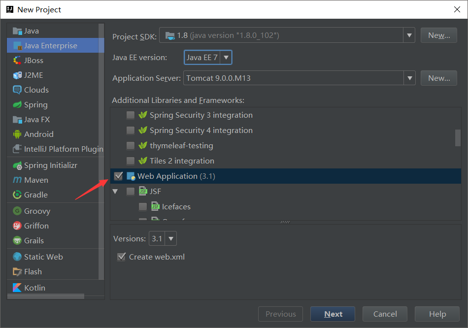

## Tomcat目录

/bin：存放windows或Linux平台上启动和关闭Tomcat的脚本文件

/conf：存放Tomcat服务器的各种全局配置文件，其中最重要的是server.xml和web.xml

/doc：存放Tomcat文档

/server：包含三个子目录：classes、lib和webapps

/server/lib：存放Tomcat服务器所需的各种JAR文件

/server/webapps：存放Tomcat自带的两个WEB应用admin应用和 manager应用

/common/lib：存放Tomcat服务器以及所有web应用都可以访问的jar文件

/shared/lib：存放所有web应用都可以访问的jar文件（但是不能被Tomcat服务器访问）

/logs：存放Tomcat执行时的日志文件

/src：存放Tomcat的源代码

/webapps：Tomcat的主要Web发布目录，默认情况下把Web应用文件放于此目录

/work：存放JSP编译后产生的class文件


## 运行一个基础项目

我们示例运行Hello项目。

在/webapps里面建一个Hello文件夹，在Hello文件夹里面建一个WEB-INF文件夹，WEB-INF文件夹属于服务器web配置文件夹，里面放一个web.xml配置文件，文件内容如下：

```xml
<?xml version="1.0" encoding="UTF-8"?>
<web-app xmlns:xsi="http://www.w3.org/2001/XMLSchema-instance" xmlns="http://java.sun.com/xml/ns/javaee" xsi:schemaLocation="http://java.sun.com/xml/ns/javaee http://java.sun.com/xml/ns/javaee/web-app_2_5.xsd" id="WebApp_ID" version="2.5">
  <display-name>T1</display-name>
  <welcome-file-list>
    <welcome-file>index.html</welcome-file>
    <welcome-file>index.htm</welcome-file>
    <welcome-file>index.jsp</welcome-file>
    <welcome-file>default.html</welcome-file>
    <welcome-file>default.htm</welcome-file>
    <welcome-file>default.jsp</welcome-file>
  </welcome-file-list>
</web-app>
```

这只是最基本的配置。

我们再在Hello文件夹建立一个index.html文件，里面的内容随便定义。然后就可以启动tomcat，然后用浏览器输入http://localhost:8080/Hello/或者http://localhost:8080/Hello/index.html访问即可。


## IntelliJ IDEA配置Tomcat

查找该问题的童鞋我相信IntelliJ IDEA，Tomcat的下载，JDK等其他的配置都应该完成了，那我直接进入正题了。

1.新建一个项目


2.由于这里我们仅仅为了展示如何成功部署Tomcat，以及配置完成后成功运行一个jsp文件，我仅勾选JavaEnterprise-->Web Application-->Next。可能由于我之前配置过了所以在Application Server这一栏会显示已有Tomcat，你们忽略就好。



3.项目名称这些默认就好了，为了快速部署Tomcat嘛，这些不是重点。点击Finish,等待IntelliJ IDEA加载完


4.点击如图所示小三角，接着点击（Edit Configurations或者ADD Configurations）-->绿色加号-->如果列表里没有则-->点击33 items more irrelevant这一项后继续寻找。


Tomcat Server-->Local

5.


点击"Configure..."，配置Apache你从官网上下载的Tomcat，zip压缩包解压后的文件目录 ，我的是apache-tomcat-9.0.0.M13。而且我没有进行配置，是IDE自己定位好的，很智能，我当时有小惊奇哈哈。


6.选择浏览器


我用的是火狐，并配置firefox.exe路径。我建议使用火狐或者Chrome，开发者必备。

 7.配置artifacts，我第一次因为忘了配置也不懂这个东西是干嘛的，运行Tomcat后会报错，错误信息是：

[RMI TCP Connection(2)-127.0.0.1] org.apache.catalina.core.StandardContext.startInternal One or more Filters failed to start.

官方的说法:https://www.jetbrains.com/help/idea/2016.3/configuring-web-application-deployment.html(我英语不好不忍心翻译）点击Fix


标签由Server跳到Deploment，点击小铅笔一样的图标对artifacts进行配置


新建文件夹-->绿色小加号-->Directory Content选择Web存放的位置，当然是Tomcat的webapps了,生成的war文件部署在该项目中才可以在Tomcat服务器上运行。直接运行在web文件夹下的index。jsp文件，做最后验证。

点击下图按钮验证


## intellij idea 打包成war

点击【File】->【Project Structure】菜单（或使用Shift+Ctrl+Alt+S快捷键），打开【Project Structure】窗口。


编译及执行打war包，点击【Build】->【BuildArtifacts】->【Build】。

然后进入对应目录，把war包改成项目名称后直接扔到wabapps目录里面，启动tomcat，然后访问即可。


## IntelliJ IDEA导入servlet包

1、选中项目（在IntelliJ中称为Module）；
2、点击右键，选择open modual settings（或者直接按F4）；
3、在弹出的窗口左端选择Libraries；
4、点击顶端的一个类似加号“+”的图标，在右端选择第一项；
6、在弹出的窗口中选择tomcat所在的目录，进入里面的lib目录，寻找servlet-api.jar这个jar包（如果JSP页面也有相关的JavaWeb对象，则还要寻找jsp-api.jar；如果只有Servlet，则只选择servlet-api.jar）；

7、选中上述jar包，依次点击OK

## Jsp基础语法

### page指令介绍

> Language : 用来定义要使用的脚本语言； 

> contentType：定义 JSP 字符的编码和页面响应的 MIME 类型；

> pageEncoding：Jsp 页面的字符编码

```jsp
<%@ page contentType="text/html;charset=UTF-8" language="java" pageEncoding="UTF-8" %>
<html>
<head>
    <title>Title</title>
</head>
<body>

</body>
</html>

```

### scriptlet 标签

通过 scriptlet 标签我们可以在 Jsp 里嵌入 Java 代码

> <%! %> 我们可以在里面定义全局变量、方法、类

> <%%> 我们可以在里面定义局部变量、编写语句

> <%= %> 我们可以在里面输出一个变量或一个具体内容

```jsp
<%@ page contentType="text/html;charset=UTF-8" language="java" pageEncoding="UTF-8" %>
<%!
    String str="全局变量";
    public void fun(){
        System.out.println("全局函数");
    }
    class Cla{
        public void claFun(){
            System.out.println("全局类");
        }
    }
%>
<%
    String str1="局部变量";
    out.println(str1);//编写语句
%>
<%=str %>
<html>
<head>
    <title>Title</title>
</head>
<body>

</body>
</html>

```

### Jsp 注释

> Html 注释 客户端可见 

> <%-- --%> Jsp 注释 客户端不可见 

> // java 单行注释 

> /* */ java 多行注释 

```jsp
<%@ page contentType="text/html;charset=UTF-8" language="java" pageEncoding="UTF-8" %>
<%-- 这是jsp语法的注释 --%>
<html>
<head>
    <title>Title</title>
</head>
<body>

</body>
</html>

```


### Jsp 包含指令

> <%@ includefile=”要包含的文件”%> 静态包含 先包含，后编译处理； 

> \<jsp:includepage=”要包含的文件” /> 动态包含 先编译处理，后包含； 

**以后开发用动态包含**

```jsp
<%@ page contentType="text/html;charset=UTF-8" language="java" pageEncoding="UTF-8" %>
<!DOCTYPE html>
<html>
<head>
    <title>Title</title>
</head>
<body>
    <%--静态包含--%>
    <%@include file="include/header.html" %>
    <%@include file="include/nav.jsp" %>
    <div>这是内容</div>
    <%@include file="include/footer.html" %>

    <%--动态包含--%>
    <jsp:include page="include/header.html" />
    <jsp:include page="include/nav.jsp" />
    <div>这是内容</div>
    <jsp:include page="include/footer.html" />
</body>
</html>

```


### Jsp 跳转指令

> \<jsp:forward> 
>
> ​	<jsp:param value=”” name=”” />
>
> \< /jsp:forward>
>
> 跳转页面接受参数方式：<%=request.getParameter("参数名称") %>
>
> 服务器内部跳转，可带参数，注意：内部跳转后的链接地址不会发生变化


```jsp
<%@ page contentType="text/html;charset=UTF-8" language="java" pageEncoding="UTF-8" %>
<!DOCTYPE html>
<html>
<head>
    <title>Title</title>
</head>
<body>
  <jsp:forward page="target.jsp">
      <jsp:param name="username" value="sclzdj" />
      <jsp:param name="password" value="123456" />
  </jsp:forward>
</body>
</html>
```

taget.jsp接受参数的代码

```jsp
<%@ page contentType="text/html;charset=UTF-8" language="java" pageEncoding="UTF-8" %>
<!DOCTYPE html>
<html>
<head>
    <title>Title</title>
</head>
<body>
<div>
    username:<%=request.getParameter("username") %>
</div>
<div>
    password:<%=request.getParameter("password") %>
</div>
</body>
</html>

```


### JSP引入类

```jsp
<%@ page import="java.util.*" %>
```

注意：引入的类需要在page指令下面


## request字符集设置

```jsp
<% request.setCharacterEncoding("utf-8"); %>
```


## JSP获取请求头信息

```jsp
<%@ page language="java" contentType="text/html; charset=utf-8" pageEncoding="utf-8" %>
<%@ page import="java.util.*" %>
<%
	// 获取头信息
	Enumeration enu=request.getHeaderNames();
	while(enu.hasMoreElements()){
		String headerName=(String)enu.nextElement();
		String headerValue=request.getHeader(headerName);
%>
<div>
	<%=headerName %>&nbsp;<%=headerValue %>
</div>
<%
	}
%>
```


##  JSP 九大内置对象

在 Jsp 开发中，Jsp 提供了 9 个内置对象，这些内置对象将由容器为用户进行实例化，用户直接使用即可。这个 9 个内置对象分别是：pageContext,request,response,session,application,config,out,page,exception；常用的是前面 5 个，需要熟练掌握

> 在 Jsp 开发中，可以保存数据，Jsp 提供了四种数据保存范围；分别是 page,request,session,application;

###  JSP 四个作用域

#### Page 范围

> 只在一个页面中保存数据； javax.servlet.jsp.PageContext(抽象类)

```jsp
<%@ page contentType="text/html;charset=UTF-8" language="java" pageEncoding="UTF-8" %>
<!DOCTYPE html>
<html>
<head>
    <title>Title</title>
</head>
<body>
<%
    pageContext.setAttribute("name", "sclzdj");
    pageContext.setAttribute("age", 25);
%>
<%
    String name = (String) pageContext.getAttribute("name");
    int age = (Integer) pageContext.getAttribute("age");
%>
<div>
    name:<%=name %>
</div>
<div>
    age:<%=age %>
</div>
</body>
</html>

```

#### Request 范围

> 只在一个请求中保存数据； javax.servlet.http.HttpServletRequest(接口) 

```jsp
<%@ page contentType="text/html;charset=UTF-8" language="java" pageEncoding="UTF-8" %>
<!DOCTYPE html>
<html>
<head>
    <title>Title</title>
</head>
<body>
<%
    request.setAttribute("name", "sclzdj");
    request.setAttribute("age", 25);
%>
<jsp:forward page="target.jsp"></jsp:forward>
</body>
</html>

```

taget.jsp代码这样写

```jsp
<%@ page contentType="text/html;charset=UTF-8" language="java" pageEncoding="UTF-8" %>
<!DOCTYPE html>
<html>
<head>
    <title>Title</title>
</head>
<body>
<div>
    name:<%=request.getAttribute("name") %>
</div>
<div>
    age:<%=request.getAttribute("age") %>
</div>
</body>
</html>

```

#### Session 范围

> 在一次会话范围中保存数据，仅供单个用户使用；javax.servlet.http.HttpSession(接口) 

第一个页面代码：

```jsp
<%@ page contentType="text/html;charset=UTF-8" language="java" pageEncoding="UTF-8" %>
<!DOCTYPE html>
<html>
<head>
    <title>Title</title>
</head>
<body>
<%
    session.setAttribute("name", "sclzdj");
    session.setAttribute("age", 25);
%>
</body>
</html>

```

第二个页面代码：

```jsp
<%@ page contentType="text/html;charset=UTF-8" language="java" pageEncoding="UTF-8" %>
<!DOCTYPE html>
<html>
<head>
    <title>Title</title>
</head>
<body>
<div>
    name:<%=session.getAttribute("name") %>
</div>
<div>
    age:<%=session.getAttribute("age") %>
</div>
</body>
</html>

```

上面的两个页面需要在同一浏览器打开，才能生效

#### Application 范围

> 在整个服务器上保存数据，所有用户共享；javax.servlet.ServletContext(接口)

第一个页面代码：

```jsp
<%@ page contentType="text/html;charset=UTF-8" language="java" pageEncoding="UTF-8" %>
<!DOCTYPE html>
<html>
<head>
    <title>Title</title>
</head>
<body>
<%
    application.setAttribute("name", "sclzdj");
    application.setAttribute("age", 25);
%>
</body>
</html>

```

第二个页面代码：

```jsp
<%@ page contentType="text/html;charset=UTF-8" language="java" pageEncoding="UTF-8" %>
<!DOCTYPE html>
<html>
<head>
    <title>Title</title>
</head>
<body>
<div>
    name:<%=application.getAttribute("name") %>
</div>
<div>
    age:<%=application.getAttribute("age") %>
</div>
</body>
</html>

```

上面的两个页面可以在不同浏览器里面打开，也能生效


### response 对象

Response 内置对象和 request 内置对象是相对应的，response 内置对象用于响应客户请求，向客户端输出信息； javax.servlet.HttpServletResponse 接口

> 自动刷新应用 

```java
<%@ page contentType="text/html;charset=UTF-8" language="java" pageEncoding="UTF-8" %>
<%@ page import="java.util.Date" %>
<!DOCTYPE html>
<html>
<head>
    <title>Title</title>
</head>
<body>
<%
    response.setHeader("refresh","1");//一秒钟就刷新一次页面
    Date date=new Date();
%>
<%=date.toString() %>
</body>
</html>

```

> 页面重定向应用 客户端跳转

```java
<%@ page contentType="text/html;charset=UTF-8" language="java" pageEncoding="UTF-8" %>
<!DOCTYPE html>
<html>
<head>
    <title>Title</title>
</head>
<body>
<%
    response.sendRedirect("target.jsp");//跳转页面
%>
</body>
</html>

```

> 操作 cookie 

这里我们以一个记住登录信息功能为例，需要先引入servlet包

```jsp
<%@ page contentType="text/html;charset=UTF-8" language="java" pageEncoding="UTF-8" %>
<!DOCTYPE html>
<html>
<head>
    <title>Title</title>
</head>
<body>
<%
    String username = "";
    String password = "";
    String remerber = "";
    Cookie[] cookies = request.getCookies();
    if (cookies != null) {
        for (Cookie cookie : cookies) {
            if (cookie.getName().equals("username") && cookie.getValue() != null) {
                username = cookie.getValue();
            }
            if (cookie.getName().equals("password") && cookie.getValue() != null) {
                password = cookie.getValue();
            }
            if (cookie.getName().equals("remerber") && cookie.getValue() != null) {
                remerber = cookie.getValue();
            }
        }
    }
    String checked = "";
    if (remerber.equals("remerber")) {
        checked = "checked";
    }
%>
<form action="login.jsp" method="post">
    <div>
        账号：<input type="text" name="username" value="<%=username%>" id="username">
    </div>
    <div>
        密码：<input type="password" name="password" value="<%=password%>" id="password">
    </div>
    <div>
        <input type="checkbox" name="remerber" value="remerber" id="remerber" <%=checked%>>记住
    </div>
    <div>
        <input type="submit" value="提交">
        <input type="reset" value="重置">
    </div>
</form>
</body>
</html>

```

login.js代码如下：

```jsp
<%@ page contentType="text/html;charset=UTF-8" language="java" %>
<html>
<head>
    <title>Title</title>
</head>
<body>
<%
    String username = request.getParameter("username");
    String password = request.getParameter("password");
    String remerber = request.getParameter("remerber");
    if ("remerber".equals(remerber)) {
        Cookie usernameCookie = new Cookie("username", username);
        Cookie passwordCookie = new Cookie("password", password);
        Cookie remerberCookie = new Cookie("remerber", remerber);
        usernameCookie.setMaxAge(60 * 60 * 24 * 7);//设置cookie有效期
        passwordCookie.setMaxAge(60 * 60 * 24 * 7);//设置cookie有效期
        remerberCookie.setMaxAge(60 * 60 * 24 * 7);//设置cookie有效期
        response.addCookie(usernameCookie);//添加cookie
        response.addCookie(passwordCookie);//添加cookie
        response.addCookie(remerberCookie);//添加cookie
        System.out.println("cookie设置成功");
    } else {
        Cookie[] cookies = request.getCookies();
        if (cookies != null) {
            for (Cookie cookie : cookies) {
                if (cookie.getName().equals("username") || cookie.getName().equals("password") || cookie.getName().equals("remerber")) {
                    cookie.setValue(null);
                    response.addCookie(cookie);//添加空cookie
                }
            }
        }
        System.out.println("cookie取消成功");
    }
%>
<a href="demo.jsp">重新登录</a>
</body>
</html>

```

### out 对象

Out 内置对象主要用来向客户端输出各种类型的数据，同时还可以管理应用服务器上的输出缓冲区。所以 out 内 置对象的方法是向客户端输出数据和管理缓冲区； 底层 javax.servlet.jsp.JspWriter 抽象类

```jsp
<%@ page contentType="text/html;charset=UTF-8" language="java" pageEncoding="UTF-8" %>
<!DOCTYPE html>
<html>
<head>
    <title>Title</title>
</head>
<body>
<%
    int bufferSize=out.getBufferSize();//总缓存区大小
    int remaining=out.getRemaining();//未使用缓存区大小
    int useBufferSize=bufferSize-remaining;//已使用缓存区大小
    out.println("总缓存区大小："+"<b>"+bufferSize+"</b></br>");
    out.println("未使用缓存区大小："+"<b>"+remaining+"</b></br>");
    out.println("已使用缓存区大小："+"<b>"+useBufferSize+"</b></br>");
%>
</body>
</html>

```

### config 对象

Config 内置对象是 JSP 页面通过 JSP 容器进行初始化时被传递的对象。javax.servlet.ServletConfig 。在 Servlet 初始化的时候，JPS 引擎通过 config 向它传递信息。这种信息可以是属性名和属性值匹配的参数，也可以是通过 ServletContext 对象传递的服务器的有关信息；

先配置一下web.xml的Servlet初始化

```xml
<?xml version="1.0" encoding="UTF-8"?>
<web-app xmlns="http://xmlns.jcp.org/xml/ns/javaee"
         xmlns:xsi="http://www.w3.org/2001/XMLSchema-instance"
         xsi:schemaLocation="http://xmlns.jcp.org/xml/ns/javaee http://xmlns.jcp.org/xml/ns/javaee/web-app_4_0.xsd"
         version="4.0">
    <servlet>
        <servlet-name>Demo</servlet-name>
        <jsp-file>/demo.jsp</jsp-file>
        <init-param>
            <param-name>c1</param-name>
            <param-value>c1value</param-value>
        </init-param>
        <init-param>
            <param-name>c2</param-name>
            <param-value>c2value</param-value>
        </init-param>
    </servlet>
    <servlet-mapping>
        <servlet-name>Demo</servlet-name>
        <url-pattern>/demo</url-pattern>
    </servlet-mapping>
</web-app>
```

demo.jsp代码如下：

```jsp
<%@ page contentType="text/html;charset=UTF-8" language="java" pageEncoding="UTF-8" %>
<!DOCTYPE html>
<html>
<head>
    <title>Title</title>
</head>
<body>
<%=config.getInitParameter("c1")%>
<%=config.getInitParameter("c2")%>
</body>
</html>

```

访问时地址要跟servlet-mapping下的url-pattern一样，上面的示例用这个链接访问http://localhost:8080/jsp_war_exploded/demo

### exception 对象

Exception 内置对象用来处理 JSP 文件在执行时发生的所有异常，它是 java.lang.Throwable 类的一个对象。

下面来个示例：

抛出异常去error页面处理：<%@ page errorPage="error.jsp"%>

```jsp
<%@ page contentType="text/html;charset=UTF-8" language="java" pageEncoding="UTF-8" %>
<%@ page errorPage="error.jsp"%>
<!DOCTYPE html>
<html>
<head>
    <title>Title</title>
</head>
<body>
<%
    int a=10;
    int b=0;
    out.println(a/b);//这里明显会报除数不能为0的错
%>
</body>
</html>

```

error.jsp接受错误信息，记得要写<%@ page isErrorPage="true"%>

```jsp
<%@ page contentType="text/html;charset=UTF-8" language="java" %>
<%@ page isErrorPage="true"%>
<html>
<head>
    <title>Title</title>
</head>
<body>
<%
    if(exception!=null){
        out.println(exception.getMessage());
    }
%>

</body>
</html>

```

### pageContext 对象

pageContext 内置对象是一个比较特殊的对象。它相当于页面中所有对象功能的集合，即使用它可以访问到本页面 中所有对象。pageContext 内置对象由 Jsp 容器创建并初始化，pageContext 对象提供了对 JSP 页面所有对象及控件 的访问。

来个示例：

```jsp
<%@ page contentType="text/html;charset=UTF-8" language="java" pageEncoding="UTF-8" %>
<!DOCTYPE html>
<html>
<head>
    <title>Title</title>
</head>
<body>
<%
    pageContext.setAttribute("pageAttr","pageValue");
    request.setAttribute("requestAttr","requestValue");
    session.setAttribute("sessionAttr","sessionValue");
    application.setAttribute("applicationAttr","applicationValue");
%>
<div>pageAttr=<%=pageContext.getAttribute("pageAttr")%></div>
<div>requestAttr=<%=pageContext.getRequest().getAttribute("requestAttr")%></div>
<div>sessionAttr=<%=pageContext.getSession().getAttribute("sessionAttr")%></div>
<div>applicationAttr=<%=pageContext.getServletContext().getAttribute("applicationAttr")%></div>
</body>
</html>

```


## JavaBean 组件

### Javabean 组件引入

JavaBean 是使用 Java 语言开发的一个可重用的组件，在 JSP 开发中可以使用 JavaBean 减少重复代码，使整个 JSP 代码的开发更简洁。不用去引入外部的东西，直接使用即可。

先写一个Student类，下面的示例基本都要用到：

```java
package model;

public class Student {
    private String name;
    private int age;

    public String getName() {
        return name;
    }

    public void setName(String name) {
        this.name = name;
    }

    public int getAge() {
        return age;
    }

    public void setAge(int age) {
        this.age = age;
    }
}

```

###  创建 javabean

\<jsp:useBean id="实例化对象名称" scope="保存范围" class="类完整名称"/>

> scope，一共有 page,request,session 和 application4 个属性范围，默认是 page；

```jsp
<%@ page contentType="text/html;charset=UTF-8" language="java" pageEncoding="UTF-8" %>
<!DOCTYPE html>
<html>
<head>
    <title>Title</title>
</head>
<body>
<jsp:useBean id="student" scope="page" class="model.Student" />
<%
    student.setName("张三");
    student.setAge(25);
%>
<%=student.getName()%>
<%=student.getAge()%>
</body>
</html>
```

### 设置 javabean 属性值

\<jsp:setProperty property="属性名称" name="实例化对象的名称" value="属性值" param="参数名称" /> 

> property="*" 自动匹配所有

表单提交接受参数用它非常好使。

建立表单页面

```jsp
<%@ page contentType="text/html;charset=UTF-8" language="java" pageEncoding="UTF-8" %>
<!DOCTYPE html>
<html>
<head>
    <title>Title</title>
</head>
<body>
<form action="submit.jsp" method="post">
    <div>
        姓名：<input type="text" name="name">
    </div>
    <div>
        年龄：<input type="text" name="age">
    </div>
    <div>
        <input type="submit" value="提交">
    </div>
</form>
</body>
</html>
```

**先看一个自动匹配所有的例子:**

提交页面处理代码

```jsp
<%@ page contentType="text/html;charset=UTF-8" language="java" pageEncoding="UTF-8" %>
<!DOCTYPE html>
<html>
<head>
    <title>Title</title>
</head>
<body>
<% request.setCharacterEncoding("utf-8"); %>
<jsp:useBean id="student" scope="page" class="model.Student" />
<jsp:setProperty name="student" property="*" />
<%=student.getName()%>
<%=student.getAge()%>
</body>
</html>
```

**再来看一个不用请求传递的值，固定赋值的例子：**

更改提交页面处理代码

```jsp
<%@ page contentType="text/html;charset=UTF-8" language="java" pageEncoding="UTF-8" %>
<!DOCTYPE html>
<html>
<head>
    <title>Title</title>
</head>
<body>
<% request.setCharacterEncoding("utf-8"); %>
<jsp:useBean id="student" scope="page" class="model.Student" />
<jsp:setProperty name="student" property="name" />
<jsp:setProperty name="student" property="age" value="100" />
<%=student.getName()%>
<%=student.getAge()%>
</body>
</html>
```

这里的name用的是传的值，age用的是固定赋值

**最后再来看一个传递的参数和对象参数名称不一致的例子：**

先更改表单的那么为username

```jsp
<input type="text" name="username">
```

再更改提交页面处理代码

```jsp
<%@ page contentType="text/html;charset=UTF-8" language="java" pageEncoding="UTF-8" %>
<!DOCTYPE html>
<html>
<head>
    <title>Title</title>
</head>
<body>
<% request.setCharacterEncoding("utf-8"); %>
<jsp:useBean id="student" scope="page" class="model.Student" />
<jsp:setProperty name="student" property="name" param="username" />
<jsp:setProperty name="student" property="age" />
<%=student.getName()%>
<%=student.getAge()%>
</body>
</html>
```

### 获取 javabean 属性值

\<jsp:getProperty property="属性名称" name="实例化对象的名称" />

```jsp
<%@ page contentType="text/html;charset=UTF-8" language="java" pageEncoding="UTF-8" %>
<!DOCTYPE html>
<html>
<head>
    <title>Title</title>
</head>
<body>
<jsp:useBean id="student" scope="page" class="model.Student" />
<jsp:setProperty name="student" property="name" value="张三" />
<jsp:setProperty name="student" property="age" value="25" />
<jsp:getProperty name="student" property="name" />
<jsp:getProperty name="student" property="age" />
</body>
</html>
```

### javabean 的保存范围

Javabean 的保存范围有 page,request,session.application，默认是 page；

这里只需要更改scope的参数值即可，测试方法和JSP四个作用域时一样的

### javabean 删除

> Page 范围：pageContext.removeAttribute(“javaBeanName”); 

> request 范围：request.removeAttribute(“javaBeanName”); 

> session 范围：session.removeAttribute(“javaBeanName”);

>  application 范围：application.removeAttribute(“javaBeanName”);


## Servlet 开发

### servlet 引入

Servlet（Server Applet）是Java Servlet的简称，称为小服务程序或服务连接器，用Java编写的服务器端程序，具有独立于平台和协议的特性，主要功能在于交互式地浏览和生成数据，生成动态Web内容。

狭义的Servlet是指Java语言实现的一个接口，广义的Servlet是指任何实现了这个Servlet接口的类，一般情况下，人们将Servlet理解为后者。Servlet运行于支持Java的应用服务器中。从原理上讲，Servlet可以响应任何类型的请求，但绝大多数情况下Servlet只用来扩展基于HTTP协议的Web服务器。

最早支持Servlet标准的是JavaSoft的Java Web Server，此后，一些其它的基于Java的Web服务器开始支持标准的Servlet。

**来个简单的servlet使用**

先写一个Servlet类，继承javax.servlet.http.HttpServlet这个类，覆盖doGet和doPost方法，让doGet方法也去执行doPost方法：

```java
import javax.servlet.ServletException;
import javax.servlet.http.HttpServlet;
import javax.servlet.http.HttpServletRequest;
import javax.servlet.http.HttpServletResponse;
import java.io.IOException;
import java.io.PrintWriter;

public class Servlet extends HttpServlet {
    @Override
    protected void doGet(HttpServletRequest request, HttpServletResponse response) throws ServletException, IOException {
        this.doPost(request,response);
    }

    @Override
    protected void doPost(HttpServletRequest request, HttpServletResponse response) throws ServletException, IOException {
        response.setCharacterEncoding("gbk");
        PrintWriter out=response.getWriter();
        out.println("<html>");
        out.println("<head><title>你好</title></head>");
        out.println("<body><div>我来学习java</div></body>");
        out.println("</html>");
        out.close();
    }

}
```

修改一下web.xml

```xml
<?xml version="1.0" encoding="UTF-8"?>
<web-app xmlns="http://xmlns.jcp.org/xml/ns/javaee"
         xmlns:xsi="http://www.w3.org/2001/XMLSchema-instance"
         xsi:schemaLocation="http://xmlns.jcp.org/xml/ns/javaee http://xmlns.jcp.org/xml/ns/javaee/web-app_4_0.xsd"
         version="4.0">
    <servlet>
        <servlet-name>servlet</servlet-name>
        <servlet-class>Servlet</servlet-class>
    </servlet>
    <servlet-mapping>
        <servlet-name>servlet</servlet-name>
        <url-pattern>/servlet</url-pattern>
    </servlet-mapping>
</web-app>
```

重新编译执行访问http://localhost:8080/jsp_war_exploded/servlet

### servlet 生命周期

> Servlet 的生命周期，简单的概括这就分为四步：servlet 类加载--->实例化--->服务--->销毁。

实例化只会执行一次，即init方法。

销毁会在长时间不使用servlet或者关闭的时候执行，即destroy方法。

服务即是指所执行的doGet、doPost等方法。

**下面示例重写init和destroy方法**

```java
import javax.servlet.ServletException;
import javax.servlet.http.HttpServlet;

public class Servlet extends HttpServlet {
    @Override
    public void init() throws ServletException {
        super.init();
        System.out.println("实例化");
    }

    @Override
    public void destroy() {
        super.destroy();
        System.out.println("销毁");
    }
}
```

### 客户端跳转 VS 服务器端跳转

> 都能在 Servlet 中获取 session,application ，只有服务器端跳转能再 Servlet 中获取request

> 客户端跳转 response.sendRedirect("目标地址"); 

> 服务器跳转：RequestDispatcherrd=request.getRequestDispatcher("目标地址"); rd.forward(request,response);

下面来看个示例：

```java
import javax.servlet.RequestDispatcher;
import javax.servlet.ServletContext;
import javax.servlet.ServletException;
import javax.servlet.http.HttpServlet;
import javax.servlet.http.HttpServletRequest;
import javax.servlet.http.HttpServletResponse;
import javax.servlet.http.HttpSession;
import java.io.IOException;

public class Servlet extends HttpServlet {
    @Override
    protected void doGet(HttpServletRequest request, HttpServletResponse response) throws ServletException, IOException {
        this.doPost(request, response);
    }

    @Override
    protected void doPost(HttpServletRequest request, HttpServletResponse response) throws ServletException, IOException {
        //设置request变量值
        request.setAttribute("requestKey","request值");
        //设置session变量值
        HttpSession session=request.getSession();
        session.setAttribute("sessionKey","session值");
        //设置application变量值
        ServletContext application =request.getServletContext();
        application.setAttribute("applicationKey","application值");

        //客户端跳转
//        response.sendRedirect("target.jsp");//注意：这种跳转是获取不到requestKey的值
        //服务器端跳转
        RequestDispatcher requestDispatcher=request.getRequestDispatcher("target.jsp");
        requestDispatcher.forward(request,response);
    }

}
```

taget.jsp代码如下

```jsp
<%@ page contentType="text/html;charset=UTF-8" language="java" pageEncoding="UTF-8" %>
<!DOCTYPE html>
<html>
<head>
    <title>Title</title>
</head>
<body>
<div><%=request.getAttribute("requestKey")%></div>
<div><%=session.getAttribute("sessionKey")%></div>
<div><%=application.getAttribute("applicationKey")%></div>
</body>
</html>
```

### 用户登录功能实现

