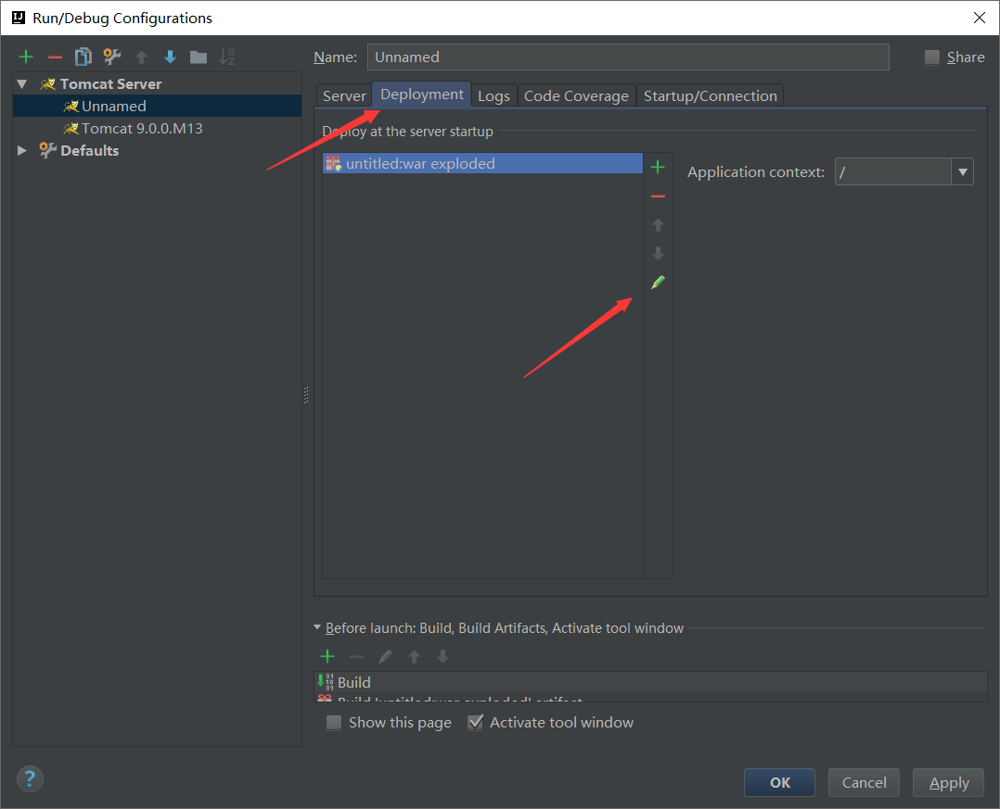
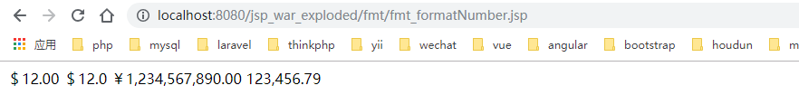

## Tomcat目录

/bin：存放windows或Linux平台上启动和关闭Tomcat的脚本文件

/conf：存放Tomcat服务器的各种全局配置文件，其中最重要的是server.xml和web.xml

/doc：存放Tomcat文档

/server：包含三个子目录：classes、lib和webapps

/server/lib：存放Tomcat服务器所需的各种JAR文件

/server/webapps：存放Tomcat自带的两个WEB应用admin应用和 manager应用

/common/lib：存放Tomcat服务器以及所有web应用都可以访问的jar文件

/shared/lib：存放所有web应用都可以访问的jar文件（但是不能被Tomcat服务器访问）

/logs：存放Tomcat执行时的日志文件

/src：存放Tomcat的源代码

/webapps：Tomcat的主要Web发布目录，默认情况下把Web应用文件放于此目录

/work：存放JSP编译后产生的class文件


## 运行一个基础项目

我们示例运行Hello项目。

在/webapps里面建一个Hello文件夹，在Hello文件夹里面建一个WEB-INF文件夹，WEB-INF文件夹属于服务器web配置文件夹，里面放一个web.xml配置文件，文件内容如下：

```xml
<?xml version="1.0" encoding="UTF-8"?>
<web-app xmlns:xsi="http://www.w3.org/2001/XMLSchema-instance" xmlns="http://java.sun.com/xml/ns/javaee" xsi:schemaLocation="http://java.sun.com/xml/ns/javaee http://java.sun.com/xml/ns/javaee/web-app_2_5.xsd" id="WebApp_ID" version="2.5">
  <display-name>T1</display-name>
  <welcome-file-list>
    <welcome-file>index.html</welcome-file>
    <welcome-file>index.htm</welcome-file>
    <welcome-file>index.jsp</welcome-file>
    <welcome-file>default.html</welcome-file>
    <welcome-file>default.htm</welcome-file>
    <welcome-file>default.jsp</welcome-file>
  </welcome-file-list>
</web-app>
```

这只是最基本的配置。

我们再在Hello文件夹建立一个index.html文件，里面的内容随便定义。然后就可以启动tomcat，然后用浏览器输入http://localhost:8080/Hello/或者http://localhost:8080/Hello/index.html访问即可。


## IntelliJ IDEA配置Tomcat

查找该问题的童鞋我相信IntelliJ IDEA，Tomcat的下载，JDK等其他的配置都应该完成了，那我直接进入正题了。

1.新建一个项目


2.由于这里我们仅仅为了展示如何成功部署Tomcat，以及配置完成后成功运行一个jsp文件，我仅勾选JavaEnterprise-->Web Application-->Next。可能由于我之前配置过了所以在Application Server这一栏会显示已有Tomcat，你们忽略就好。


3.项目名称这些默认就好了，为了快速部署Tomcat嘛，这些不是重点。点击Finish,等待IntelliJ IDEA加载完


4.点击如图所示小三角，接着点击（Edit Configurations或者ADD Configurations）-->绿色加号-->如果列表里没有则-->点击33 items more irrelevant这一项后继续寻找。


Tomcat Server-->Local

5.


点击"Configure..."，配置Apache你从官网上下载的Tomcat，zip压缩包解压后的文件目录 ，我的是apache-tomcat-9.0.0.M13。而且我没有进行配置，是IDE自己定位好的，很智能，我当时有小惊奇哈哈。


6.选择浏览器


我用的是火狐，并配置firefox.exe路径。我建议使用火狐或者Chrome，开发者必备。

 7.配置artifacts，我第一次因为忘了配置也不懂这个东西是干嘛的，运行Tomcat后会报错，错误信息是：

[RMI TCP Connection(2)-127.0.0.1] org.apache.catalina.core.StandardContext.startInternal One or more Filters failed to start.

官方的说法:https://www.jetbrains.com/help/idea/2016.3/configuring-web-application-deployment.html(我英语不好不忍心翻译）点击Fix



标签由Server跳到Deploment，点击小铅笔一样的图标对artifacts进行配置


新建文件夹-->绿色小加号-->Directory Content选择Web存放的位置，当然是Tomcat的webapps了,生成的war文件部署在该项目中才可以在Tomcat服务器上运行。直接运行在web文件夹下的index。jsp文件，做最后验证。

点击下图按钮验证


## intellij idea 打包成war

点击【File】->【Project Structure】菜单（或使用Shift+Ctrl+Alt+S快捷键），打开【Project Structure】窗口。


编译及执行打war包，点击【Build】->【BuildArtifacts】->【Build】。

然后进入对应目录，把war包改成项目名称后直接扔到wabapps目录里面，启动tomcat，然后访问即可。


## IntelliJ IDEA导入servlet包

1、选中项目（在IntelliJ中称为Module）；
2、点击右键，选择open modual settings（或者直接按F4）；
3、在弹出的窗口左端选择Libraries；
4、点击顶端的一个类似加号“+”的图标，在右端选择第一项；
6、在弹出的窗口中选择tomcat所在的目录，进入里面的lib目录，寻找servlet-api.jar这个jar包（如果JSP页面也有相关的JavaWeb对象，则还要寻找jsp-api.jar；如果只有Servlet，则只选择servlet-api.jar）；

7、选中上述jar包，依次点击OK

## Jsp基础语法

### page指令介绍

> Language : 用来定义要使用的脚本语言； 

> contentType：定义 JSP 字符的编码和页面响应的 MIME 类型；

> pageEncoding：Jsp 页面的字符编码

```jsp
<%@ page contentType="text/html;charset=UTF-8" language="java" pageEncoding="UTF-8" %>
<html>
<head>
    <title>Title</title>
</head>
<body>

</body>
</html>

```

### scriptlet 标签

通过 scriptlet 标签我们可以在 Jsp 里嵌入 Java 代码

> <%! %> 我们可以在里面定义全局变量、方法、类

> <%%> 我们可以在里面定义局部变量、编写语句

> <%= %> 我们可以在里面输出一个变量或一个具体内容

```jsp
<%@ page contentType="text/html;charset=UTF-8" language="java" pageEncoding="UTF-8" %>
<%!
    String str="全局变量";
    public void fun(){
        System.out.println("全局函数");
    }
    class Cla{
        public void claFun(){
            System.out.println("全局类");
        }
    }
%>
<%
    String str1="局部变量";
    out.println(str1);//编写语句
%>
<%=str %>
<html>
<head>
    <title>Title</title>
</head>
<body>

</body>
</html>

```

### Jsp 注释

> Html 注释 客户端可见 

> <%-- --%> Jsp 注释 客户端不可见 

> // java 单行注释 

> /* */ java 多行注释 

```jsp
<%@ page contentType="text/html;charset=UTF-8" language="java" pageEncoding="UTF-8" %>
<%-- 这是jsp语法的注释 --%>
<html>
<head>
    <title>Title</title>
</head>
<body>

</body>
</html>

```


### Jsp 包含指令

> <%@ includefile=”要包含的文件”%> 静态包含 先包含，后编译处理； 

> \<jsp:includepage=”要包含的文件” /> 动态包含 先编译处理，后包含； 

**以后开发用动态包含**

```jsp
<%@ page contentType="text/html;charset=UTF-8" language="java" pageEncoding="UTF-8" %>
<!DOCTYPE html>
<html>
<head>
    <title>Title</title>
</head>
<body>
    <%--静态包含--%>
    <%@include file="include/header.html" %>
    <%@include file="include/nav.jsp" %>
    <div>这是内容</div>
    <%@include file="include/footer.html" %>

    <%--动态包含--%>
    <jsp:include page="include/header.html" />
    <jsp:include page="include/nav.jsp" />
    <div>这是内容</div>
    <jsp:include page="include/footer.html" />
</body>
</html>

```


### Jsp 跳转指令

> \<jsp:forward> 
>
> ​	<jsp:param value=”” name=”” />
>
> \< /jsp:forward>
>
> 跳转页面接受参数方式：<%=request.getParameter("参数名称") %>
>
> 服务器内部跳转，可带参数，注意：内部跳转后的链接地址不会发生变化


```jsp
<%@ page contentType="text/html;charset=UTF-8" language="java" pageEncoding="UTF-8" %>
<!DOCTYPE html>
<html>
<head>
    <title>Title</title>
</head>
<body>
  <jsp:forward page="target.jsp">
      <jsp:param name="username" value="sclzdj" />
      <jsp:param name="password" value="123456" />
  </jsp:forward>
</body>
</html>
```

taget.jsp接受参数的代码

```jsp
<%@ page contentType="text/html;charset=UTF-8" language="java" pageEncoding="UTF-8" %>
<!DOCTYPE html>
<html>
<head>
    <title>Title</title>
</head>
<body>
<div>
    username:<%=request.getParameter("username") %>
</div>
<div>
    password:<%=request.getParameter("password") %>
</div>
</body>
</html>

```


### JSP引入类

```jsp
<%@ page import="java.util.*" %>
```

注意：引入的类需要在page指令下面


## request字符集设置

```jsp
<% request.setCharacterEncoding("utf-8"); %>
```


## JSP获取请求头信息

```jsp
<%@ page language="java" contentType="text/html; charset=utf-8" pageEncoding="utf-8" %>
<%@ page import="java.util.*" %>
<%
	// 获取头信息
	Enumeration enu=request.getHeaderNames();
	while(enu.hasMoreElements()){
		String headerName=(String)enu.nextElement();
		String headerValue=request.getHeader(headerName);
%>
<div>
	<%=headerName %>&nbsp;<%=headerValue %>
</div>
<%
	}
%>
```


##  JSP 九大内置对象

在 Jsp 开发中，Jsp 提供了 9 个内置对象，这些内置对象将由容器为用户进行实例化，用户直接使用即可。这个 9 个内置对象分别是：pageContext,request,response,session,application,config,out,page,exception；常用的是前面 5 个，需要熟练掌握

> 在 Jsp 开发中，可以保存数据，Jsp 提供了四种数据保存范围；分别是 page,request,session,application;

###  JSP 四个作用域

#### Page 范围

> 只在一个页面中保存数据； javax.servlet.jsp.PageContext(抽象类)

```jsp
<%@ page contentType="text/html;charset=UTF-8" language="java" pageEncoding="UTF-8" %>
<!DOCTYPE html>
<html>
<head>
    <title>Title</title>
</head>
<body>
<%
    pageContext.setAttribute("name", "sclzdj");
    pageContext.setAttribute("age", 25);
%>
<%
    String name = (String) pageContext.getAttribute("name");
    int age = (Integer) pageContext.getAttribute("age");
%>
<div>
    name:<%=name %>
</div>
<div>
    age:<%=age %>
</div>
</body>
</html>

```

#### Request 范围

> 只在一个请求中保存数据； javax.servlet.http.HttpServletRequest(接口) 

```jsp
<%@ page contentType="text/html;charset=UTF-8" language="java" pageEncoding="UTF-8" %>
<!DOCTYPE html>
<html>
<head>
    <title>Title</title>
</head>
<body>
<%
    request.setAttribute("name", "sclzdj");
    request.setAttribute("age", 25);
%>
<jsp:forward page="target.jsp"></jsp:forward>
</body>
</html>

```

taget.jsp代码这样写

```jsp
<%@ page contentType="text/html;charset=UTF-8" language="java" pageEncoding="UTF-8" %>
<!DOCTYPE html>
<html>
<head>
    <title>Title</title>
</head>
<body>
<div>
    name:<%=request.getAttribute("name") %>
</div>
<div>
    age:<%=request.getAttribute("age") %>
</div>
</body>
</html>

```

#### Session 范围

> 在一次会话范围中保存数据，仅供单个用户使用；javax.servlet.http.HttpSession(接口) 

- 销毁当前会话域中的所有属性    session.invalidate();

- 只移除特定属性名的属性   session.removeAttribute("属性名");

下面来个session范围的示例

第一个页面代码：

```jsp
<%@ page contentType="text/html;charset=UTF-8" language="java" pageEncoding="UTF-8" %>
<!DOCTYPE html>
<html>
<head>
    <title>Title</title>
</head>
<body>
<%
    session.setAttribute("name", "sclzdj");
    session.setAttribute("age", 25);
%>
</body>
</html>

```

第二个页面代码：

```jsp
<%@ page contentType="text/html;charset=UTF-8" language="java" pageEncoding="UTF-8" %>
<!DOCTYPE html>
<html>
<head>
    <title>Title</title>
</head>
<body>
<div>
    name:<%=session.getAttribute("name") %>
</div>
<div>
    age:<%=session.getAttribute("age") %>
</div>
</body>
</html>

```

上面的两个页面需要在同一浏览器打开，才能生效

#### Application 范围

> 在整个服务器上保存数据，所有用户共享；javax.servlet.ServletContext(接口)

第一个页面代码：

```jsp
<%@ page contentType="text/html;charset=UTF-8" language="java" pageEncoding="UTF-8" %>
<!DOCTYPE html>
<html>
<head>
    <title>Title</title>
</head>
<body>
<%
    application.setAttribute("name", "sclzdj");
    application.setAttribute("age", 25);
%>
</body>
</html>

```

第二个页面代码：

```jsp
<%@ page contentType="text/html;charset=UTF-8" language="java" pageEncoding="UTF-8" %>
<!DOCTYPE html>
<html>
<head>
    <title>Title</title>
</head>
<body>
<div>
    name:<%=application.getAttribute("name") %>
</div>
<div>
    age:<%=application.getAttribute("age") %>
</div>
</body>
</html>

```

上面的两个页面可以在不同浏览器里面打开，也能生效


### response 对象

Response 内置对象和 request 内置对象是相对应的，response 内置对象用于响应客户请求，向客户端输出信息； javax.servlet.HttpServletResponse 接口

> 自动刷新应用 

```java
<%@ page contentType="text/html;charset=UTF-8" language="java" pageEncoding="UTF-8" %>
<%@ page import="java.util.Date" %>
<!DOCTYPE html>
<html>
<head>
    <title>Title</title>
</head>
<body>
<%
    response.setHeader("refresh","1");//一秒钟就刷新一次页面
    Date date=new Date();
%>
<%=date.toString() %>
</body>
</html>

```

> 页面重定向应用 客户端跳转

```java
<%@ page contentType="text/html;charset=UTF-8" language="java" pageEncoding="UTF-8" %>
<!DOCTYPE html>
<html>
<head>
    <title>Title</title>
</head>
<body>
<%
    response.sendRedirect("target.jsp");//跳转页面
%>
</body>
</html>

```

> 操作 cookie 

这里我们以一个记住登录信息功能为例，需要先引入servlet包

```jsp
<%@ page contentType="text/html;charset=UTF-8" language="java" pageEncoding="UTF-8" %>
<!DOCTYPE html>
<html>
<head>
    <title>Title</title>
</head>
<body>
<%
    String username = "";
    String password = "";
    String remerber = "";
    Cookie[] cookies = request.getCookies();
    if (cookies != null) {
        for (Cookie cookie : cookies) {
            if (cookie.getName().equals("username") && cookie.getValue() != null) {
                username = cookie.getValue();
            }
            if (cookie.getName().equals("password") && cookie.getValue() != null) {
                password = cookie.getValue();
            }
            if (cookie.getName().equals("remerber") && cookie.getValue() != null) {
                remerber = cookie.getValue();
            }
        }
    }
    String checked = "";
    if (remerber.equals("remerber")) {
        checked = "checked";
    }
%>
<form action="login.jsp" method="post">
    <div>
        账号：<input type="text" name="username" value="<%=username%>" id="username">
    </div>
    <div>
        密码：<input type="password" name="password" value="<%=password%>" id="password">
    </div>
    <div>
        <input type="checkbox" name="remerber" value="remerber" id="remerber" <%=checked%>>记住
    </div>
    <div>
        <input type="submit" value="提交">
        <input type="reset" value="重置">
    </div>
</form>
</body>
</html>

```

login.js代码如下：

```jsp
<%@ page contentType="text/html;charset=UTF-8" language="java" %>
<html>
<head>
    <title>Title</title>
</head>
<body>
<%
    String username = request.getParameter("username");
    String password = request.getParameter("password");
    String remerber = request.getParameter("remerber");
    if ("remerber".equals(remerber)) {
        Cookie usernameCookie = new Cookie("username", username);
        Cookie passwordCookie = new Cookie("password", password);
        Cookie remerberCookie = new Cookie("remerber", remerber);
        usernameCookie.setMaxAge(60 * 60 * 24 * 7);//设置cookie有效期
        passwordCookie.setMaxAge(60 * 60 * 24 * 7);//设置cookie有效期
        remerberCookie.setMaxAge(60 * 60 * 24 * 7);//设置cookie有效期
        response.addCookie(usernameCookie);//添加cookie
        response.addCookie(passwordCookie);//添加cookie
        response.addCookie(remerberCookie);//添加cookie
        System.out.println("cookie设置成功");
    } else {
        Cookie[] cookies = request.getCookies();
        if (cookies != null) {
            for (Cookie cookie : cookies) {
                if (cookie.getName().equals("username") || cookie.getName().equals("password") || cookie.getName().equals("remerber")) {
                    cookie.setValue(null);
                    response.addCookie(cookie);//添加空cookie
                }
            }
        }
        System.out.println("cookie取消成功");
    }
%>
<a href="demo.jsp">重新登录</a>
</body>
</html>

```

### out 对象

Out 内置对象主要用来向客户端输出各种类型的数据，同时还可以管理应用服务器上的输出缓冲区。所以 out 内 置对象的方法是向客户端输出数据和管理缓冲区； 底层 javax.servlet.jsp.JspWriter 抽象类

```jsp
<%@ page contentType="text/html;charset=UTF-8" language="java" pageEncoding="UTF-8" %>
<!DOCTYPE html>
<html>
<head>
    <title>Title</title>
</head>
<body>
<%
    int bufferSize=out.getBufferSize();//总缓存区大小
    int remaining=out.getRemaining();//未使用缓存区大小
    int useBufferSize=bufferSize-remaining;//已使用缓存区大小
    out.println("总缓存区大小："+"<b>"+bufferSize+"</b></br>");
    out.println("未使用缓存区大小："+"<b>"+remaining+"</b></br>");
    out.println("已使用缓存区大小："+"<b>"+useBufferSize+"</b></br>");
%>
</body>
</html>

```

### config 对象

Config 内置对象是 JSP 页面通过 JSP 容器进行初始化时被传递的对象。javax.servlet.ServletConfig 。在 Servlet 初始化的时候，JPS 引擎通过 config 向它传递信息。这种信息可以是属性名和属性值匹配的参数，也可以是通过 ServletContext 对象传递的服务器的有关信息；

先配置一下web.xml的Servlet初始化

```xml
<?xml version="1.0" encoding="UTF-8"?>
<web-app xmlns="http://xmlns.jcp.org/xml/ns/javaee"
         xmlns:xsi="http://www.w3.org/2001/XMLSchema-instance"
         xsi:schemaLocation="http://xmlns.jcp.org/xml/ns/javaee http://xmlns.jcp.org/xml/ns/javaee/web-app_4_0.xsd"
         version="4.0">
    <servlet>
        <servlet-name>Demo</servlet-name>
        <jsp-file>/demo.jsp</jsp-file>
        <init-param>
            <param-name>c1</param-name>
            <param-value>c1value</param-value>
        </init-param>
        <init-param>
            <param-name>c2</param-name>
            <param-value>c2value</param-value>
        </init-param>
    </servlet>
    <servlet-mapping>
        <servlet-name>Demo</servlet-name>
        <url-pattern>/demo</url-pattern>
    </servlet-mapping>
</web-app>
```

demo.jsp代码如下：

```jsp
<%@ page contentType="text/html;charset=UTF-8" language="java" pageEncoding="UTF-8" %>
<!DOCTYPE html>
<html>
<head>
    <title>Title</title>
</head>
<body>
<%=config.getInitParameter("c1")%>
<%=config.getInitParameter("c2")%>
</body>
</html>

```

访问时地址要跟servlet-mapping下的url-pattern一样，上面的示例用这个链接访问http://localhost:8080/jsp_war_exploded/demo

### exception 对象

Exception 内置对象用来处理 JSP 文件在执行时发生的所有异常，它是 java.lang.Throwable 类的一个对象。

下面来个示例：

抛出异常去error页面处理：<%@ page errorPage="error.jsp"%>

```jsp
<%@ page contentType="text/html;charset=UTF-8" language="java" pageEncoding="UTF-8" %>
<%@ page errorPage="error.jsp"%>
<!DOCTYPE html>
<html>
<head>
    <title>Title</title>
</head>
<body>
<%
    int a=10;
    int b=0;
    out.println(a/b);//这里明显会报除数不能为0的错
%>
</body>
</html>

```

error.jsp接受错误信息，记得要写<%@ page isErrorPage="true"%>

```jsp
<%@ page contentType="text/html;charset=UTF-8" language="java" %>
<%@ page isErrorPage="true"%>
<html>
<head>
    <title>Title</title>
</head>
<body>
<%
    if(exception!=null){
        out.println(exception.getMessage());
    }
%>

</body>
</html>

```

### pageContext 对象

pageContext 内置对象是一个比较特殊的对象。它相当于页面中所有对象功能的集合，即使用它可以访问到本页面 中所有对象。pageContext 内置对象由 Jsp 容器创建并初始化，pageContext 对象提供了对 JSP 页面所有对象及控件 的访问。

来个示例：

```jsp
<%@ page contentType="text/html;charset=UTF-8" language="java" pageEncoding="UTF-8" %>
<!DOCTYPE html>
<html>
<head>
    <title>Title</title>
</head>
<body>
<%
    pageContext.setAttribute("pageAttr","pageValue");
    request.setAttribute("requestAttr","requestValue");
    session.setAttribute("sessionAttr","sessionValue");
    application.setAttribute("applicationAttr","applicationValue");
%>
<div>pageAttr=<%=pageContext.getAttribute("pageAttr")%></div>
<div>requestAttr=<%=pageContext.getRequest().getAttribute("requestAttr")%></div>
<div>sessionAttr=<%=pageContext.getSession().getAttribute("sessionAttr")%></div>
<div>applicationAttr=<%=pageContext.getServletContext().getAttribute("applicationAttr")%></div>
</body>
</html>

```


## JavaBean 组件

### Javabean 组件引入

JavaBean 是使用 Java 语言开发的一个可重用的组件，在 JSP 开发中可以使用 JavaBean 减少重复代码，使整个 JSP 代码的开发更简洁。不用去引入外部的东西，直接使用即可。

先写一个Student类，下面的示例基本都要用到：

```java
package model;

public class Student {
    private String name;
    private int age;

    public String getName() {
        return name;
    }

    public void setName(String name) {
        this.name = name;
    }

    public int getAge() {
        return age;
    }

    public void setAge(int age) {
        this.age = age;
    }
}

```

###  创建 javabean

\<jsp:useBean id="实例化对象名称" scope="保存范围" class="类完整名称"/>

> scope，一共有 page,request,session 和 application4 个属性范围，默认是 page；

```jsp
<%@ page contentType="text/html;charset=UTF-8" language="java" pageEncoding="UTF-8" %>
<!DOCTYPE html>
<html>
<head>
    <title>Title</title>
</head>
<body>
<jsp:useBean id="student" scope="page" class="model.Student" />
<%
    student.setName("张三");
    student.setAge(25);
%>
<%=student.getName()%>
<%=student.getAge()%>
</body>
</html>
```

### 设置 javabean 属性值

\<jsp:setProperty property="属性名称" name="实例化对象的名称" value="属性值" param="参数名称" /> 

> property="*" 自动匹配所有

表单提交接受参数用它非常好使。

建立表单页面

```jsp
<%@ page contentType="text/html;charset=UTF-8" language="java" pageEncoding="UTF-8" %>
<!DOCTYPE html>
<html>
<head>
    <title>Title</title>
</head>
<body>
<form action="submit.jsp" method="post">
    <div>
        姓名：<input type="text" name="name">
    </div>
    <div>
        年龄：<input type="text" name="age">
    </div>
    <div>
        <input type="submit" value="提交">
    </div>
</form>
</body>
</html>
```

**先看一个自动匹配所有的例子:**

提交页面处理代码

```jsp
<%@ page contentType="text/html;charset=UTF-8" language="java" pageEncoding="UTF-8" %>
<!DOCTYPE html>
<html>
<head>
    <title>Title</title>
</head>
<body>
<% request.setCharacterEncoding("utf-8"); %>
<jsp:useBean id="student" scope="page" class="model.Student" />
<jsp:setProperty name="student" property="*" />
<%=student.getName()%>
<%=student.getAge()%>
</body>
</html>
```

**再来看一个不用请求传递的值，固定赋值的例子：**

更改提交页面处理代码

```jsp
<%@ page contentType="text/html;charset=UTF-8" language="java" pageEncoding="UTF-8" %>
<!DOCTYPE html>
<html>
<head>
    <title>Title</title>
</head>
<body>
<% request.setCharacterEncoding("utf-8"); %>
<jsp:useBean id="student" scope="page" class="model.Student" />
<jsp:setProperty name="student" property="name" />
<jsp:setProperty name="student" property="age" value="100" />
<%=student.getName()%>
<%=student.getAge()%>
</body>
</html>
```

这里的name用的是传的值，age用的是固定赋值

**最后再来看一个传递的参数和对象参数名称不一致的例子：**

先更改表单的那么为username

```jsp
<input type="text" name="username">
```

再更改提交页面处理代码

```jsp
<%@ page contentType="text/html;charset=UTF-8" language="java" pageEncoding="UTF-8" %>
<!DOCTYPE html>
<html>
<head>
    <title>Title</title>
</head>
<body>
<% request.setCharacterEncoding("utf-8"); %>
<jsp:useBean id="student" scope="page" class="model.Student" />
<jsp:setProperty name="student" property="name" param="username" />
<jsp:setProperty name="student" property="age" />
<%=student.getName()%>
<%=student.getAge()%>
</body>
</html>
```

### 获取 javabean 属性值

\<jsp:getProperty property="属性名称" name="实例化对象的名称" />

```jsp
<%@ page contentType="text/html;charset=UTF-8" language="java" pageEncoding="UTF-8" %>
<!DOCTYPE html>
<html>
<head>
    <title>Title</title>
</head>
<body>
<jsp:useBean id="student" scope="page" class="model.Student" />
<jsp:setProperty name="student" property="name" value="张三" />
<jsp:setProperty name="student" property="age" value="25" />
<jsp:getProperty name="student" property="name" />
<jsp:getProperty name="student" property="age" />
</body>
</html>
```

### javabean 的保存范围

Javabean 的保存范围有 page,request,session.application，默认是 page；

这里只需要更改scope的参数值即可，测试方法和JSP四个作用域时一样的

### javabean 删除

> Page 范围：pageContext.removeAttribute(“javaBeanName”); 

> request 范围：request.removeAttribute(“javaBeanName”); 

> session 范围：session.removeAttribute(“javaBeanName”);

>  application 范围：application.removeAttribute(“javaBeanName”);


## Servlet 开发

### servlet 引入

Servlet（Server Applet）是Java Servlet的简称，称为小服务程序或服务连接器，用Java编写的服务器端程序，具有独立于平台和协议的特性，主要功能在于交互式地浏览和生成数据，生成动态Web内容。

狭义的Servlet是指Java语言实现的一个接口，广义的Servlet是指任何实现了这个Servlet接口的类，一般情况下，人们将Servlet理解为后者。Servlet运行于支持Java的应用服务器中。从原理上讲，Servlet可以响应任何类型的请求，但绝大多数情况下Servlet只用来扩展基于HTTP协议的Web服务器。

最早支持Servlet标准的是JavaSoft的Java Web Server，此后，一些其它的基于Java的Web服务器开始支持标准的Servlet。

**来个简单的servlet使用**

先写一个Servlet类，继承javax.servlet.http.HttpServlet这个类，覆盖doGet和doPost方法，让doGet方法也去执行doPost方法：

```java
import javax.servlet.ServletException;
import javax.servlet.http.HttpServlet;
import javax.servlet.http.HttpServletRequest;
import javax.servlet.http.HttpServletResponse;
import java.io.IOException;
import java.io.PrintWriter;

public class Servlet extends HttpServlet {
    @Override
    protected void doGet(HttpServletRequest request, HttpServletResponse response) throws ServletException, IOException {
        this.doPost(request,response);
    }

    @Override
    protected void doPost(HttpServletRequest request, HttpServletResponse response) throws ServletException, IOException {
        response.setCharacterEncoding("gbk");
        PrintWriter out=response.getWriter();
        out.println("<html>");
        out.println("<head><title>你好</title></head>");
        out.println("<body><div>我来学习java</div></body>");
        out.println("</html>");
        out.close();
    }

}
```

修改一下web.xml

```xml
<?xml version="1.0" encoding="UTF-8"?>
<web-app xmlns="http://xmlns.jcp.org/xml/ns/javaee"
         xmlns:xsi="http://www.w3.org/2001/XMLSchema-instance"
         xsi:schemaLocation="http://xmlns.jcp.org/xml/ns/javaee http://xmlns.jcp.org/xml/ns/javaee/web-app_4_0.xsd"
         version="4.0">
    <servlet>
        <servlet-name>servlet</servlet-name>
        <servlet-class>Servlet</servlet-class>
    </servlet>
    <servlet-mapping>
        <servlet-name>servlet</servlet-name>
        <url-pattern>/servlet</url-pattern>
    </servlet-mapping>
</web-app>
```

重新编译执行访问http://localhost:8080/jsp_war_exploded/servlet

### servlet 生命周期

> Servlet 的生命周期，简单的概括这就分为四步：servlet 类加载--->实例化--->服务--->销毁。

实例化只会执行一次，即init方法。

销毁会在长时间不使用servlet或者关闭的时候执行，即destroy方法。

服务即是指所执行的doGet、doPost等方法。

**下面示例重写init和destroy方法**

```java
import javax.servlet.ServletException;
import javax.servlet.http.HttpServlet;

public class Servlet extends HttpServlet {
    @Override
    public void init() throws ServletException {
        super.init();
        System.out.println("实例化");
    }

    @Override
    public void destroy() {
        super.destroy();
        System.out.println("销毁");
    }
}
```

### 客户端跳转 VS 服务器端跳转

> 都能在 Servlet 中获取 session,application ，只有服务器端跳转能再 Servlet 中获取request

> 客户端跳转 response.sendRedirect("目标地址"); 

> 服务器跳转：RequestDispatcherrd=request.getRequestDispatcher("目标地址"); rd.forward(request,response);   当然，也可以连起来用一句代码搞定

下面来看个示例：

```java
import javax.servlet.RequestDispatcher;
import javax.servlet.ServletContext;
import javax.servlet.ServletException;
import javax.servlet.http.HttpServlet;
import javax.servlet.http.HttpServletRequest;
import javax.servlet.http.HttpServletResponse;
import javax.servlet.http.HttpSession;
import java.io.IOException;

public class Servlet extends HttpServlet {
    @Override
    protected void doGet(HttpServletRequest request, HttpServletResponse response) throws ServletException, IOException {
        this.doPost(request, response);
    }

    @Override
    protected void doPost(HttpServletRequest request, HttpServletResponse response) throws ServletException, IOException {
        //设置request变量值
        request.setAttribute("requestKey","request值");
        //设置session变量值
        HttpSession session=request.getSession();
        session.setAttribute("sessionKey","session值");
        //设置application变量值
        ServletContext application =request.getServletContext();
        application.setAttribute("applicationKey","application值");

        //客户端跳转
//        response.sendRedirect("target.jsp");//注意：这种跳转是获取不到requestKey的值
        //服务器端跳转
        RequestDispatcher requestDispatcher=request.getRequestDispatcher("target.jsp");
        requestDispatcher.forward(request,response);
//        request.getRequestDispatcher("target.jsp").forward(request,response);//可以连起来简写
    }

}
```

taget.jsp代码如下

```jsp
<%@ page contentType="text/html;charset=UTF-8" language="java" pageEncoding="UTF-8" %>
<!DOCTYPE html>
<html>
<head>
    <title>Title</title>
</head>
<body>
<div><%=request.getAttribute("requestKey")%></div>
<div><%=session.getAttribute("sessionKey")%></div>
<div><%=application.getAttribute("applicationKey")%></div>
</body>
</html>
```

### 用户登录功能实现

> 先建一个users数据表，里面简单的id、username、password三个字段，并加一个zhangsan用户


> 建立一个操作数据库的Db工具类

需要先引入jdbc扩展包，在tomcat引入和先前不同，只需要把jdbc包拷贝到/WEB-INF/lib目录即可，没有lib目录创建即可


```java
package util;

import java.sql.Connection;
import java.sql.DriverManager;
import java.sql.PreparedStatement;

public class Db {

    // 数据库地址
    private static String dbUrl = "jdbc:mysql://localhost:3306/test";
    // 用户名
    private static String dbUserName = "root";
    // 密码
    private static String dbPassword = "root";
    // 驱动名称
    private static String jdbcName = "com.mysql.jdbc.Driver";

    /**
     * 获取数据库连接
     *
     * @return
     * @throws Exception
     */
    public Connection getCon() throws Exception {
        Class.forName(jdbcName);
        Connection con = DriverManager.getConnection(dbUrl, dbUserName, dbPassword);
        return con;
    }

    /**
     * 关闭连接
     *
     * @param con
     * @throws Exception
     */
    public void close(PreparedStatement pstmt, Connection con) throws Exception {
        if (pstmt != null) {
            pstmt.close();
            if (con != null) {
                con.close();
            }
        }
    }
}
```

>建一个user模型类，里面包含通过账号和密码查找是否存在用户的方法

```java
package model;

import util.Db;

import java.sql.Connection;
import java.sql.PreparedStatement;
import java.sql.ResultSet;

public class User {
    private int id;
    private String username;
    private String password;
    private Db db = new Db();

    public User() {
    }

    public User(String username, String password) {
        this.username = username;
        this.password = password;
    }

    public User(int id, String username, String password) {
        this.id = id;
        this.username = username;
        this.password = password;
    }

    /*
    根据账号和密码查询是否存在该用户，存在怎返回该用户模型，否则返回null
     */
    public User isHas() throws Exception {
        Connection con = db.getCon(); // 获取连接
        String sql = "select * from users where username=? and password=?";
        PreparedStatement pstmt = con.prepareStatement(sql);
        pstmt.setString(1, this.getUsername());
        pstmt.setString(2, this.getPassword());
        ResultSet rs = pstmt.executeQuery(); // 返回结果集ResultSet
        User returnUser = null;//方法返回结果
        while (rs.next()) {
            if (returnUser != null) {
                break;
            }
            returnUser = new User(rs.getInt("id"), rs.getString("username"), rs.getString("password"));
        }
        db.close(pstmt, con);//关闭连接
        return returnUser;
    }

    public int getId() {
        return id;
    }

    public void setId(int id) {
        this.id = id;
    }

    public String getUsername() {
        return username;
    }

    public void setUsername(String username) {
        this.username = username;
    }

    public String getPassword() {
        return password;
    }

    public void setPassword(String password) {
        this.password = password;
    }

}
```

> 登录控制器和退出控制器

```java
package controller;

import model.User;

import javax.servlet.ServletException;
import javax.servlet.http.HttpServlet;
import javax.servlet.http.HttpServletRequest;
import javax.servlet.http.HttpServletResponse;
import javax.servlet.http.HttpSession;
import java.io.IOException;

public class LoginHandle extends HttpServlet {
    @Override
    protected void doGet(HttpServletRequest request, HttpServletResponse response) throws ServletException, IOException {
        this.doPost(request, response);
    }

    @Override
    protected void doPost(HttpServletRequest request, HttpServletResponse response) throws ServletException, IOException {

        String username = request.getParameter("username");
        String password = request.getParameter("password");
        User user = new User(username, password);
        try {
            User loginUser = user.isHas();
            if (loginUser == null) {//不存在该用户
                request.setAttribute("errMsg", "账号或密码错误");
                request.setAttribute("username", username);
                request.setAttribute("password", password);
                request.getRequestDispatcher("login.jsp").forward(request, response);
            } else {//存在该用户
                HttpSession session = request.getSession();
                session.setAttribute("loginUser", loginUser);
                response.sendRedirect("user_info.jsp");
            }
        } catch (Exception e) {
            e.printStackTrace();
        }
    }
}
```

```java
package controller;

import javax.servlet.ServletException;
import javax.servlet.http.HttpServlet;
import javax.servlet.http.HttpServletRequest;
import javax.servlet.http.HttpServletResponse;
import javax.servlet.http.HttpSession;
import java.io.IOException;

public class LogoutHandle extends HttpServlet {
    @Override
    protected void doGet(HttpServletRequest request, HttpServletResponse response) throws ServletException, IOException {
        this.doPost(request, response);
    }

    @Override
    protected void doPost(HttpServletRequest request, HttpServletResponse response) throws ServletException, IOException {
        HttpSession session = request.getSession();
        session.removeAttribute("loginUser");
        response.sendRedirect("login.jsp");
    }
}
```

> 修改web.xml，改了之后记得要重新编译运行哦

```xml
<?xml version="1.0" encoding="UTF-8"?>
<web-app xmlns="http://xmlns.jcp.org/xml/ns/javaee"
         xmlns:xsi="http://www.w3.org/2001/XMLSchema-instance"
         xsi:schemaLocation="http://xmlns.jcp.org/xml/ns/javaee http://xmlns.jcp.org/xml/ns/javaee/web-app_4_0.xsd"
         version="4.0">
    <servlet>
        <servlet-name>loginHandle</servlet-name>
        <servlet-class>controller.LoginHandle</servlet-class>
    </servlet>
    <servlet-mapping>
        <servlet-name>loginHandle</servlet-name>
        <url-pattern>/loginHandle</url-pattern>
    </servlet-mapping>
    <servlet>
        <servlet-name>logoutHandle</servlet-name>
        <servlet-class>controller.LogoutHandle</servlet-class>
    </servlet>
    <servlet-mapping>
        <servlet-name>logoutHandle</servlet-name>
        <url-pattern>/logoutHandle</url-pattern>
    </servlet-mapping>
</web-app>
```

> 登录页面login.jsp代码

```jsp
<%@ page contentType="text/html;charset=UTF-8" language="java" %>
<%@ page import="model.User" %>
<html>
<head>
    <title>登录</title>
</head>
<body>
<%
    User user = (User) session.getAttribute("loginUser");
    if (user != null) {
        response.sendRedirect("user_info.jsp");
    }
%>
<form action="loginHandle" method="post">
    <h2>登录</h2>
    <div>账号：<input type="text" name="username" value="${username }"></div>
    <div>密码：<input type="text" name="password" value="${password }"></div>
    <div style="color: #f00000;">${errMsg }</div>
    <div><input type="submit" value="提交"></div>
</form>
</body>
</html>

```

> 用户中心页面user_info.jsp代码

```jsp
<%@ page contentType="text/html;charset=UTF-8" language="java" %>
<%@ page import="model.User" %>
<html>
<head>
    <title>用户中心</title>
</head>
<body>
<%
    int id = 0;
    String username = "";
    String password = "";
    User user = (User) session.getAttribute("loginUser");
    if (user != null) {
        id = user.getId();
        username = user.getUsername();
        password = user.getPassword();
    }else{
        response.sendRedirect("login.jsp");
    }
%>
<div>
    <%=id%>
</div>
<div>
    <%=username%>
</div>
<div>
    <%=password%>
</div>
<div>
    <a href="logoutHandle">退出</a>
</div>
</body>
</html>
```

### Servlet 过滤器

像上面的登录功能，用户如果未登录去访问用户中心页面的话，我们还可以用Servlet 过滤器实现，只不过用起来比较麻烦，我不推荐这种用法。

首先写个过滤器类

```java
package filter;

import javax.servlet.*;
import javax.servlet.http.HttpServletRequest;
import javax.servlet.http.HttpSession;
import java.io.IOException;

public class Login implements Filter {
    @Override
    public void init(FilterConfig filterConfig) throws ServletException {

    }

    @Override
    public void doFilter(ServletRequest servletRequest, ServletResponse servletResponse, FilterChain filterChain) throws IOException, ServletException {
        HttpServletRequest request = (HttpServletRequest) servletRequest;
        HttpSession session = request.getSession();
        String path = request.getServletPath();
        System.out.println(path);
        if (session.getAttribute("loginUser") == null && path.equals("/user_info.jsp")) {
            request.getRequestDispatcher("login.jsp").forward(servletRequest, servletResponse);
        } else {
            filterChain.doFilter(servletRequest, servletResponse);
        }
    }

    @Override
    public void destroy() {

    }
}
```

然后改一下web.xml，改了要重启编译

```xml
<?xml version="1.0" encoding="UTF-8"?>
<web-app xmlns="http://xmlns.jcp.org/xml/ns/javaee"
         xmlns:xsi="http://www.w3.org/2001/XMLSchema-instance"
         xsi:schemaLocation="http://xmlns.jcp.org/xml/ns/javaee http://xmlns.jcp.org/xml/ns/javaee/web-app_4_0.xsd"
         version="4.0">
    <servlet>
        <servlet-name>loginHandle</servlet-name>
        <servlet-class>controller.LoginHandle</servlet-class>
    </servlet>
    <servlet-mapping>
        <servlet-name>loginHandle</servlet-name>
        <url-pattern>/loginHandle</url-pattern>
    </servlet-mapping>
    <servlet>
        <servlet-name>logoutHandle</servlet-name>
        <servlet-class>controller.LogoutHandle</servlet-class>
    </servlet>
    <servlet-mapping>
        <servlet-name>logoutHandle</servlet-name>
        <url-pattern>/logoutHandle</url-pattern>
    </servlet-mapping>

    <filter>
        <filter-name>loginFilter</filter-name>
        <filter-class>filter.Login</filter-class>
    </filter>
    <filter-mapping>
        <filter-name>loginFilter</filter-name>
        <url-pattern>/*</url-pattern>
    </filter-mapping>
</web-app>
```

这样就实现了未登录时不能进入用户中心，当然登录了就不能进入登录页面也可以用一样的原理实现。不过还是那句话，我不推荐使用这个方法。

### Servlet 监听器

监听 web 事件；如 application,session,request

来一个监听类

```java
package listener;

import javax.servlet.http.HttpSessionEvent;
import javax.servlet.http.HttpSessionListener;

public class SessionAttributeListener implements HttpSessionListener {
    @Override
    public void sessionCreated(HttpSessionEvent httpSessionEvent) {
        System.out.println("创建了session属性");
    }

    @Override
    public void sessionDestroyed(HttpSessionEvent httpSessionEvent) {
        System.out.println("销毁了session属性");
    }
}
```


## EL 表达式

ExpressionLanguage，EL

使用方法：${ }

### 内置对象


### 访问 4 种范围属性

寻找值的顺序：page->request->session->application

### 接收请求参数

> param：单个参数 

> paramValues：一组参数

来个示例：

```jsp
<%@ page contentType="text/html;charset=UTF-8" language="java" pageEncoding="UTF-8" %>
<!DOCTYPE html>
<html>
<head>
    <title>Title</title>
</head>
<body>
<form action="submit.jsp?status=5" method="post">
    <div>
        姓名：<input type="text" name="username">
    </div>
    <div>
        爱好：<input type="checkbox" name="aihao" value="足球">足球
        &nbsp;&nbsp;<input type="checkbox" name="aihao" value="游泳">游泳
        &nbsp;&nbsp;<input type="checkbox" name="aihao" value="学习">学习
    </div>
    <div>
        <input type="submit" value="提交">
    </div>
</form>
</body>
</html>
```

submit.jsp代码如下

```jsp
<%@ page contentType="text/html;charset=UTF-8" language="java" pageEncoding="UTF-8" %>
<!DOCTYPE html>
<html>
<head>
    <title>Title</title>
</head>
<body>
<% request.setCharacterEncoding("utf-8"); %>
<div>get状态：${param.status }</div>
<div>姓名：${param.username }</div>
<div>爱好1：${paramValues.aihao[0] }</div>
<div>爱好2：${paramValues.aihao[1] }</div>
<div>爱好3：${paramValues.aihao[2] }</div>
</body>
</html>
```

### 对象操作 

先建个模型示例：

```java
package model;

public class Student {
    private String name;
    private int age;

    public String getName() {
        return name;
    }

    public void setName(String name) {
        this.name = name;
    }

    public int getAge() {
        return age;
    }

    public void setAge(int age) {
        this.age = age;
    }
}
```

再来个el表达式操作

```jsp
<%@ page contentType="text/html;charset=UTF-8" language="java" pageEncoding="UTF-8" %>
<%@ page import="model.Student" %>
<!DOCTYPE html>
<html>
<head>
    <title>Title</title>
</head>
<body>
<%
    Student student=new Student();
    student.setName("张三");
    student.setAge(25);
    pageContext.setAttribute("student",student);
%>
<div>姓名：${student.name }</div>
<div>年龄：${student.age }</div>
</body>
</html>
```

### 集合操作 

直接来个示例：

```jsp
<%@ page contentType="text/html;charset=UTF-8" language="java" pageEncoding="UTF-8" %>
<%@ page import="java.util.LinkedList" %>
<!DOCTYPE html>
<html>
<head>
    <title>Title</title>
</head>
<body>
<%
    LinkedList linkedList=new LinkedList();
    linkedList.add("王五");
    linkedList.add("李四");
    pageContext.setAttribute("linkedList",linkedList);
%>
<div>${linkedList[0] }</div>
<div>${linkedList[1] }</div>
</body>
</html>
```

### 运算符操作

支持的运算符操作

> 算数运算符，关系运算符，逻辑运算符； 

> 三目运算符； 

> empty关键字；使用方法：${empty 变量名}


## JSP自定义标签

### 空标签

这是最简单的标签，下面来个示例

```java
package tag;

import javax.servlet.jsp.JspException;
import javax.servlet.jsp.JspWriter;
import javax.servlet.jsp.tagext.TagSupport;
import java.io.IOException;
import java.util.Date;

public class ShowTime extends TagSupport {
    @Override
    public int doStartTag() throws JspException {
        Date date = new Date();
        JspWriter out = this.pageContext.getOut();
        try {
            out.println(date);
        } catch (IOException e) {
            e.printStackTrace();
        }
        return TagSupport.SKIP_BODY;//直接结束标签
    }
}
```

再在/WEB-INF/目录下面建立一个customTag.tld文件，文件内容如下

> tlib-version：文件版本号

>short-name：文件名称描述，随意取

>tag>name：标签名称
>
>tag>tag-class：标签对应的类
>
>tag>body-content：标签体，可以理解有标签体是标签对如：<custom>... </custom>，一般用作循环标签，用JSP表示，简单标签用scriptless表示。无标签体是独立标签如：<custom />，用empty表示

```xml
<?xml version="1.0" encoding="UTF-8" ?>
<taglib xmlns="http://java.sun.com/xml/ns/javaee"
        xmlns:xsi="http://www.w3.org/2001/XMLSchema-instance"
        xsi:schemaLocation="http://java.sun.com/xml/ns/javaee http://java.sun.com/xml/ns/javaee/web-jsptaglibrary_2_1.xsd"
        version="2.1">
    <tlib-version>1.0</tlib-version>
    <short-name>customTag</short-name>

    <tag>
        <name>showTime</name>
        <tag-class>
            tag.ShowTime
        </tag-class>
        <body-content>empty</body-content>
    </tag>

</taglib>
```

下面我们就可以使用了，要先引入tld文件

```jsp
<%@ page contentType="text/html;charset=UTF-8" language="java" pageEncoding="UTF-8" %>
<%@ taglib prefix="custom" uri="/WEB-INF/customTag.tld" %>
<!DOCTYPE html>
<html>
<head>
    <title>custom-tag</title>
</head>
<body>
<custom:showTime/>
</body>
</html>
```

### 自定义有属性的标签

定义两个参数name、title

```java
package tag;

import javax.servlet.jsp.JspException;
import javax.servlet.jsp.JspWriter;
import javax.servlet.jsp.tagext.TagSupport;
import java.io.IOException;

public class ShowInfo extends TagSupport {
    private String name;
    private String title;

    public String getName() {
        return name;
    }

    public void setName(String name) {
        this.name = name;
    }

    public String getTitle() {
        return title;
    }

    public void setTitle(String title) {
        this.title = title;
    }

    @Override
    public int doStartTag() throws JspException {
        JspWriter out = this.pageContext.getOut();
        try {
            out.println(this.name + " " + this.title);
        } catch (IOException e) {
            e.printStackTrace();
        }
        return TagSupport.SKIP_BODY;//直接结束标签
    }
}
```

配置/WEB-INF/customTag.tld文件，没有则建立

> tag>attribute>name：属性名称
>
> tag>attribute>required：是否比传
>
> tag>attribute>rtexprvalue：是否支持el表达式

```xml
<?xml version="1.0" encoding="UTF-8" ?>
<taglib xmlns="http://java.sun.com/xml/ns/javaee"
        xmlns:xsi="http://www.w3.org/2001/XMLSchema-instance"
        xsi:schemaLocation="http://java.sun.com/xml/ns/javaee http://java.sun.com/xml/ns/javaee/web-jsptaglibrary_2_1.xsd"
        version="2.1">
    <tlib-version>1.0</tlib-version>
    <short-name>customTag</short-name>

    <tag>
        <name>showInfo</name>
        <tag-class>
            tag.ShowInfo
        </tag-class>
        <body-content>empty</body-content>
        <attribute>
            <name>name</name>
            <required>true</required>
            <rtexprvalue>true</rtexprvalue>
        </attribute>
        <attribute>
            <name>title</name>
            <required>false</required>
            <rtexprvalue>false</rtexprvalue>
        </attribute>
    </tag>

</taglib>
```

下面来使用这个标签

```jsp
<%@ page contentType="text/html;charset=UTF-8" language="java" pageEncoding="UTF-8" %>
<%@ taglib prefix="custom" uri="/WEB-INF/customTag.tld" %>
<!DOCTYPE html>
<html>
<head>
    <title>custom-tag</title>
</head>
<body>
<custom:showInfo name="张三" />
<custom:showInfo name="张三" title="我来了"/>
</body>
</html>
```

### 自定义有标签体的标签

一般循环标签，我们使用**自定义简单标签**实现，不用这个太麻烦了，但是也看需求，有时候还是要用这个实现。

我们下面以循环list集合为例

```java
package tag;

import javax.servlet.jsp.JspException;
import javax.servlet.jsp.tagext.TagSupport;
import java.util.Iterator;
import java.util.List;

public class forList extends TagSupport {
    private String var;
    private String items;
    private Iterator iterator;//循环遍历器，内部使用，不需要get和set方法

    public String getVar() {
        return var;
    }

    public void setVar(String var) {
        this.var = var;
    }

    public String getItems() {
        return items;
    }

    public void setItems(String items) {
        this.items = items;
    }

    @Override
    public int doStartTag() throws JspException {
        Object value = this.pageContext.getAttribute(this.items);
        if (value != null) {
            if (value instanceof List) {
                this.iterator = ((List) value).iterator();
                if (this.iterator.hasNext()) {
                    this.pageContext.setAttribute(this.var, this.iterator.next());
                    return TagSupport.EVAL_BODY_INCLUDE; // 执行标签体
                }
            }
        }
        return TagSupport.SKIP_BODY;//直接结束标签
    }

    @Override
    public int doAfterBody() throws JspException {
        if (this.iterator.hasNext()) {
            this.pageContext.setAttribute(this.var, this.iterator.next());
            return TagSupport.EVAL_BODY_AGAIN; // 再执行一次标签体
        }
        return TagSupport.SKIP_BODY; // 直接结束标签
    }
}
```

配置/WEB-INF/customTag.tld文件，没有则建立

```xml
<?xml version="1.0" encoding="UTF-8" ?>
<taglib xmlns="http://java.sun.com/xml/ns/javaee"
        xmlns:xsi="http://www.w3.org/2001/XMLSchema-instance"
        xsi:schemaLocation="http://java.sun.com/xml/ns/javaee http://java.sun.com/xml/ns/javaee/web-jsptaglibrary_2_1.xsd"
        version="2.1">
    <tlib-version>1.0</tlib-version>
    <short-name>customTag</short-name>

    <tag>
        <name>forList</name>
        <tag-class>
            tag.forList
        </tag-class>
        <body-content>JSP</body-content>
        <attribute>
            <name>var</name>
            <required>true</required>
            <rtexprvalue>true</rtexprvalue>
        </attribute>
        <attribute>
            <name>items</name>
            <required>true</required>
            <rtexprvalue>true</rtexprvalue>
        </attribute>
    </tag>

</taglib>
```

下面来使用这个标签

```jsp
<%@ page contentType="text/html;charset=UTF-8" language="java" pageEncoding="UTF-8" %>
<%@ page import="java.util.LinkedList" %>
<%@ taglib prefix="custom" uri="/WEB-INF/customTag.tld" %>

<!DOCTYPE html>
<html>
<head>
    <title>custom-tag</title>
</head>
<body>
<%
    LinkedList data = new LinkedList();
    data.add("张三");
    data.add("李四");
    data.add("王五");
    pageContext.setAttribute("data", data);
%>
<custom:forList items="data" var="vo">
    <div>${vo }</div>
</custom:forList>
</body>
</html>
```

### 自定义简单标签

一般循环标签用这个实现，我们还是以上面的自定义有标签体的标签为例：

修改一下ForList类

```java
package tag;

import javax.servlet.jsp.JspException;
import javax.servlet.jsp.tagext.SimpleTagSupport;
import java.io.IOException;
import java.util.Iterator;
import java.util.List;

public class forList extends SimpleTagSupport {
    private String var;
    private String items;

    public String getVar() {
        return var;
    }

    public void setVar(String var) {
        this.var = var;
    }

    public String getItems() {
        return items;
    }

    public void setItems(String items) {
        this.items = items;
    }

    @Override
    public void doTag() throws JspException, IOException {
        Object value = this.getJspContext().getAttribute(this.items);
        if (value != null) {
            if (value instanceof List) {
                Iterator iterator = ((List) value).iterator();
                while (iterator.hasNext()) {
                    this.getJspContext().setAttribute(this.var, iterator.next());
                    this.getJspBody().invoke(null); // 响应页面
                }
            }
        }
    }
}
```

修改/WEB-INF/customTag.tld文件中的`<body-content>JSP</body-content>`为`<body-content>scriptless</body-content>`

好了，我们可以向上面的自定义有标签体的标签一样进行操作测试了。


## Jsp 标准标签库

详细教程：https://www.runoob.com/jsp/jsp-jstl.html

下面使用的简单笔记

jar包地址：https://pan.baidu.com/disk/home?#/all?vmode=list&path=%2Fresources%2Fjava%2Fpackage%2Fjstl

先把standard.jar和 jstl.jar文件拷贝到 /WEB-INF/lib/ 下。重新编译启动。

下面我们来讲解他的用法：

先建个模型类，下面示例要用到

```java
package model;

public class People {

	private int id;
	private String name;
	private int age;
	
	public People(int id, String name, int age) {
		super();
		this.id = id;
		this.name = name;
		this.age = age;
	}
	public People() {
		super();
	}
	public int getId() {
		return id;
	}
	public void setId(int id) {
		this.id = id;
	}
	public String getName() {
		return name;
	}
	public void setName(String name) {
		this.name = name;
	}
	public int getAge() {
		return age;
	}
	public void setAge(int age) {
		this.age = age;
	}
	
}
```

### JSTL 核心标签库

jsp文件要引入核心标签库，代码如下：

```jsp
<%@ taglib prefix="c" uri="http://java.sun.com/jsp/jstl/core" %>
```

#### c:out 

- c:out 内容输出标签；

```jsp
<%@ page contentType="text/html;charset=UTF-8" language="java" pageEncoding="UTF-8" %>
<%@ taglib prefix="c" uri="http://java.sun.com/jsp/jstl/core" %>
<!DOCTYPE html>
<html>
<head>
    <title>jstl</title>
</head>
<body>
<%
    pageContext.setAttribute("people","张三");
%>
<h2><c:out value="${people}"></c:out></h2>
<h2><c:out value="${people2}" default="某人"></c:out></h2>
</body>
</html>
```

#### c:set

- c:set 用来设置 4 中属性范围值的标签； 

```jsp
<%@ page contentType="text/html;charset=UTF-8" language="java" pageEncoding="UTF-8" %>
<%@ taglib prefix="c" uri="http://java.sun.com/jsp/jstl/core" %>
<!DOCTYPE html>
<html>
<head>
    <title>jstl</title>
</head>
<body>
<c:set var="people" value="张三" scope="request"></c:set>
<h2><c:out value="${people}"></c:out></h2>
<jsp:useBean id="people2" class="model.People" scope="page"></jsp:useBean>
<c:set property="id" target="${people2 }" value="007"></c:set>
<c:set property="name" target="${people2 }" value="王二小"></c:set>
<c:set property="age" target="${people2 }" value="16"></c:set>
<h2>编号：${people2.id }</h2>
<h2>姓名：${people2.name }</h2>
<h2>年龄：${people2.age }</h2>
</body>
</html>
```

#### c:remove

- c:remove 用来删除指定范围中的属性； 

```jsp
<%@ page contentType="text/html;charset=UTF-8" language="java" pageEncoding="UTF-8" %>
<%@ taglib prefix="c" uri="http://java.sun.com/jsp/jstl/core" %>
<!DOCTYPE html>
<html>
<head>
    <title>jstl</title>
</head>
<body>
<c:set var="people" value="张三" scope="request"></c:set>
<h2><c:out value="${people}" default="没人啊"></c:out></h2>
<c:remove var="people" scope="request"/>
<h2><c:out value="${people}" default="没人啊"></c:out></h2>
</body>
</html>
```

#### c:catch 

- c:catch 用来处理程序中产生的异常； 

```jsp
<%@ page contentType="text/html;charset=UTF-8" language="java" pageEncoding="UTF-8" %>
<%@ taglib prefix="c" uri="http://java.sun.com/jsp/jstl/core" %>
<!DOCTYPE html>
<html>
<head>
    <title>jstl</title>
</head>
<body>
<c:catch var="errMsg">
    <%
        int a=1/0;
    %>
</c:catch>
<h2>异常信息：${errMsg }</h2>
</body>
</html>
```

#### c:if

- c:if 用来条件判断； 

```jsp
<%@ page contentType="text/html;charset=UTF-8" language="java" pageEncoding="UTF-8" %>
<%@ taglib prefix="c" uri="http://java.sun.com/jsp/jstl/core" %>
<!DOCTYPE html>
<html>
<head>
    <title>jstl</title>
</head>
<body>
<jsp:useBean id="people" class="model.People" scope="page"></jsp:useBean>
<c:set property="id" target="${people }" value="007"></c:set>
<c:set property="name" target="${people }" value="王二小"></c:set>
<c:set property="age" target="${people }" value="16"></c:set>
<c:if test="${people.name=='王二小' }" var="r" scope="page">
    <h2>是王二小</h2>
</c:if>
<c:if test="${people.age<18 }">
    <h2>是未成年</h2>
</c:if>
</body>
</html>
```

#### c:choose

- c:choose、c:when、c:otherwise 用来多条件判断； 

```jsp
<%@ page contentType="text/html;charset=UTF-8" language="java" pageEncoding="UTF-8" %>
<%@ taglib prefix="c" uri="http://java.sun.com/jsp/jstl/core" %>
<!DOCTYPE html>
<html>
<head>
    <title>jstl</title>
</head>
<body>
<jsp:useBean id="people" class="model.People" scope="page"></jsp:useBean>
<c:set property="id" target="${people }" value="007"></c:set>
<c:set property="name" target="${people }" value="王二小"></c:set>
<c:set property="age" target="${people }" value="19"></c:set>


<c:choose>
    <c:when test="${people.age<18 }">
        <h2>小于18</h2>
    </c:when>
    <c:when test="${people.age==18 }">
        <h2>等于18</h2>
    </c:when>
    <c:otherwise>
        <h2>大于18</h2>
    </c:otherwise>
</c:choose>
</body>
</html>
```

#### c:forEach

- c:forEach 用来遍历数组或者集合； 

  > step：每次循环的步数
  >
  > begin：开始的位置
  >
  > end：结束的位置

```jsp
<%@ page contentType="text/html;charset=UTF-8" language="java" pageEncoding="UTF-8" %>
<%@ taglib prefix="c" uri="http://java.sun.com/jsp/jstl/core" %>
<%@ page import="java.util.List" %>
<%@ page import="java.util.ArrayList" %>
<%@ page import="model.People" %>
<!DOCTYPE html>
<html>
<head>
    <title>jstl</title>
</head>
<body>
<%
    String dogs[]={"小黑","小黄","小白","小小"};
    pageContext.setAttribute("dogs",dogs);
%>
<c:forEach var="dog" items="${dogs }">
    ${dog }
</c:forEach>
<hr/>
<c:forEach var="dog" items="${dogs }" step="2">
    ${dog }
</c:forEach>
<hr/>
<c:forEach var="dog" items="${dogs }" begin="1" end="2">
    ${dog }
</c:forEach>
<hr/>
<%
    List<People> pList=new ArrayList<People>();
    pList.add(new People(1,"张三",10));
    pList.add(new People(2,"李四",20));
    pList.add(new People(3,"王五",30));
    pageContext.setAttribute("pList",pList);
%>
<table>
    <tr>
        <th>编号</th>
        <th>姓名</th>
        <th>年龄</th>
    </tr>
    <c:forEach var="p" items="${pList }">
        <tr>
            <td>${p.id }</td>
            <td>${p.name }</td>
            <td>${p.age }</td>
        </tr>
    </c:forEach>
</table>
</body>
</html>
```

#### c:fortokens

- c:fortokens 分隔输出； 

```jsp
<%@ page contentType="text/html;charset=UTF-8" language="java" pageEncoding="UTF-8" %>
<%@ taglib prefix="c" uri="http://java.sun.com/jsp/jstl/core" %>
<!DOCTYPE html>
<html>
<head>
    <title>jstl</title>
</head>
<body>
<%
    String str1="www.java1234.com";
    String str2="张三，李四，王五";
    pageContext.setAttribute("str1",str1);
    pageContext.setAttribute("str2",str2);
%>
<c:forTokens items="${str1 }" delims="." var="s1">
    ${s1 }
</c:forTokens>
<hr/>
<c:forTokens items="${str2 }" delims="，" var="s2">
    ${s2 }
</c:forTokens>
</body>
</html>
```

#### c:import 

- c:import 导入页面； 

```java
<%@ page contentType="text/html;charset=UTF-8" language="java" pageEncoding="UTF-8" %>
<%@ taglib prefix="c" uri="http://java.sun.com/jsp/jstl/core" %>
<!DOCTYPE html>
<html>
<head>
    <title>jstl</title>
</head>
<body>
<c:import url="index.jsp"></c:import>
</body>
</html>
```

#### c:url

- c:url 生成一个 url 地址； 

```jsp
<%@ page contentType="text/html;charset=UTF-8" language="java" pageEncoding="UTF-8" %>
<%@ taglib prefix="c" uri="http://java.sun.com/jsp/jstl/core" %>
<!DOCTYPE html>
<html>
<head>
    <title>jstl</title>
</head>
<body>
<c:url value="http://www.sclzdj.cn" var="url">
    <c:param name="name" value="dujun"></c:param>
    <c:param name="age" value="26"></c:param>
</c:url>
<a href="${url }">sclzdj的主页</a>

<c:url value="target.jsp" var="url">
    <c:param name="name" value="dujun"></c:param>
    <c:param name="age" value="26"></c:param>
</c:url>
<a href="${url }">项目中的跳转页</a>
</body>
</html>
```

#### c:redirect

- c:redirect 客户端跳转

```jsp
<%@ page contentType="text/html;charset=UTF-8" language="java" pageEncoding="UTF-8" %>
<%@ taglib prefix="c" uri="http://java.sun.com/jsp/jstl/core" %>
<!DOCTYPE html>
<html>
<head>
    <title>jstl</title>
</head>
<body>
<%--<c:redirect url="http://www.sclzdj.cn">--%>
<%--    <c:param name="name" value="sclzdj"></c:param>--%>
<%--    <c:param name="age" value="26"></c:param>--%>
<%--</c:redirect>--%>
<c:redirect url="target.jsp">
    <c:param name="name" value="sclzdj"></c:param>
    <c:param name="age" value="26"></c:param>
</c:redirect>
</body>
</html>
```

### JSTL 国际化标签库

jsp文件要引入国际化标签库，代码如下：

```jsp
<%@ taglib prefix="fmt" uri="http://java.sun.com/jsp/jstl/fmt" %>
```

建立两个语言文件，info_en_US.properties和info_en_US.properties文件放到项目中的src/目录下面。

info_en_US.properties

```
name=xiaofeng
info=Current user{0}:Welcome to use our system
```

info_en_US.properties  中文要编码

```
name=\u5c0f\u950b
info=\u5f53\u524d\u7528\u6237{0}:\u6b22\u8fce\u4f7f\u7528\u672c\u7cfb\u7edf
```

这两个文件的内容可以自己定义，但是要符合标准。

然后我们来测试下面的东西。

#### fmt:setLocale

- fmt:setLocale 设定用户所在的区域；

示例见下方fmt:bundlefmt:message里面

#### fmt:bundlefmt:message

- fmt:bundlefmt:message 读取国际化资源；

```jsp
<%@ page language="java" contentType="text/html; charset=UTF-8"
    pageEncoding="UTF-8"%>
<%@ taglib uri="http://java.sun.com/jsp/jstl/fmt" prefix="fmt" %>
<!DOCTYPE html PUBLIC "-//W3C//DTD HTML 4.01 Transitional//EN" "http://www.w3.org/TR/html4/loose.dtd">
<html>
<head>
<meta http-equiv="Content-Type" content="text/html; charset=UTF-8">
<title>Insert title here</title>
</head>
<body>
<fmt:setLocale value="zh_CN"/>
<fmt:bundle basename="info">
	<fmt:message key="name" var="userName"/>
</fmt:bundle>
<h2>姓名：${userName }</h2>
<fmt:bundle basename="info">
	<fmt:message key="info" var="infomation">
		<fmt:param value="<font color='red'>小锋</font>"/>
	</fmt:message>
</fmt:bundle>
<h2>信息：${infomation }</h2>
<hr/>
<fmt:setLocale value="en_US"/>
<fmt:bundle basename="info">
	<fmt:message key="name" var="userName"/>
</fmt:bundle>
<h2>姓名：${userName }</h2>
<fmt:bundle basename="info">
	<fmt:message key="info" var="infomation">
		<fmt:param value="<font color='red'>小锋</font>"/>
	</fmt:message>
</fmt:bundle>
<h2>信息：${infomation }</h2>
</body>
</html>
```

显示结果


#### fmt:formatDate 

- fmt:formatDate 对日期进行格式化； 

```jsp
<%@ page language="java" contentType="text/html; charset=UTF-8"
    pageEncoding="UTF-8"%>
<%@ page import="java.util.*" %>
<%@ taglib uri="http://java.sun.com/jsp/jstl/fmt" prefix="fmt" %>
<!DOCTYPE html PUBLIC "-//W3C//DTD HTML 4.01 Transitional//EN" "http://www.w3.org/TR/html4/loose.dtd">
<html>
<head>
<meta http-equiv="Content-Type" content="text/html; charset=UTF-8">
<title>Insert title here</title>
</head>
<body>
<!-- value:数值 ;  type:数值类型;  pattern:格式 -->
<%
	Date date=new Date();
	pageContext.setAttribute("date",date);
%>
<fmt:formatDate value="${date }" pattern="yyyy-MM-dd HH:mm:ss"/>
<hr/>
<fmt:formatDate value="${date }" pattern="yyyy-MM-dd"/>
</body>
</html>
```

显示结果


#### fmt:requestEncoding

- fmt:requestEncoding 设置所有的请求编码； 

```jsp
<%@ page language="java" contentType="text/html; charset=UTF-8"
    pageEncoding="UTF-8"%>
<%@ taglib uri="http://java.sun.com/jsp/jstl/fmt" prefix="fmt" %>
<!DOCTYPE html PUBLIC "-//W3C//DTD HTML 4.01 Transitional//EN" "http://www.w3.org/TR/html4/loose.dtd">
<html>
<head>
<meta http-equiv="Content-Type" content="text/html; charset=UTF-8">
<title>Insert title here</title>
</head>
<body>
<fmt:requestEncoding value="UTF-8"/>
</body>
</html>
```

#### fmt:formatNumber

- fmt:formatNumber 格式化数字； 

```jsp
<%@ page language="java" contentType="text/html; charset=UTF-8"
    pageEncoding="UTF-8"%>
<%@ taglib uri="http://java.sun.com/jsp/jstl/fmt" prefix="fmt" %>
<!DOCTYPE html PUBLIC "-//W3C//DTD HTML 4.01 Transitional//EN" "http://www.w3.org/TR/html4/loose.dtd">
<html>
<head>
<meta http-equiv="Content-Type" content="text/html; charset=UTF-8">
<title>Insert title here</title>
</head>
<body>
<!-- value:数值 ;  type:数值类型;  pattern:格式 -->
<fmt:formatNumber value="12" type="currency" pattern="＄.00"/> 
<fmt:formatNumber value="12" type="currency" pattern="＄.0#"/>
<fmt:formatNumber value="1234567890" type="currency"/> 
<fmt:formatNumber value="123456.7891" pattern="#,#00.0#"/>
</body>
</html>
```

显示结果



#### fmt:timeZone 

- fmt:timeZone 设置临时时区；

```jsp
<%@ page language="java" contentType="text/html; charset=UTF-8"
    pageEncoding="UTF-8"%>
<%@ page import="java.util.*" %>
<%@ taglib uri="http://java.sun.com/jsp/jstl/fmt" prefix="fmt" %>
<!DOCTYPE html PUBLIC "-//W3C//DTD HTML 4.01 Transitional//EN" "http://www.w3.org/TR/html4/loose.dtd">
<html>
<head>
<meta http-equiv="Content-Type" content="text/html; charset=UTF-8">
<title>Insert title here</title>
</head>
<body>
<!-- value:数值 ;  type:数值类型;  pattern:格式 -->
<%
	Date date=new Date();
	pageContext.setAttribute("date",date);
%>
当前时间：<fmt:formatDate value="${date }" pattern="yyyy-MM-dd HH:mm:ss"/>
<hr/>
格林尼治时间：
<fmt:timeZone value="GMT">
   <fmt:formatDate value="${date }" pattern="yyyy-MM-dd HH:mm:ss"/>
</fmt:timeZone>
</body>
</html>
```

显示结果


### JSTL SQL 标签库

要先引入jdbc包

jsp文件要引入SQL 标签库，代码如下：

```jsp
<%@ taglib prefix="sql" uri="http://java.sun.com/jsp/jstl/sql" %>
```

先在数据库中运行一段sql代码，为后面的示例做准备

```sql
CREATE DATABASE /*!32312 IF NOT EXISTS*/`db_jstl` /*!40100 DEFAULT CHARACTER SET utf8 */;

USE `db_jstl`;

DROP TABLE IF EXISTS `t_student`;
CREATE TABLE `t_student` (
  `id` int(11) NOT NULL AUTO_INCREMENT,
  `stuNo` varchar(20) DEFAULT NULL,
  `stuName` varchar(20) DEFAULT NULL,
  `birthday` date DEFAULT NULL,
  `sex` varchar(10) DEFAULT NULL,
  PRIMARY KEY (`id`)
) ENGINE=InnoDB AUTO_INCREMENT=6 DEFAULT CHARSET=utf8;

insert  into `t_student`(`id`,`stuNo`,`stuName`,`birthday`,`sex`) values (1,'001','张三','1988-01-01','男'),(2,'002','李四','1987-02-02','男'),(3,'003','王五','1987-02-02','男'),(4,'004','小妮','1990-03-03','女');
```

#### sql:setDataDource

- sql:setDataDource 设置 JDBC 连接; 

这里就不演示了，因为下面都会用到

#### sql:query

- sql:query 数据库查询操作；

```jsp
<%@ page language="java" contentType="text/html; charset=UTF-8"
    pageEncoding="UTF-8"%>
<%@ taglib uri="http://java.sun.com/jsp/jstl/sql" prefix="sql" %>
<%@ taglib uri="http://java.sun.com/jsp/jstl/core" prefix="c"%>
<!DOCTYPE html PUBLIC "-//W3C//DTD HTML 4.01 Transitional//EN" "http://www.w3.org/TR/html4/loose.dtd">
<html>
<head>
<meta http-equiv="Content-Type" content="text/html; charset=UTF-8">
<title>Insert title here</title>
</head>
<body>
<h1>设置JDBC连接</h1>
<sql:setDataSource driver="com.mysql.jdbc.Driver" url="jdbc:mysql://localhost:3306/db_jstl" user="root" password="root" />
<sql:query var="result">
	select * from t_student;
</sql:query>
<h2>总记录数：${result.rowCount }</h2>
<table>
	<tr>
		<th>编号</th>
		<th>学号</th>
		<th>姓名</th>
		<th>出生日期</th>
		<th>性别</th>
	</tr>
	<c:forEach var="student"  items="${result.rows }">
	<tr>
		<td>${student.id }</td>
		<td>${student.stuNo }</td>
		<td>${student.stuName }</td>
		<td>${student.birthday }</td>
		<td>${student.sex }</td>
	</tr>
	</c:forEach>
</table>
</body>
</html>
```

显示结果


#### sql:update

- sql:update 数据库添加，修改，删除操作； 

添加

```jsp
<%@ page language="java" contentType="text/html; charset=UTF-8"
    pageEncoding="UTF-8"%>
<%@ taglib uri="http://java.sun.com/jsp/jstl/sql" prefix="sql" %>
<!DOCTYPE html PUBLIC "-//W3C//DTD HTML 4.01 Transitional//EN" "http://www.w3.org/TR/html4/loose.dtd">
<html>
<head>
<meta http-equiv="Content-Type" content="text/html; charset=UTF-8">
<title>Insert title here</title>
</head>
<body>
<h1>设置JDBC连接</h1>
<sql:setDataSource driver="com.mysql.jdbc.Driver" url="jdbc:mysql://localhost:3306/db_jstl" user="root" password="root"/>
<h1>添加数据</h1>
<sql:update var="result" >
	insert into t_student values(null,"008","张三","1991-1-1","男");
</sql:update>
</body>
</html>
```

修改

```jsp
<%@ page language="java" contentType="text/html; charset=UTF-8"
    pageEncoding="UTF-8"%>
<%@ taglib uri="http://java.sun.com/jsp/jstl/sql" prefix="sql" %>
<!DOCTYPE html PUBLIC "-//W3C//DTD HTML 4.01 Transitional//EN" "http://www.w3.org/TR/html4/loose.dtd">
<html>
<head>
<meta http-equiv="Content-Type" content="text/html; charset=UTF-8">
<title>Insert title here</title>
</head>
<body>
<h1>设置JDBC连接</h1>
<sql:setDataSource driver="com.mysql.jdbc.Driver" url="jdbc:mysql://localhost:3306/db_jstl" user="root" password="root"/>
<h1>修改数据</h1>
<sql:update var="result" >
	update t_student set stuNo="010",sex="未知" where id=6
</sql:update>
</body>
</html>
```

删除

```jsp
<%@ page language="java" contentType="text/html; charset=UTF-8"
    pageEncoding="UTF-8"%>
<%@ taglib uri="http://java.sun.com/jsp/jstl/sql" prefix="sql" %>
<!DOCTYPE html PUBLIC "-//W3C//DTD HTML 4.01 Transitional//EN" "http://www.w3.org/TR/html4/loose.dtd">
<html>
<head>
<meta http-equiv="Content-Type" content="text/html; charset=UTF-8">
<title>Insert title here</title>
</head>
<body>
<h1>设置JDBC连接</h1>
<sql:setDataSource driver="com.mysql.jdbc.Driver" url="jdbc:mysql://localhost:3306/db_jstl" user="root" password="root"/>
<h1>删除数据</h1>
<sql:update var="result" >
	delete from t_student where id=6
</sql:update>
</body>
</html>
```

#### sql:transaction

- sql:transaction 数据库事务；

```jsp
<%@ page language="java" contentType="text/html; charset=UTF-8"
    pageEncoding="UTF-8"%>
<%@ taglib uri="http://java.sun.com/jsp/jstl/sql" prefix="sql" %>
<!DOCTYPE html PUBLIC "-//W3C//DTD HTML 4.01 Transitional//EN" "http://www.w3.org/TR/html4/loose.dtd">
<html>
<head>
<meta http-equiv="Content-Type" content="text/html; charset=UTF-8">
<title>Insert title here</title>
</head>
<body>
<h1>设置JDBC连接</h1>
<sql:setDataSource driver="com.mysql.jdbc.Driver" url="jdbc:mysql://localhost:3306/db_jstl" user="root" password="root"/>
<h1>事务</h1>
<sql:transaction>
	<sql:update var="result" >
		insert into t_student values(null,"008","张三","1991-1-1","男");
	</sql:update>
</sql:transaction>
</body>
</html>
```

### JSTL XML 标签库

jar包地址：https://pan.baidu.com/disk/home?#/all?vmode=list&path=%2Fresources%2Fjava%2Fpackage%2Fjstl

先把standard.jar和 jstl.jar文件拷贝到 /WEB-INF/lib/ 下。重新编译启动。

jsp文件要引入XML 标签库，代码如下：

```jsp
<%@ taglib prefix="sql" uri="http://java.sun.com/jsp/jstl/sql" %>
```

为了下面的示例做准备，先创建两个xml文件，直接放到web目录下，即WEB-INF/目录的父级目录下。

usersInfo.xml

```xml
<?xml version="1.0" encoding="UTF-8"?>
<users>
	<user>
		<name id="n1">张三</name>
		<birthday>2011-1-1</birthday>
	</user>
</users>
```

usersInfo2.xml

```xml
<?xml version="1.0" encoding="UTF-8"?>
<users>
	<user>
		<name id="n1">张三</name>
		<birthday>2011-1-1</birthday>
	</user>
	<user>
		<name id="n2">王五</name>
		<birthday>2011-1-2</birthday>
	</user>
	<user>
		<name id="n3">赵六</name>
		<birthday>2011-1-3</birthday>
	</user>
</users>
```

#### x:parse

- x:parse 解析 xml； 

```jsp
<%@ page language="java" contentType="text/html; charset=UTF-8"
    pageEncoding="UTF-8"%>
<%@ taglib uri="http://java.sun.com/jsp/jstl/sql" prefix="sql" %>
<%@ taglib uri="http://java.sun.com/jsp/jstl/core" prefix="c"%>
<%@ taglib uri="http://java.sun.com/jsp/jstl/xml" prefix="x"%>
<!DOCTYPE html PUBLIC "-//W3C//DTD HTML 4.01 Transitional//EN" "http://www.w3.org/TR/html4/loose.dtd">
<html>
<head>
<meta http-equiv="Content-Type" content="text/html; charset=UTF-8">
<title>Insert title here</title>
</head>
<body>
<c:import var="usersInfo" url="usersInfo.xml" charEncoding="UTF-8"/>
<x:parse var="usersInfoXml" doc="${usersInfo }"/>
</body>
</html>
```

#### x:out 

- x:out 输出 xml 文件的内容； 

```jsp
<%@ page language="java" contentType="text/html; charset=UTF-8"
    pageEncoding="UTF-8"%>
<%@ taglib uri="http://java.sun.com/jsp/jstl/core" prefix="c"%>
<%@ taglib uri="http://java.sun.com/jsp/jstl/xml" prefix="x"%>
<!DOCTYPE html PUBLIC "-//W3C//DTD HTML 4.01 Transitional//EN" "http://www.w3.org/TR/html4/loose.dtd">
<html>
<head>
<meta http-equiv="Content-Type" content="text/html; charset=UTF-8">
<title>Insert title here</title>
</head>
<body>
<c:import var="usersInfo" url="usersInfo.xml" charEncoding="UTF-8"/>
<x:parse var="usersInfoXml" doc="${usersInfo }"/>
<h2>姓名：<x:out select="$usersInfoXml/users/user/name"/>
(ID:<x:out select="$usersInfoXml/users/user/name/@id"/>)</h2>
<h2>出生日期：<x:out select="$usersInfoXml/users/user/birthday"/></h2>
</body>
</html>
```

显示结果


#### x:set 

- x:set 把 xml 读取的内容保存到指定的属性范围； 

```jsp
<%@ page language="java" contentType="text/html; charset=UTF-8"
    pageEncoding="UTF-8"%>
<%@ taglib uri="http://java.sun.com/jsp/jstl/sql" prefix="sql" %>
<%@ taglib uri="http://java.sun.com/jsp/jstl/core" prefix="c"%>
<%@ taglib uri="http://java.sun.com/jsp/jstl/xml" prefix="x"%>
<!DOCTYPE html PUBLIC "-//W3C//DTD HTML 4.01 Transitional//EN" "http://www.w3.org/TR/html4/loose.dtd">
<html>
<head>
<meta http-equiv="Content-Type" content="text/html; charset=UTF-8">
<title>Insert title here</title>
</head>
<body>
<c:import var="usersInfo" url="usersInfo.xml" charEncoding="UTF-8"/>
<x:parse var="usersInfoXml" doc="${usersInfo }"/>
<x:set var="userInfoXml" select="$usersInfoXml/users/user"/>
<h2>姓名：<x:out select="$userInfoXml/name"/></h2>
</body>
</html>
```

显示结果


#### x:if 

- x:if 判断指定路径的内容是否符合判断的条件；

```jsp
<%@ page language="java" contentType="text/html; charset=UTF-8"
    pageEncoding="UTF-8"%>
<%@ taglib uri="http://java.sun.com/jsp/jstl/core" prefix="c"%>
<%@ taglib uri="http://java.sun.com/jsp/jstl/xml" prefix="x"%>
<!DOCTYPE html PUBLIC "-//W3C//DTD HTML 4.01 Transitional//EN" "http://www.w3.org/TR/html4/loose.dtd">
<html>
<head>
<meta http-equiv="Content-Type" content="text/html; charset=UTF-8">
<title>Insert title here</title>
</head>
<body>
<c:import var="usersInfo" url="usersInfo.xml" charEncoding="UTF-8"/>
<x:parse var="usersInfoXml" doc="${usersInfo }"/>
<x:if select="$usersInfoXml/users/user/name/@id='n1'">
	<h2>有编号是n1的user信息</h2>
</x:if>
</body>
</html>
```

显示结果


#### x:choose

- x:choose x:when x:otherwise 多条件判断； 、

```jsp
<%@ page language="java" contentType="text/html; charset=UTF-8"
    pageEncoding="UTF-8"%>
<%@ taglib uri="http://java.sun.com/jsp/jstl/core" prefix="c"%>
<%@ taglib uri="http://java.sun.com/jsp/jstl/xml" prefix="x"%>
<!DOCTYPE html PUBLIC "-//W3C//DTD HTML 4.01 Transitional//EN" "http://www.w3.org/TR/html4/loose.dtd">
<html>
<head>
<meta http-equiv="Content-Type" content="text/html; charset=UTF-8">
<title>Insert title here</title>
</head>
<body>
<c:import var="usersInfo" url="usersInfo.xml" charEncoding="UTF-8"/>
<x:parse var="usersInfoXml" doc="${usersInfo }"/>
<x:choose>
	<x:when select="$usersInfoXml/users/user/name/@id='n2'">
		<h2>有编号是n2的user信息</h2>
	</x:when>
	<x:otherwise>
		<h2>没有编号是n2的user信息</h2>
	</x:otherwise>
</x:choose>
</body>
</html>
```

显示结果


#### x:forEach 

- x:forEach 遍历

```jsp
<%@ page language="java" contentType="text/html; charset=UTF-8"
    pageEncoding="UTF-8"%>
<%@ taglib uri="http://java.sun.com/jsp/jstl/core" prefix="c"%>
<%@ taglib uri="http://java.sun.com/jsp/jstl/xml" prefix="x"%>
<!DOCTYPE html PUBLIC "-//W3C//DTD HTML 4.01 Transitional//EN" "http://www.w3.org/TR/html4/loose.dtd">
<html>
<head>
<meta http-equiv="Content-Type" content="text/html; charset=UTF-8">
<title>Insert title here</title>
</head>
<body>
<c:import var="usersInfo" url="usersInfo2.xml" charEncoding="UTF-8"/>
<x:parse var="usersInfoXml" doc="${usersInfo }"/>
<x:forEach select="$usersInfoXml/users/user" var="userInfoXml">
	<h2>姓名：<x:out select="$userInfoXml/name"/>&nbsp;出生日期：<x:out select="$userInfoXml/birthday"/></h2>
	<hr/>
</x:forEach>
</body>
</html>
```

显示结果


### JSTL 函数标签库

jsp文件要引入函数标签库，代码如下：

```jsp
<%@ taglib prefix="x" uri="http://java.sun.com/jsp/jstl/xml" %>
```

下面来个简单示例

```jsp
<%@ page language="java" contentType="text/html; charset=UTF-8"
    pageEncoding="UTF-8"%>
<%@ taglib uri="http://java.sun.com/jsp/jstl/functions" prefix="fn"%>
<!DOCTYPE html PUBLIC "-//W3C//DTD HTML 4.01 Transitional//EN" "http://www.w3.org/TR/html4/loose.dtd">
<html>
<head>
<meta http-equiv="Content-Type" content="text/html; charset=UTF-8">
<title>Insert title here</title>
</head>
<body>
<%
	pageContext.setAttribute("info","www.java1234.com");
%>
<h2>查找java1234位置:${fn:indexOf(info,"java1234")}</h2>
<h2>判断java1234是否存在:${fn:contains(info,"java1234")}</h2>
<h2>截取:${fn:substring(info,0,5)}</h2>
<h2>拆分:${fn:split(info,".")[1]}</h2>
</body>
</html>
```

显示结果

